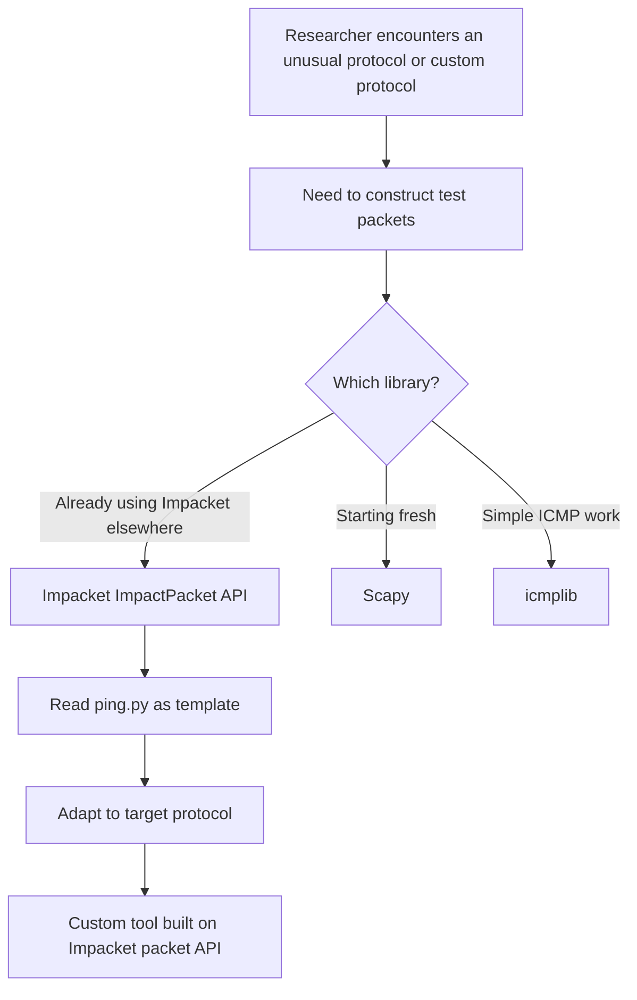

title: "ping.py"
script: "examples/ping.py"
category: "Network Analysis"
status: "Published"
protocols:
  - ICMP
  - IPv4
ms_specs: []
mitre_techniques:
  - T1018
auth_types:
  - none
tags:
  - impacket
  - impacket/examples
  - category/network_analysis
  - status/published
  - protocol/icmp
  - protocol/ipv4
  - technique/raw_socket
  - technique/packet_construction
  - library/impact_packet
  - library/impact_decoder
  - mitre/T1018
aliases:
  - ping
  - impacket-ping


# ping.py

> **One line summary:** Minimal ICMP Echo ping implementation written in roughly fifty lines that exists primarily as a **reference example for Impacket's packet construction and decoding libraries** (`ImpactPacket` for building IP/ICMP headers and payloads from scratch, and `ImpactDecoder` for parsing received packets back into typed objects), demonstrating the hierarchical `contains()` API for stacking protocol layers, the raw socket send/receive pattern with `IPPROTO_ICMP`, and the general structure that every other Impacket tool at the packet layer follows; operationally the tool just pings a host, but its real value is as the documented starting point for anyone learning to use Impacket as a packet construction library rather than as a collection of SMB/DCE-RPC clients, opening the Network Analysis category that covers Impacket's role as a low level networking toolkit outside of Windows service protocols.

| Field | Value |
|:---|:---|
| Script | `examples/ping.py` |
| Category | Network Analysis |
| Status | Published |
| Primary protocols | ICMP, IPv4 |
| Primary Microsoft specifications | None (ICMP is defined in RFC 792, not MS-*) |
| MITRE ATT&CK techniques | T1018 Remote System Discovery |
| Authentication types supported | None (raw ICMP) |
| First appearance in Impacket | Early Impacket (one of the oldest example scripts in the tree) |
| Original authors | Gerardo Richarte (`@gerasdf`), Javier Kohen |


## Prerequisites

This article is mostly self contained. Helpful context:

- [`00_Introduction_and_Architecture.md`](Introduction_and_Architecture.md) for Impacket's overall architecture. The `ImpactPacket` and `ImpactDecoder` modules covered here are the low level layer that underlies all the higher level SMB and DCE/RPC tools in the other wiki articles.

Familiarity with basic networking concepts (IP header, ICMP message types, checksums, raw sockets) helps but the article explains the relevant pieces.


## What it does

`ping.py` is a working ICMP Echo ping implementation. Given a source IP and a destination IP, it:

1. Constructs an IPv4 packet with the specified source and destination addresses.
2. Adds an ICMP Echo Request (Type 8) message with a 156 byte payload.
3. Opens a raw socket with protocol `IPPROTO_ICMP` and the `IP_HDRINCL` socket option, which tells the kernel "I am providing the full IP header; do not add one".
4. Sends the constructed packet.
5. Reads from the socket with a short timeout waiting for an ICMP Echo Reply.
6. Uses `ImpactDecoder` to parse the reply into typed Python objects.
7. Verifies the reply's source matches the destination and the destination matches the source (swapped on return), and that the ICMP type is Echo Reply (Type 0).
8. Prints the sequence number of each successful reply.
9. Loops forever, incrementing the sequence number each iteration.

Operationally this is just `ping`. It is not a better ping, a faster ping, or a feature rich ping. Linux's `ping` and Windows's `ping.exe` are better at almost everything a user actually wants from ping. The Impacket version exists as **source code to read**, not as a utility to use.

Its value:

- It demonstrates the full Impacket packet construction API in a very short, readable script.
- It shows how to use raw sockets for custom protocol work on Linux.
- It serves as the template for any custom packet level tool a researcher might want to build.
- It is the entry point to Impacket as a library, distinct from Impacket as a collection of ready made Windows attack tools.

If you came to Impacket expecting a Windows focused toolkit for lateral movement and credential extraction (which is what ninety percent of the other articles in this wiki cover), `ping.py` is the reminder that Impacket started as a general networking library. The Windows protocol implementations were built on top of the general packet and transport primitives that `ping.py` uses.


## Why it exists

Impacket's original purpose, when Gerardo Richarte and Javier Kohen started the project at Core Security in the early 2000s, was to enable security researchers to build and dissect arbitrary network packets in Python. At the time, the main alternatives were:

- **Scapy** (started around 2003). Today the canonical Python packet library but then a competitor with different design tradeoffs.
- **Libnet / libpcap** (C libraries). Powerful but not Python.
- **Raw `struct.pack` and `socket` calls**. The pure manual approach.

Impacket's contribution was an object oriented Python API where each protocol layer was a class, layers could `contain()` each other to build hierarchies, and the serialization and checksum computation happened automatically. You could build an IP+TCP+SMB packet by composing three objects instead of computing offsets and bit fields by hand.

`ping.py` was one of the first example scripts written to demonstrate the API. It picked ICMP Echo because it is the simplest complete protocol exchange in TCP/IP: one request type, one reply type, no session state, no options to worry about, no authentication. Anyone who understands ping understands enough to read the script and see the pattern.

The tool has been in the repository essentially unchanged for two decades. Modern Impacket has extended well beyond this simple API (the SMB and DCE/RPC implementations use `Structure` and `NDR` serialization, which are more powerful but less approachable). But `ImpactPacket` remains the documented starting point and continues to work for simple packet level tasks.

Over time, Impacket's center of gravity shifted. The Windows protocol tools (`psexec.py`, `secretsdump.py`, `ntlmrelayx.py`) eclipsed the packet construction heritage in visibility. Today most users encounter Impacket through the Windows tools and may not realize the packet construction API exists. The `ping.py` article exists, among other reasons, to point this capability out for readers who want to use Impacket to build custom protocol tools rather than attacks against Windows services.


## The protocol and library theory

This section covers two things: enough of ICMP to read `ping.py`, and enough of the `ImpactPacket` and `ImpactDecoder` APIs to extend beyond it.

### ICMP basics

Internet Control Message Protocol (RFC 792) is the error reporting and diagnostic protocol that runs alongside IP. ICMP messages carry an IP header plus an ICMP payload. ICMP message types relevant to ping:

| Type | Meaning |
|:---|:---|
| 0 | Echo Reply (response to a ping) |
| 3 | Destination Unreachable |
| 5 | Redirect |
| 8 | Echo Request (ping) |
| 11 | Time Exceeded (used by traceroute) |

An ICMP Echo Request contains:

- Type (1 byte): 8.
- Code (1 byte): 0.
- Checksum (2 bytes): covers type, code, identifier, sequence, payload.
- Identifier (2 bytes): used to match replies to requests across processes.
- Sequence Number (2 bytes): used to match replies to specific requests.
- Payload (variable): arbitrary data that the reply must echo back verbatim.

An Echo Reply (Type 0) has the same structure, with the payload copied from the matching request.

The request/reply pair is the complete protocol. No handshake, no state, no options.

### Raw sockets

Normal TCP and UDP sockets interact at the transport layer. The kernel handles IP headers, routing, fragmentation, and protocol specific mechanics (connection setup for TCP, address resolution, etc.). Raw sockets bypass some of this.

A raw socket created with `socket.SOCK_RAW` and `protocol=IPPROTO_ICMP` gives you a handle where:

- Received data comes with the full IP header prepended.
- Sent data is wrapped in an IP header by the kernel unless you explicitly override.

The socket option `IP_HDRINCL` (IP Header Include) tells the kernel "the data I send you already has an IP header, do not add another one". With `IP_HDRINCL` set, the caller has complete control over the IP header fields. This is what `ping.py` does: it builds the IP header itself (via `ImpactPacket.IP`), sets the source address to something arbitrary (including potentially a spoofed source), and the kernel passes the bytes through unchanged.

Raw sockets require elevated privileges on most operating systems:

- **Linux:** the `CAP_NET_RAW` capability, typically granted only to root. Setting the capability directly on a binary (`setcap cap_net_raw+ep <binary>`) is the workaround.
- **Windows:** administrator privileges are required. Raw sockets also have additional restrictions in Windows (for instance, receiving TCP data is blocked even with raw socket access).
- **macOS:** root access.

This privilege requirement is the reason `ping.py` is usually run with `sudo` on Linux.

### ImpactPacket hierarchy

`from impacket import ImpactPacket` gives access to classes representing network protocol layers:

| Class | Represents |
|:---|:---|
| `Ethernet` | Ethernet frame header. |
| `IP` | IPv4 header. |
| `TCP` | TCP header. |
| `UDP` | UDP header. |
| `ICMP` | ICMP header with convenience constants like `ICMP_ECHO`. |
| `IGMP` | IGMP header. |
| `ARP` | ARP message. |
| `Data` | Arbitrary binary payload. |

Each class has setters and getters for its fields (`set_ip_src`, `get_ip_dst`, `set_icmp_type`, etc.). Each also has a `contains(inner)` method to nest another layer inside it.

The idiom:

```python
ip = ImpactPacket.IP()
ip.set_ip_src('10.0.0.1')
ip.set_ip_dst('10.0.0.2')

icmp = ImpactPacket.ICMP()
icmp.set_icmp_type(icmp.ICMP_ECHO)

icmp.contains(ImpactPacket.Data(b"A" * 156))
ip.contains(icmp)

raw_bytes = ip.get_packet()
```

The `get_packet()` method walks the containment chain, serializes each layer, computes checksums, and returns the final byte string ready to hand to `socket.sendto`.

The containment relationship matters for checksum computation: an IP header's checksum covers only the IP header fields, while an ICMP checksum covers the ICMP header plus all nested data. `ImpactPacket` handles the distinction automatically.

Layers can be nested arbitrarily. A TCP SYN packet would be `Ethernet.contains(IP.contains(TCP))`. A UDP DNS query would be `IP.contains(UDP.contains(Data(dns_bytes)))`. Custom protocols defined on top of UDP or TCP extend `Data` or create new classes that follow the same pattern.

### ImpactDecoder

The mirror of `ImpactPacket`. Given raw bytes received from a socket, `ImpactDecoder.IPDecoder().decode(bytes)` returns an `IP` object with the same accessors as the one used for sending. Walking the hierarchy works via `.child()`:

```python
from impacket import ImpactDecoder

raw = s.recv(4096)
decoder = ImpactDecoder.IPDecoder()
rip = decoder.decode(raw)           # IP object
ricmp = rip.child()                  # ICMP object nested inside
payload = ricmp.child()              # Data object nested in ICMP
```

Each layer exposes getters matching the setters used on the send side. This symmetry is the API's biggest usability win: the code to build a packet and the code to parse a response are nearly identical in shape.

The specialized decoders (`IPDecoder`, `EthDecoder`, etc.) know which class to instantiate at each layer based on protocol numbers and fields. `IPDecoder` looks at the IP header's Protocol field and picks `TCPDecoder`, `UDPDecoder`, or `ICMPDecoder` for the nested layer automatically.

### Checksum handling

IP headers have a 16 bit checksum covering the IP header. ICMP has a separate 16 bit checksum covering the ICMP header and payload. TCP and UDP checksums cover a pseudo header including IP source and destination.

Computing these checksums manually is an error prone chore: sum the 16 bit words with carry wrap, invert, account for odd length padding, handle the correct byte order. `ImpactPacket` does all of this when `get_packet()` is called. This is one of the library's most valuable features for rapid protocol research; it eliminates the most common class of "why is my packet rejected?" bugs.

### What ImpactPacket does NOT do

The library covers the basic IP stack protocols (IP, ICMP, TCP, UDP, IGMP, ARP, and variants like ICMPv6 in the `IP6` and `ICMP6` modules). It does not cover:

- Application layer protocols (SMB, DNS, HTTP) in the packet construction sense. For those, Impacket provides separate higher level modules (`impacket.smb`, `impacket.dcerpc`, etc.).
- Modern protocol features (QUIC, HTTP/2, TLS). If you want to forge these, you need other libraries.
- Arbitrary bit twiddling. If your protocol has unusual field alignment or encoding rules, you may need to drop down to manual `struct.pack`.

For the eighty percent of packet construction work that involves standard IP-stack protocols with standard field layouts, `ImpactPacket` is exactly right.


## How the tool works internally

The script is about fifty lines. Walking through it step by step:

1. **Arguments.** Two positional arguments: source IP and destination IP. No options. No target list, no count, no interval.

2. **Build the IP header.**
   ```python
   ip = ImpactPacket.IP()
   ip.set_ip_src(src)
   ip.set_ip_dst(dst)
   ```
   Protocol, version, TTL, and ID use default values. Since the socket will set `IP_HDRINCL`, the kernel does not override these.

3. **Build the ICMP header.**
   ```python
   icmp = ImpactPacket.ICMP()
   icmp.set_icmp_type(icmp.ICMP_ECHO)
   ```
   Sets type to 8 (Echo Request). Code defaults to 0. Identifier and sequence number are assigned later by the library.

4. **Build the payload.**
   ```python
   icmp.contains(ImpactPacket.Data(b"A" * 156))
   ```
   156 bytes of 'A'. The total ICMP size (8 byte header + 156 byte payload = 164 bytes) plus IP header (20 bytes) plus ICMP identifier/sequence overhead works out close to a round number but the exact size is not significant; any payload size works.

5. **Stack the layers.**
   ```python
   ip.contains(icmp)
   ```

6. **Open the raw socket.**
   ```python
   s = socket.socket(socket.AF_INET, socket.SOCK_RAW, socket.IPPROTO_ICMP)
   s.setsockopt(socket.IPPROTO_IP, socket.IP_HDRINCL, 1)
   ```
   `AF_INET` for IPv4, `SOCK_RAW` for raw access, `IPPROTO_ICMP` as the protocol (so the kernel does some filtering on what the socket receives). `IP_HDRINCL=1` for full header control.

7. **Main loop.** Increment sequence number, set it on the ICMP, serialize the packet:
   ```python
   icmp.set_icmp_id(seq_id)
   s.sendto(ip.get_packet(), (dst, 0))
   ```
   `sendto` takes the destination tuple; port is 0 because ICMP has no ports.

8. **Wait for reply.** Use `select.select` with a short timeout:
   ```python
   if s in select.select([s], [], [], 1)[0]:
       reply = s.recv(1500)
   ```

9. **Decode and verify.**
   ```python
   rip = ImpactDecoder.IPDecoder().decode(reply)
   ricmp = rip.child()
   if rip.get_ip_dst() == src and rip.get_ip_src() == dst \
      and icmp.ICMP_ECHOREPLY == ricmp.get_icmp_type():
       print("Ping reply for sequence #%d" % ricmp.get_icmp_id())
   ```
   The address swap check ensures we got a response to our request (source and destination reversed). The type check ensures it's an Echo Reply (Type 0), not some other ICMP message.

10. **Loop.** Sleep briefly and repeat.

That is the whole tool. Reading the source is a fifteen minute exercise and covers the entire `ImpactPacket`/`ImpactDecoder` idiom. After this, building a custom TCP SYN scanner, a DNS query tool, or an ARP sweep is a matter of swapping layer classes.


## Authentication options

None. ICMP has no authentication. Raw socket access requires elevated OS privileges but that is OS level, not protocol level.


## Practical usage

### Basic ping

```bash
sudo python3 ping.py 10.0.0.1 10.0.0.2
```

Requires `sudo` because of raw socket privileges. Source IP is `10.0.0.1`, destination is `10.0.0.2`. The source address must be one that exists on the local interface (or the kernel routing will fail); setting a spoofed source requires more machinery.

Output:

```text
Impacket v0.11.0 - Copyright ...

Ping reply for sequence #1
Ping reply for sequence #2
Ping reply for sequence #3
...
```

No RTT, no packet loss summary, no statistics. Just confirmation that replies are arriving.

### Comparison with standard ping

```bash
sudo python3 ping.py 10.0.0.1 10.0.0.2
```

versus

```bash
ping 10.0.0.2
```

The standard `ping` gives RTT, packet loss percentage, icmp_seq parsing, TTL observation, proper Ctrl+C summary stats, and a dozen other features. For operational use, use `ping`. Use `ping.py` when you want to see the Impacket API in action.

### Real value: as a template

```python
from impacket import ImpactPacket, ImpactDecoder
import socket

# TCP SYN packet to port 80
ip = ImpactPacket.IP()
ip.set_ip_src('10.0.0.1')
ip.set_ip_dst('10.0.0.2')

tcp = ImpactPacket.TCP()
tcp.set_th_sport(12345)
tcp.set_th_dport(80)
tcp.set_SYN()
tcp.set_th_seq(0)

ip.contains(tcp)

s = socket.socket(socket.AF_INET, socket.SOCK_RAW, socket.IPPROTO_TCP)
s.setsockopt(socket.IPPROTO_IP, socket.IP_HDRINCL, 1)
s.sendto(ip.get_packet(), ('10.0.0.2', 80))
```

Fifteen lines of substance and you have a TCP SYN scanner primitive. Adding reply parsing, ports iteration, and timing turns it into `nmap -sS` in Python. This is the kind of custom tool that `ping.py` primes the reader to build.

### Key flags

| Flag | Meaning |
|:---|:---|
| `src` (positional 1) | Source IP. Must be an address on the local interface. |
| `dst` (positional 2) | Destination IP. |

No other flags. Changing payload size, count, interval, or anything else requires editing the script.


## What it looks like on the wire

Standard ICMP Echo Request/Reply pair. Wireshark decodes natively:

```text
Internet Protocol Version 4, Src: 10.0.0.1, Dst: 10.0.0.2
Internet Control Message Protocol
    Type: 8 (Echo (ping) request)
    Code: 0
    Checksum: 0x....
    Identifier (BE): ...
    Sequence number (BE): 1
    Data: AAAAAAAAA... (156 bytes)
```

The reply is symmetric with Type: 0 (Echo (ping) reply) and the same payload echoed back.

### Wireshark filters

```text
icmp                                    # all ICMP
icmp.type == 8                          # Echo Request
icmp.type == 0                          # Echo Reply
ip.src == 10.0.0.1 and icmp.type == 8   # Specific pings from a host
```

ICMP is so routine that detection for `ping.py` specifically is not meaningful. The traffic is indistinguishable from `ping`, `nmap -sn`, or any other ICMP generator.


## What it looks like in logs

Nothing specific. ICMP traffic is typically not logged at the endpoint OS level. Network IDS systems may log ICMP floods or unusual patterns, but a normal ping rate is beneath the noise floor.

Exception: hosts configured with verbose firewall logging may record individual ICMP exchanges. `iptables -j LOG` rules on Linux or Windows Firewall Advanced logging can capture each packet. These logs look identical regardless of which tool generated the traffic.

### Starter Sigma rules

Detection rules for ping itself are rare and low value. Most environments have too much legitimate ICMP for useful detection. Relevant patterns that do matter:

```yaml
title: ICMP Flood
logsource:
  category: network
detection:
  selection:
    protocol: 'icmp'
    icmp_type: 8
  timeframe: 10s
  condition: selection | count() by src_ip > 1000
level: medium
```

Detects volume based abuse, not the tool. Useful against ICMP-based denial of service but not against `ping.py`.

```yaml
title: ICMP Data Exfiltration Pattern
logsource:
  category: network
detection:
  selection:
    protocol: 'icmp'
    icmp_type: 8
    payload_size: '>256'
  filter_normal:
    # Normal ping payloads are typically 56 or 64 bytes
  condition: selection | count() by src_ip > 10
level: high
```

Detects ICMP tunneling and data exfiltration where payload sizes are abnormal. The 156 byte payload in `ping.py` is slightly above normal but below the threshold that would trigger exfiltration detection.


## Detection and defense

### Detection opportunities

ICMP ping is so common that detecting it specifically is rarely useful. The detection opportunities are around ICMP abuse patterns:

- **ICMP tunneling.** Data exfiltration through ICMP payload. Identified by unusual payload sizes or payloads containing encoded data.
- **ICMP floods.** Denial of service via high volume pings. Identified by request rate.
- **Unusual ICMP types.** Echo Request/Reply are routine; Redirects, Timestamps, and Address Mask requests are unusual and can indicate reconnaissance or attack.
- **Ping sweeps.** Many Echo Requests to sequential IP addresses. Indicates network mapping via tools like nmap or custom scanners.

`ping.py` itself does not match any of these patterns at default settings.

### Preventive controls

- **ICMP filtering at perimeter.** Block ICMP at the Internet edge except for required types (Type 3 Code 4 for Path MTU Discovery, for instance). Many organizations block Echo Request from external sources.
- **ICMP rate limiting.** Linux and most firewalls support rate limiting ICMP to mitigate floods and ping sweeps.
- **Monitor ICMP tunneling.** Commercial network monitoring tools have detections for ICMP payload anomalies.
- **Raw socket restrictions.** The privilege required to run `ping.py` is itself a mitigation: an unprivileged user cannot forge ICMP traffic.

In general, defending against `ping.py` specifically is not a priority because the tool does not do anything a regular user could not do with the standard `ping` command. The defensive focus for ICMP is on abuse patterns, not on any particular generating tool.


## Related tools and attack chains

`ping.py` opens the Network Analysis category. Other stubs in the category:

- **`ping6.py`**. The IPv6 version. Uses the `IP6` and `ICMP6` modules which have a slightly different API (factory methods like `ICMP6.ICMP6.Echo_Request(...)` rather than containment with set methods).
- **`sniff.py`** and **`sniffer.py`**. Packet capture and dissection using `ImpactDecoder`.
- **`split.py`**. PCAP file splitting.
- **`mqtt_check.py`**. MQTT probe.
- **`nmapAnswerMachine.py`**. A tool that responds to nmap probes deceptively. Demonstrates the packet construction API for scan evasion.

### Related Impacket library usage

The `ImpactPacket`/`ImpactDecoder` API demonstrated in `ping.py` underlies:

- The sniffer and parser used internally by other network tools.
- Custom research tools built on top of Impacket.
- Protocol fuzzers that need fine grained control over headers.

### External alternatives

- **Scapy** at `https://scapy.net`. The canonical Python packet manipulation library today. More features, broader protocol support, interactive shell. For most new research at the packet layer, Scapy is the default choice.
- **icmplib** at `https://github.com/ValentinBELYN/icmplib`. Pure Python ICMP library with ready made ping, multiping, and traceroute functions. Better for "I just want to ping something" than either Impacket or Scapy.
- **pyping** and similar small libraries. Compact, focused ping implementations.
- **libpcap / tcpdump**. C library for packet capture. Industrial strength, not Python.

### When to choose Impacket's packet API over Scapy

Scapy is the usual answer for new work. Impacket is preferable when:

- You are already using Impacket for other parts of the tool (the Windows protocol clients). Sharing the library avoids extra dependencies.
- You want a minimal, procedural API. Scapy's metaclass magic and interactive shell are powerful but can be confusing for simple tasks.
- You are working in a restricted Python environment where installing Scapy is difficult. Impacket is also a significant dependency but often already present in security distros.

For most standalone packet construction work, Scapy is the stronger choice. The `ping.py` article and the Impacket packet API are valuable mainly in contexts where Impacket is already in use.

### Attack chains

Not a primary attack tool. The reconnaissance value is minimal (standard `ping` works for that). The interesting chain is:



The tool's role is as the documented starting point for researchers who need to extend Impacket beyond its Windows protocol clients.


## Further reading

- **RFC 792: Internet Control Message Protocol.** The foundational ICMP specification.
- **RFC 1122: Requirements for Internet Hosts** (updates ICMP behavior).
- **Gerardo Richarte talks** on Impacket's origins. Historical context for why the library exists.
- **Scapy documentation** at `https://scapy.readthedocs.io/`. The main alternative, worth understanding for any packet construction work.
- **icmplib documentation** at `https://github.com/ValentinBELYN/icmplib`. Modern focused ICMP library.
- **Linux raw socket documentation** (`man 7 raw`, `man 7 packet`). OS level reference for the socket mechanics.
- **Impacket source code** at `https://github.com/fortra/impacket/tree/master/impacket`. The `ImpactPacket.py`, `ImpactDecoder.py`, `IP6.py`, and `ICMP6.py` modules are worth reading directly. They are compact and the code is the documentation.
- **MITRE ATT&CK T1018** at `https://attack.mitre.org/techniques/T1018/`. Remote System Discovery technique (of which ping is the simplest example).

If you want to internalize the Impacket packet construction API, read `ping.py` first (fifteen minutes), then `ping6.py` to see the IPv6 variant (fifteen minutes), then `sniff.py` for the decoder usage pattern (fifteen minutes). Then try a custom exercise: build a UDP based DNS query tool using `ImpactPacket`. Compose `IP.contains(UDP.contains(Data(dns_query_bytes)))`, send it, decode the response. Once this works, the library's rhythm is internalized and extending to any IP-stack protocol becomes routine. The skill transfers directly to Scapy and other packet libraries, since the underlying concepts (hierarchical composition, automatic checksumming, raw socket mechanics) are shared across the ecosystem. The larger point of the exercise is that Impacket is not just a Windows attack toolkit; it is a general networking library with a clean API, and `ping.py` is the thirty year old door into that capability.
