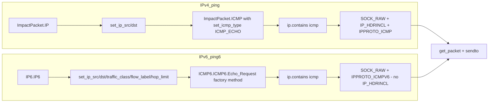

title: "ping6.py"
script: "examples/ping6.py"
category: "Network Analysis"
status: "Published"
protocols:
  - ICMPv6
  - IPv6
ms_specs: []
mitre_techniques:
  - T1018
auth_types:
  - none
tags:
  - impacket
  - impacket/examples
  - category/network_analysis
  - status/published
  - protocol/icmpv6
  - protocol/ipv6
  - technique/raw_socket
  - technique/packet_construction
  - library/ip6
  - library/icmp6
  - mitre/T1018
aliases:
  - ping6
  - impacket-ping6


# ping6.py

> **One line summary:** IPv6 variant of [`ping.py`](ping.md) that sends ICMPv6 Echo Request packets to an IPv6 destination using Impacket's `IP6` and `ICMP6` modules, with a distinct API from the IPv4 side (`IP6.IP6()` instead of `ImpactPacket.IP()`, `ICMP6.ICMP6.Echo_Request(id, seq, payload)` factory method instead of the ImpactPacket pattern of "set then contains", header fields specific to IPv6 for traffic class, flow label, and hop limit, and no `IP_HDRINCL` socket option because the kernel constructs the IPv6 header on most operating systems), serving as the IPv6 companion reference in the "Impacket as a networking library" lineage alongside [`ping.py`](ping.md) for construction and [`sniff.py`](sniff.md) for decoding, and continuing the Network Analysis category at 3 of 7 articles.

| Field | Value |
|:---|:---|
| Script | `examples/ping6.py` |
| Category | Network Analysis |
| Status | Published |
| Primary protocols | ICMPv6, IPv6 |
| Primary Microsoft specifications | None (ICMPv6 defined in RFC 4443, IPv6 in RFC 8200) |
| MITRE ATT&CK techniques | T1018 Remote System Discovery |
| Authentication types supported | None (raw ICMPv6) |
| First appearance in Impacket | Added with the IP6 and ICMP6 library modules |
| Original author | Alberto Solino (`@agsolino`) |
| External dependency | None beyond Impacket |


## Prerequisites

This article builds directly on:

- [`ping.py`](ping.md) for the full treatment of Impacket's packet construction library, raw socket fundamentals, and the IPv4 idiom this article contrasts with. Read ping.py first; this article focuses on what differs for IPv6.
- [`sniff.py`](sniff.md) for the companion ImpactDecoder treatment. Packets built by ping6.py parse via the IP6 and ICMP6 decoders in the same way IPv4 packets parse via the IP and ICMP decoders.
- [`00_Introduction_and_Architecture.md`](Introduction_and_Architecture.md) for the overall Impacket architecture.

Basic familiarity with IPv6 helps (128-bit addresses, different header structure from IPv4, no fragmentation in flight by default). The article covers the pieces that matter for ping6 specifically.


## What it does

`ping6.py` is a minimal IPv6 ICMPv6 Echo ping. Given a source IPv6 address and a destination IPv6 address, it:

1. Constructs an IPv6 packet with the specified source and destination addresses.
2. Sets fields specific to IPv6: traffic class (0), flow label (0), hop limit (64).
3. Opens a raw socket with `AF_INET6` and `IPPROTO_ICMPV6`.
4. In a loop, constructs an ICMPv6 Echo Request via the factory method `ICMP6.ICMP6.Echo_Request(id, seq, payload)`, nests it inside the IPv6 packet, and sends.
5. Reads the reply and parses it with `ImpactDecoder` to extract the sequence number.
6. Prints each reply's size and sequence number.
7. Loops until interrupted.

Output looks like:

```text
PING 2001:db8::1 156 data bytes
156 bytes from 2001:db8::1: icmp_seq=1
156 bytes from 2001:db8::1: icmp_seq=2
156 bytes from 2001:db8::1: icmp_seq=3
...
```

Functionally equivalent to `ping -6` on Linux or `ping6` on older systems. The tool itself is not operationally competitive with the standard `ping` utility; its value is as a reference implementation for Impacket's IPv6 support.


## Why it exists

When Impacket's IPv4 packet library was created, IPv6 adoption was still nascent. As IPv6 deployment grew, Alberto Solino added the `IP6` and `ICMP6` modules to the library and ported the ping example to demonstrate the new modules. The parallel exists for the same reason ping.py does: the simplest possible protocol exchange makes the cleanest reference example.

The IPv6 ping is pedagogically valuable specifically because IPv6 has a noticeably different API in Impacket from IPv4:

- The `IP6` module uses a slightly different class naming (`IP6.IP6()` instead of just `IP()`).
- The `ICMP6` module uses factory methods (`Echo_Request`, `Echo_Reply`, `Neighbor_Solicitation`, etc.) rather than the "create instance, set fields, call contains()" pattern.
- The socket layer behaves differently because modern kernels treat IPv6 raw sockets as cooked rather than fully raw (the kernel constructs the IPv6 header even when the caller does not request that behavior, making `IP_HDRINCL` unnecessary and in fact incompatible on most platforms).

These API differences are not arbitrary; they reflect real differences between IPv4 and IPv6 at the protocol level and at the OS socket layer. Having a working example that demonstrates all of them in fifty lines is useful for anyone extending Impacket into IPv6 protocol research.

For operational IPv6 ping, use the standard tools. For custom IPv6 protocol research (neighbor discovery attacks, router advertisement manipulation, IPv6 scanning tools), ping6.py is the documented starting point for the Impacket library side of the work.


## IPv6 and ICMPv6 theory

This section covers the pieces of IPv6 and ICMPv6 needed to read ping6.py and extend it. Readers who want deeper IPv6 material should go to RFC 8200 (IPv6), RFC 4443 (ICMPv6), and RFC 4861 (Neighbor Discovery) directly.

### IPv6 header structure

Compared to IPv4, the IPv6 header is of fixed length (40 bytes), simpler, and omits some IPv4 fields while adding others:

| Field | Bits | IPv4 equivalent | Purpose |
|:---|:---|||
| Version | 4 | Version | Always 6. |
| Traffic Class | 8 | TOS/DSCP | QoS marking. ping6.py sets 0. |
| Flow Label | 20 | none | Flow identification for load balancing. ping6.py sets 0. |
| Payload Length | 16 | Total Length (of IP+payload) | Length of data after the header. |
| Next Header | 8 | Protocol | Type of next header (extension header or upper protocol). |
| Hop Limit | 8 | TTL | Decremented at each hop. ping6.py sets 64. |
| Source Address | 128 | Source Address (32) | IPv6 source. |
| Destination Address | 128 | Destination Address (32) | IPv6 destination. |

Omitted from IPv6: header checksum (upper protocols are expected to carry their own checksums, which include IPv6 source and destination via a pseudo header), IHL (header length is fixed), fragmentation fields (fragmentation by routers is removed; sender only via the Fragment extension header), options (moved to extension headers).

### IPv6 extension headers

IPv6 replaces IPv4's options embedded in the header with a chain of extension headers:

| Next Header | Extension | Use |
|:---|:---||
| 0 | Hop by Hop Options | Options processed by every router on the path. |
| 43 | Routing | Source routing (restricted in modern deployments). |
| 44 | Fragment | Fragmentation by sender. |
| 50 | ESP | IPsec encryption. |
| 51 | AH | IPsec authentication. |
| 60 | Destination Options | Options for the destination. |

ping6.py does not use extension headers. The IPv6 packet chains directly to ICMPv6 via Next Header = 58.

### ICMPv6

ICMPv6 (RFC 4443) is the IPv6 counterpart of IPv4 ICMP, extended to carry functions that ARP and IGMP handled in IPv4:

- **Error messages** (Destination Unreachable, Packet Too Big, Time Exceeded, Parameter Problem).
- **Informational messages** (Echo Request/Reply; Multicast Listener Discovery; Neighbor Discovery via Neighbor Solicitation, Neighbor Advertisement, Router Solicitation, Router Advertisement).

Message types relevant to ping6:

| Type | Meaning |
|:---|:---|
| 1 | Destination Unreachable |
| 2 | Packet Too Big |
| 3 | Time Exceeded |
| 4 | Parameter Problem |
| 128 | Echo Request (ping6 sends this) |
| 129 | Echo Reply (ping6 receives this) |
| 133 | Router Solicitation |
| 134 | Router Advertisement |
| 135 | Neighbor Solicitation |
| 136 | Neighbor Advertisement |

An ICMPv6 Echo Request has the same structure as IPv4 Echo Request except:

- Type = 128 (not 8).
- Checksum covers the ICMPv6 message and an IPv6 pseudo header (source + destination + length + next header).

The pseudo header requirement means the kernel typically computes the ICMPv6 checksum when the application hands the socket a zeroed checksum field. `ICMP6.ICMP6.Echo_Request` hides this detail; the kernel fills in the checksum during send.

### The socket layer difference

In IPv4, opening a raw ICMP socket with `IP_HDRINCL` lets the application write the IP header byte for byte, giving full control including source address forgery. This is what `ping.py` does.

In IPv6, the socket API works differently on most operating systems:

- **Linux IPv6 raw sockets do NOT support IP_HDRINCL the same way.** The application writes the ICMPv6 payload; the kernel constructs the IPv6 header based on the source/destination specified when sending.
- The kernel computes checksums for ICMPv6 because the pseudo header is awkward to construct in userspace.
- The application controls which interface is used via bind() or socket options, not by writing the header directly.

Because of this, `ping6.py` calls `ip.get_packet()` to serialize the IPv6+ICMPv6 packet to bytes and passes them to `sendto`, but the kernel wrapping means the actual bytes on the wire reflect a combination of the application's IPv6 header and the kernel's interpretation. In practice this works for standard Echo Request traffic; for more exotic IPv6 work (custom extension headers, source address forgery, neighbor discovery spoofing), additional socket options or platform-specific interfaces are needed.

### Why address forgery is harder in IPv6

IPv6 addresses are 128 bits and many sources are hard to forge:

- Addresses that are link local (fe80::/10) are tied to specific interfaces.
- Global unicast addresses typically follow EUI-64 or privacy addressing conventions that expose MAC addresses or random identifiers.
- Kernel raw socket constraints (as above) limit what the application can put in the source field.

For legitimate lab work, spoofing IPv6 source is possible but more involved than the IPv4 equivalent. Most IPv6 research tools accept this and work with real source addresses, using bindings to specific interfaces to choose which address gets used.


## How the tool works internally

The tool is about fifty lines, paralleling ping.py:

1. **Arguments.** Two positional: source IPv6 and destination IPv6.

2. **Build the IPv6 header.**
   ```python
   from impacket import ImpactDecoder, IP6, ICMP6, version
   ip = IP6.IP6()
   ip.set_ip_src(src)
   ip.set_ip_dst(dst)
   ip.set_traffic_class(0)
   ip.set_flow_label(0)
   ip.set_hop_limit(64)
   ```
   Notice: the class is `IP6.IP6` (module.class), distinct from `ImpactPacket.IP`. Fields specific to IPv6 are set explicitly.

3. **Open the raw socket.**
   ```python
   s = socket.socket(socket.AF_INET6, socket.SOCK_RAW, socket.IPPROTO_ICMPV6)
   ```
   No `IP_HDRINCL` option. The kernel handles header construction.

4. **Main loop.** For each sequence number:
   ```python
   icmp = ICMP6.ICMP6.Echo_Request(1, seq_id, payload)
   ip.contains(icmp)
   s.sendto(ip.get_packet(), (dst, 0))
   ```
   The factory method `Echo_Request(id, seq, payload)` is a significant departure from ping.py's pattern. In ICMP6, factory methods construct the appropriate message type with correct fields in one call, rather than requiring the caller to instantiate a base ICMP class and then set the type.

5. **Receive reply.** Read from the socket; the kernel delivers the IPv6 packet with the ICMPv6 Echo Reply inside.

6. **Decode.**
   ```python
   decoder = ImpactDecoder.IP6Decoder()
   rip = decoder.decode(raw_bytes)
   ```
   The `IP6Decoder` mirrors `IPDecoder` from IPv4 but for IPv6.

7. **Extract and print.**
   ```python
   print("%d bytes from %s: icmp_seq=%d" %
         (rip.child().get_size() - 4,
          dst,
          rip.get_echo_sequence_number()))
   ```
   The accessor names differ from the IPv4 side. Where IPv4 uses `ricmp.get_icmp_id()`, IPv6 uses `rip.get_echo_sequence_number()` directly on the IP6 wrapper. These naming differences reflect the distinct `ICMP6` module's API choices.

8. **Loop.** Continue until interrupted.

That is the whole tool. Like ping.py, its value is as a reference for the IPv6 side of Impacket's packet library.


## Authentication options

None. ICMPv6 has no authentication. Raw socket access requires elevated OS privileges (CAP_NET_RAW on Linux, administrator on Windows, root on macOS).

### Running

```bash
sudo python3 ping6.py 2001:db8::100 2001:db8::1
```

Source IPv6 must be a real address on the local interface. Destination is the IPv6 address to ping.


## Practical usage

### Basic IPv6 ping

```bash
sudo python3 ping6.py fe80::1%eth0 fe80::2
```

Addresses that are link local (fe80::/10) require specifying the interface via the `%` zone identifier, which the operator's OS must support. Global unicast addresses (2000::/3 in current allocations) do not need zone identifiers.

```bash
sudo python3 ping6.py 2001:db8::100 2001:db8::1
```

### Comparison with standard ping

```bash
ping -6 2001:db8::1     # Linux
ping6 2001:db8::1       # older systems
```

As with the IPv4 case, the standard tool is better at essentially everything operational. ping6.py is a reference implementation.

### Template for IPv6 protocol research

Adapting ping6.py for different ICMPv6 message types:

```python
# Neighbor Solicitation (type 135)
icmp = ICMP6.ICMP6.Neighbor_Solicitation(target_address)

# Router Solicitation (type 133)
icmp = ICMP6.ICMP6.Router_Solicitation()

# Router Advertisement (type 134, requires specific options)
icmp = ICMP6.ICMP6.Router_Advertisement(...)
```

Each factory method hides the field details; the module knows which fields each message type requires.

### Key flags

| Flag | Meaning |
|:---|:---|
| `src` (positional 1) | Source IPv6 address. Must exist on a local interface. |
| `dst` (positional 2) | Destination IPv6 address. |

No other flags. Custom variants typically add count, interval, payload size.


## What it looks like on the wire

Standard ICMPv6 Echo Request and Echo Reply. Wireshark decodes natively:

```text
Internet Protocol Version 6, Src: 2001:db8::100, Dst: 2001:db8::1
    Traffic Class: 0x00
    Flow Label: 0x00000
    Payload Length: 164
    Next Header: ICMPv6 (58)
    Hop Limit: 64
Internet Control Message Protocol v6
    Type: Echo (ping) request (128)
    Code: 0
    Checksum: 0x....
    Identifier: 1
    Sequence: 1
    Data: AAAAAAAA... (156 bytes)
```

The reply is symmetric with Type: 129 (Echo Reply).

### Wireshark filters

```text
icmpv6                                # all ICMPv6
icmpv6.type == 128                    # Echo Request
icmpv6.type == 129                    # Echo Reply
ipv6.src == 2001:db8::100 and icmpv6  # From specific host
```


## What it looks like in logs

Nothing specific to ping6.py. ICMPv6 traffic is typically not logged at the endpoint OS level. Network IDS may log unusual ICMPv6 patterns (floods, atypical types), but standard ping rates are beneath noise.

### Starter Sigma rules

Similar to ping.py, detection rules specific to the tool itself are rarely valuable. Abuse patterns matter:

```yaml
title: ICMPv6 Router Advertisement from Untrusted Source
logsource:
  category: network
detection:
  selection:
    protocol: 'icmpv6'
    icmpv6_type: 134
  filter_legitimate:
    src_ip: 'authorized_routers'
  condition: selection and not filter_legitimate
level: high
```

Catches rogue Router Advertisement attacks (the IPv6 equivalent of DHCP spoofing). Not about ping6.py specifically but important for the broader ICMPv6 research space.

```yaml
title: Excessive ICMPv6 Echo Requests
logsource:
  category: network
detection:
  selection:
    protocol: 'icmpv6'
    icmpv6_type: 128
  timeframe: 10s
  condition: selection | count() by src_ip > 1000
level: medium
```

Detects abuse by volume.


## Detection and defense

### Detection opportunities

Like ping.py for IPv4, ping6.py itself is not a meaningful attack tool. The detection opportunities are around ICMPv6 abuse patterns:

- **Router Advertisement spoofing** (type 134 from untrusted sources). Classic IPv6 attack class; tools like `fake_router6` in the THC-IPv6 suite automate it.
- **Neighbor Discovery attacks** (types 135/136). Allow traffic interception on a local segment.
- **ICMPv6 tunneling** for data exfiltration (unusual payloads in Echo Request).
- **Rogue DHCPv6** combined with ICMPv6 manipulation.

ping6.py's Echo Request traffic is routine and alone means nothing.

### Preventive controls

- **RA Guard** on switches. Blocks Router Advertisement from unauthorized ports.
- **Neighbor Discovery inspection.** Modern switches support ND inspection similar to DHCP snooping.
- **ICMPv6 rate limiting.** Rate limits at the OS layer and at the firewall layer mitigate floods.
- **IPv6 first hop security.** Broadly the suite of switch features (RA Guard, DHCPv6 Guard, SAVI) that protect the local segment.
- **Disable IPv6 on segments where it is not needed.** Reduces attack surface; common advice in networks that haven't rolled out IPv6.

### Framing for ping6.py

Like its IPv4 sibling, ping6.py is a research and education tool. Its place in the Impacket tree is as the documented starting point for researchers who want to build custom IPv6 protocol tools on the IP6/ICMP6 modules. Defensive concerns belong at the protocol and network architecture layers, not at the layer of tool detection.


## Related tools and attack chains

`ping6.py` continues the Network Analysis category at 3 of 7 articles alongside [`ping.py`](ping.md) and [`sniff.py`](sniff.md).

### Related Impacket tools

- [`ping.py`](ping.md) is the IPv4 version. Reading the pair together teaches both the IPv4 and IPv6 sides of Impacket's construction API.
- [`sniff.py`](sniff.md) captures and decodes the IPv6 traffic ping6.py generates (among other packet types).
- Stubs in Network Analysis yet to be documented: `sniffer.py` (raw socket variant of sniff.py), `split.py` (PCAP splitter), `mqtt_check.py` (MQTT probe), `nmapAnswerMachine.py` (nmap deception).

### External IPv6 tools

- **`ping6` / `ping -6`** in standard OSes. Production quality IPv6 ping.
- **THC-IPv6** at `https://github.com/vanhauser-thc/thc-ipv6`. Comprehensive IPv6 attack suite covering RA spoofing, neighbor discovery attacks, fragmentation bugs, and more. The reference toolkit for IPv6 penetration testing.
- **Scapy** for IPv6 packet construction in Python. Much broader protocol coverage than Impacket's IP6/ICMP6 modules.
- **tshark / Wireshark** for IPv6 traffic analysis.
- **traceroute6** for path discovery over IPv6.

### When to choose ping6.py

Same answer as ping.py: for operational IPv6 ping, use the standard tools. ping6.py is for researchers who want to understand Impacket's IPv6 API or are building custom protocol tools where consistency with other Impacket code matters.

For serious IPv6 research (RA attacks, ND attacks, flow label research, extension header exploration), THC-IPv6 and Scapy are usually more productive than extending Impacket's IP6/ICMP6 modules. Impacket's IPv6 coverage is enough for the basic protocols but not comprehensive.

### IPv4-IPv6 API comparison



The diagram shows what is similar and what differs. Key differences: factory methods vs setter pattern, additional IPv6 header fields, and the absence of IP_HDRINCL on the IPv6 side.


## Further reading

- **RFC 8200: Internet Protocol, Version 6 (IPv6) Specification.** The IPv6 standard.
- **RFC 4443: Internet Control Message Protocol (ICMPv6) for the Internet Protocol Version 6 (IPv6) Specification.** The ICMPv6 standard.
- **RFC 4861: Neighbor Discovery for IP version 6 (IPv6).** Neighbor Discovery protocol details.
- **RFC 4291: IP Version 6 Addressing Architecture.** Address types and structure.
- **THC-IPv6 documentation** at `https://github.com/vanhauser-thc/thc-ipv6`. Practical IPv6 attack research.
- **Scapy's IPv6 documentation** at `https://scapy.readthedocs.io/en/latest/usage.html`. Alternative Python IPv6 library.
- **Linux raw IPv6 socket documentation** (`man 7 ipv6`, `man 7 raw`). OS-level reference for the socket mechanics.
- **Impacket source** for `IP6.py` and `ICMP6.py` in the `impacket/` directory. Short, readable, the code is the documentation.
- **MITRE ATT&CK T1018** at `https://attack.mitre.org/techniques/T1018/`. Remote System Discovery.

The best way to internalize ping6.py is to read ping.py first, then ping6.py, making the comparison explicit. The API differences (factory methods vs setter pattern, IPv6 header fields, no IP_HDRINCL) are the things to take away. After both, reading `IP6.py` and `ICMP6.py` in the Impacket source directly teaches what other ICMPv6 message types are available via factory methods (Neighbor_Solicitation, Router_Advertisement, Destination_Unreachable, Packet_Too_Big, etc.) and how to extend into the broader IPv6 research space. For serious IPv6 work beyond basic protocols, Scapy and THC-IPv6 remain the stronger choices; Impacket's value is consistency within research stacks that already use it for other reasons.
