title: "sniff.py"
script: "examples/sniff.py"
category: "Network Analysis"
status: "Published"
protocols:
  - Ethernet
  - IP
  - TCP
  - UDP
  - ICMP
ms_specs: []
mitre_techniques:
  - T1040
  - T1595
auth_types:
  - none
tags:
  - impacket
  - impacket/examples
  - category/network_analysis
  - status/published
  - protocol/ethernet
  - protocol/ip
  - technique/packet_capture
  - technique/packet_decoding
  - library/impact_decoder
  - library/pcapy
  - library/libpcap
  - mitre/T1040
  - mitre/T1595
aliases:
  - sniff
  - impacket-sniff


# sniff.py

> **One line summary:** Packet capture tool that bridges libpcap (via the `pcapy` Python binding) to Impacket's `ImpactDecoder`, demonstrating the parsing side of the lower level Impacket library that complements [`ping.py`](ping.md)'s packet construction demonstration, taking raw bytes off the wire, dispatching them through datalink-appropriate decoders (Ethernet via `EthDecoder`, Linux cooked capture via `LinuxSLLDecoder`), and producing typed Python objects with hierarchical accessors for each protocol layer (`ethernet.child()` returns the IP layer, `ip.child()` returns the TCP/UDP/ICMP layer, and so on), continuing the Network Analysis category at 2 of 7 articles as the second reference example in the "Impacket as a general networking library" lineage.

| Field | Value |
|:---|:---|
| Script | `examples/sniff.py` |
| Category | Network Analysis |
| Status | Published |
| Primary protocols | Ethernet, IP, TCP, UDP, ICMP (anything Impacket can decode) |
| Primary Microsoft specifications | None (operates on RFC-defined TCP/IP protocols) |
| MITRE ATT&CK techniques | T1040 Network Sniffing, T1595 Active Scanning (relevant in reconnaissance contexts) |
| Authentication types supported | None (observes traffic; does not authenticate) |
| First appearance in Impacket | Early Impacket, alongside `ping.py` |
| Original authors | Gerardo Richarte (`@gerasdf`) and Javier Kohen |
| External dependency | `pcapy-ng` (libpcap Python binding) |


## Prerequisites

This article builds directly on:

- [`ping.py`](ping.md) for the foundational treatment of Impacket's packet library. Where ping.py documented `ImpactPacket` (the construction side) with the `contains()` idiom, this article documents `ImpactDecoder` (the parsing side) with the mirror `child()` idiom. The two articles together cover Impacket's general networking library API end to end.
- [`00_Introduction_and_Architecture.md`](Introduction_and_Architecture.md) for Impacket's overall architecture.

Familiarity with basic networking concepts (Ethernet frames, IP packets, TCP/UDP segments, libpcap) helps but is not required; the article explains the relevant pieces.


## What it does

`sniff.py` captures packets off a network interface and prints decoded representations of each packet to stdout. Given an interface name (or a prompt to choose one), it:

1. Lists available network interfaces via `pcapy.findalldevs()` and either uses the only available one or prompts the operator to choose.
2. Opens the chosen interface for live capture via `pcapy.open_live()`.
3. Inspects the interface's datalink type and instantiates an appropriate decoder (`EthDecoder` for standard Ethernet, `LinuxSLLDecoder` for Linux cooked capture).
4. Starts a capture loop (`pcap.loop()`) that invokes a handler callback for each packet.
5. In the handler, passes the raw bytes to `self.decoder.decode(data)` to produce a hierarchy of `ImpactPacket` objects with typed accessors.
6. Prints the decoded packet's string representation, which recursively walks the hierarchy producing human readable output.
7. Loops until interrupted (Ctrl+C).

The output looks like:

```text
Ether: dst=00:1a:2b:3c:4d:5e src=aa:bb:cc:dd:ee:ff type=IPv4
    IP: id=1234 ttl=64 proto=TCP src=10.0.0.50 dst=10.0.0.100
        TCP: sport=49152 dport=443 seq=... flags=SYN ...
            Data: (0 bytes)
```

The decoder preserves the nested structure. Operators can modify the handler to access individual fields (`ip.get_ip_src()`, `tcp.get_th_dport()`, etc.) or to filter packets programmatically before printing.

**The tool exists primarily as a reference example** for using `ImpactDecoder` in custom research code. Like [`ping.py`](ping.md), its value is as source code to read and adapt rather than as an operational sniffer (for which `tcpdump` and Wireshark are far better choices). Reading `sniff.py` alongside `ping.py` teaches the full Impacket packet library idiom in roughly thirty minutes.

### Related tool: `sniffer.py`

Impacket ships a second, similar tool named `sniffer.py` (note the trailing 'r'). The key difference:

- **`sniff.py`** uses `pcapy` which calls libpcap. It inherits libpcap's flexibility (BPF filters, promiscuous mode, any protocol including non-IP traffic like ARP).
- **`sniffer.py`** uses raw sockets directly (no libpcap dependency). It filters by protocol name ('icmp', 'tcp', 'udp' as defaults) and captures only IP traffic matching those protocols.

Both use `ImpactDecoder` for parsing. Choose `sniff.py` when pcapy is available and you need libpcap's power; choose `sniffer.py` when pcapy is not available or when you want a pure-Python solution with fewer dependencies. Both articles are covered in this category; `sniff.py` is the more commonly referenced of the two.


## Why it exists

When Impacket was created, the Python networking ecosystem was different. Scapy (the dominant Python packet manipulation library today) was in early development or did not yet exist. Scientists, researchers, and penetration testers needed an object oriented way to work with packets in Python, and Core Security built Impacket to fill that gap.

Part of building a packet library is demonstrating how to use it. Two reference examples emerged in the early Impacket tree:

- **`ping.py`** demonstrating packet construction with `ImpactPacket`.
- **`sniff.py`** demonstrating packet decoding with `ImpactDecoder`.

Together, these examples showed the library's two fundamental operations: making packets and reading them. Any other protocol work (TCP SYN scanning, custom DNS queries, ARP manipulation, ICMP tunneling research) combined construction and decoding. Understanding both sides of the API was prerequisite to building anything nontrivial.

Over two decades later, `sniff.py` remains in the Impacket examples directory essentially unchanged. Its role has shifted slightly:

- **Historical reference:** the original demonstration of `ImpactDecoder` API patterns.
- **Integration point:** when researchers already use Impacket for Windows protocol clients and need analysis at the packet layer, `sniff.py` shows the parsing idiom in a few dozen lines.
- **Teaching example:** for security courses covering Python networking, `sniff.py` and `ping.py` are compact readable pair demonstrating the fundamentals.

Modern production sniffing is typically done with Scapy, Zeek, Wireshark's pipe integrations, or custom tools built on raw pcap. `sniff.py` is not competitive with these for operational use. Its value is pedagogical and as a stepping stone to custom protocol research within a research stack built on Impacket.

The "sniff the wire to see your own test traffic" use case is still legitimate and common. When researching a new protocol tool built on Impacket, `sniff.py` is a fast way to verify what your tool is actually sending. The library consistency means both your tool and the sniffer use the same protocol classes, making field access straightforward in both directions.


## Library and protocol theory

This section covers the `pcapy` library, libpcap fundamentals, and the `ImpactDecoder` API. Most of the Impacket library theory was covered in [`ping.py`](ping.md); cross reference that article for the full picture of the construction side.

### libpcap and pcapy

libpcap is the portable packet capture library that underlies tcpdump, Wireshark, and most packet analysis tools on Unix and similar systems. It provides:

- A way to open a network interface for capture (including promiscuous mode).
- A Berkeley Packet Filter (BPF) engine for efficient filtering inside the kernel.
- An API based on callbacks where the application provides a handler function and libpcap invokes it for each captured packet.
- Support for various datalink types (Ethernet, Linux cooked, Wi-Fi radiotap, PPP, and dozens more).

`pcapy` is a Python binding to libpcap. The modern fork is `pcapy-ng` (maintained successor to the original `pcapy`). It exposes the core libpcap functionality:

- `findalldevs()` returns a list of interface names that support capture.
- `open_live(iface, snaplen, promisc, timeout_ms)` opens an interface for live capture.
- `open_offline(filename)` opens a PCAP file for reading (the same API for captures from disk).
- `pcap.datalink()` returns the datalink type.
- `pcap.setfilter(bpf_expression)` installs a BPF filter.
- `pcap.loop(count, handler)` runs the capture loop, invoking the handler for each packet.
- `pcap.dump_open(filename)` opens a PCAP file for writing.

`sniff.py` uses `findalldevs`, `open_live`, `datalink`, and `loop`. BPF filtering is not used in the shipped tool but is trivial to add for custom versions.

### Datalink types

When you capture from a network interface, libpcap returns raw frames including the header for the datalink layer. The datalink type tells you how to interpret the first bytes:

- `DLT_EN10MB` (1): standard Ethernet. 14-byte header with destination MAC, source MAC, and EtherType.
- `DLT_LINUX_SLL` (113): Linux "cooked" capture. 16-byte header used when capturing on the pseudo-interface `any` or on non-Ethernet interfaces where Linux normalizes the frame format.
- `DLT_IEEE802_11` (105): raw 802.11 frames. Uncommon except in wireless monitoring setups.
- `DLT_IEEE802_11_RADIO` (127): 802.11 with radiotap header, the typical format for wireless capture in monitor mode.
- `DLT_RAW` (101): no datalink header, starts directly with IP.

`sniff.py` handles the two most common: Ethernet and Linux SLL. For other datalink types, it raises an exception. The fix when encountering an unsupported type is to either add a decoder class for that type or to use a different capture method.

### ImpactDecoder hierarchy

`ImpactDecoder` is the parsing counterpart to `ImpactPacket`. The relationship is symmetric: where `ImpactPacket.IP()` produces an IP packet object with setters, `ImpactDecoder.IPDecoder().decode(bytes)` produces an IP packet object with getters from raw bytes.

The decoder classes:

| Decoder | Decodes |
|:---|:---|
| `EthDecoder` | Ethernet frames. |
| `LinuxSLLDecoder` | Linux cooked capture frames. |
| `IPDecoder` | IPv4 packets (no datalink header, starts at IP). |
| `IP6Decoder` | IPv6 packets. |
| `TCPDecoder` | TCP segments. |
| `UDPDecoder` | UDP datagrams. |
| `ICMPDecoder` | ICMP messages. |
| `ARPDecoder` | ARP messages. |

Each decoder's `decode(data)` method returns an object of the corresponding type from `ImpactPacket`. The returned object has the same accessors a constructed object would have (`get_ip_src`, `get_ip_dst`, `get_ip_p`, etc.).

The hierarchy traversal idiom:

```python
from impacket.ImpactDecoder import EthDecoder

eth = EthDecoder().decode(raw_bytes)    # Ethernet object
ip = eth.child()                         # IP object (or IPv6, ARP, etc.)
tcp = ip.child()                         # TCP object (or UDP, ICMP)
data = tcp.child()                       # Data object (payload)

src_mac = eth.as_eth_addr(eth.get_ether_shost())
src_ip = ip.get_ip_src()
src_port = tcp.get_th_sport()
payload = data.get_bytes()
```

The `child()` method walks the chain. The type of the child depends on the parent's type field (Ethernet's EtherType, IP's Protocol), which the parent decoder has already read. The result is that you do not need to know in advance what protocol stack a packet carries; you ask each layer what it contains.

### Print representations

Each decoded object has a `__str__` method that produces a human-readable, indented representation walking the hierarchy. This is what `sniff.py` prints for each packet. The output is informational and not intended for machine parsing; for programmatic use, access individual fields through accessors.

### Relationship to Wireshark decoders

Wireshark has its own extensive decoder ecosystem (hundreds of dissectors written in C and Lua). `ImpactDecoder` does not approach Wireshark's breadth; it covers the TCP/IP stack and a handful of common protocols but not the thousands of application layer protocols Wireshark knows. For deep packet inspection and unusual protocols, Wireshark or Zeek is the right tool.

Where `ImpactDecoder` wins is Python integration. A research tool that already uses Impacket for Windows protocol clients and wants to examine its own network traffic can use the same library throughout. No need to shell out to tcpdump and parse its output, or to spawn Wireshark and use tshark's JSON export.


## How the tool works internally

The whole tool is about sixty lines. Walking through it:

1. **Interface selection.**
   ```python
   def getInterface():
       ifs = findalldevs()
       if len(ifs) == 0:
           print("You don't have enough permissions...")
           sys.exit(1)
       elif len(ifs) == 1:
           return ifs[0]
       # prompt user to choose
   ```
   Handles the three cases: no interfaces (usually a permission problem, exit), one interface (use it), many (prompt).

2. **Opening the interface.**
   ```python
   p = pcapy.open_live(iface, 1500, 0, 100)
   ```
   Arguments: interface name, snaplen (1500 bytes captures standard Ethernet MTU), promisc (0 means not promiscuous, only see traffic destined for this host), timeout (100ms between buffer flushes).

3. **Datalink detection.**
   ```python
   datalink = pcapObj.datalink()
   if pcapy.DLT_EN10MB == datalink:
       self.decoder = EthDecoder()
   elif pcapy.DLT_LINUX_SLL == datalink:
       self.decoder = LinuxSLLDecoder()
   else:
       raise Exception("Datalink type not supported: %d" % datalink)
   ```
   Pick the right decoder for the top of the stack.

4. **Capture loop in a thread.**
   ```python
   class DecoderThread(Thread):
       def run(self):
           self.pcap.loop(0, self.packetHandler)

       def packetHandler(self, hdr, data):
           print(self.decoder.decode(data))
   ```
   The thread wrapper is structural; the loop itself is blocking in a single thread. `loop(0, ...)` means loop forever. `hdr` contains capture metadata (timestamp, captured length, original length) which `sniff.py` ignores.

5. **Main.**
   ```python
   dev = getInterface()
   p = pcapy.open_live(dev, 1500, 0, 100)
   DecoderThread(p).start()
   ```
   Start the thread; main returns but the thread keeps running.

That is the complete tool. Custom versions typically add:

- BPF filter via `p.setfilter("tcp port 80")`.
- Promiscuous mode by passing `1` to `open_live`.
- Handling for specific fields in `packetHandler` (for example, extracting HTTP User Agent strings, logging to a database, or triggering actions on specific traffic patterns).
- PCAP file output via `p.dump_open("capture.pcap")`.


## Authentication options

None. Packet capture requires OS-level privileges (typically root or `CAP_NET_RAW`) but does not involve any protocol authentication. The tool observes traffic; it does not speak protocols.

### Privilege requirements

- **Linux:** `CAP_NET_RAW` capability, typically only root. Setting the capability on the Python binary (`setcap cap_net_raw+ep /usr/bin/python3`) allows packet capture without root privileges. This is sometimes desirable but has security implications (any script run by that Python interpreter inherits the capability).
- **macOS:** root access.
- **Windows:** Npcap driver installed (libpcap for Windows is provided by Npcap, the successor to WinPcap). Administrator privileges typically required.

### Running

```bash
sudo python3 sniff.py
```

Prompts for interface if multiple are available, then captures until Ctrl+C.


## Practical usage

### Watch all traffic on the default interface

```bash
sudo python3 sniff.py
```

Decodes and prints every packet. Useful for observing what a test tool is sending or catching unexpected traffic in a lab.

### Filter to specific traffic (requires edit)

The shipped tool does not accept a filter argument. For common use cases, adding a single line is usually the fastest path:

```python
# After open_live, before starting the thread:
p.setfilter("tcp port 443")
```

This uses BPF filter syntax. Examples:

| Filter | Matches |
|:---|:---|
| `tcp port 443` | HTTPS traffic. |
| `udp port 53` | DNS queries and responses. |
| `icmp` | All ICMP. |
| `host 10.0.0.50` | Traffic to or from 10.0.0.50. |
| `arp` | ARP traffic. |
| `tcp[13] == 0x02` | TCP SYN packets only. |

BPF syntax is shared with tcpdump, Wireshark's capture filters, and most other tools that use pcap.

### Capture to PCAP for later analysis

Add to the `packetHandler` or in a parallel writer:

```python
dumper = p.dump_open("capture.pcap")
def packetHandler(self, hdr, data):
    dumper.dump(hdr, data)
    print(self.decoder.decode(data))
```

Produces a standard PCAP file that opens in Wireshark.

### Read from a PCAP instead of live capture

Change `open_live` to `open_offline`:

```python
p = pcapy.open_offline("existing_capture.pcap")
```

Useful for running analysis via Impacket on captures produced by other tools.

### Custom field extraction

For programmatic analysis, skip the default print and access fields directly:

```python
def packetHandler(self, hdr, data):
    eth = self.decoder.decode(data)
    ip = eth.child()
    if ip.protocol == 6:  # TCP
        tcp = ip.child()
        print(f"{ip.get_ip_src()}:{tcp.get_th_sport()} -> "
              f"{ip.get_ip_dst()}:{tcp.get_th_dport()}")
```

The result is a compact flow log. Extending this pattern covers most protocol analysis needs.

### Key flags

The shipped tool has no command line flags. The interface is prompted interactively. Custom versions typically add `-i <iface>`, `-f <filter>`, `-w <pcap>`, `-r <pcap>` following tcpdump's conventions, but doing so is an exercise for the operator.


## What it looks like on the wire

The tool itself does not generate traffic. Capturing is passive (when promiscuous mode is off, the interface only sees its own traffic plus broadcast/multicast; when promiscuous mode is on, the interface sees all traffic on the local collision domain).

### Detection of sniffing

Passive sniffing is not detectable by normal network observation. The attacker's interface is simply receiving frames the network sends to it. In modern switched Ethernet networks:

- Capture that is not promiscuous only sees traffic destined for the attacker's host or broadcast/multicast.
- Promiscuous capture on a standard switch port still only sees traffic destined for the port plus broadcasts, because switches filter traffic per port.
- Span/monitor ports and network taps intentionally deliver all traffic to the capture interface; this requires switch configuration or physical hardware.
- ARP spoofing or other MITM techniques can redirect traffic to the attacker, but those techniques are detectable separately (abnormal ARP patterns, duplicate MAC addresses, etc.).

An attacker using `sniff.py` in a position where they can see interesting traffic is either already privileged (root on a host) or has established a MITM path (which has its own signals). The sniffing itself is silent.

### Wireshark filters for correlating Impacket tool traffic

If the research goal is to watch your own Impacket tool send packets, running `sniff.py` on the sending host or a nearby capture point with a filter like:

```text
host <target> and (tcp port 445 or tcp port 88 or tcp port 389)
```

captures the SMB, Kerberos, and LDAP traffic typical of Impacket client tools. This is useful for verifying what a new custom tool actually sends.


## What it looks like in logs

Nothing. Passive capture leaves no log entries unless:

- The OS logs raw socket creation or capability use at audit level (uncommon).
- Promiscuous mode is logged by some kernel auditing configurations (Linux's `auditd` with `PROMISC` rules, for example).
- EDR products on the host detect the pcap activity (some do, some don't).

### Detection at the kernel level

Linux:

- Promiscuous mode transitions can be logged via `dmesg`: "entered promiscuous mode" / "left promiscuous mode" messages appear for interfaces set to promisc.
- `auditd` with a rule on `setsockopt` or `ioctl` with `SIOCGIFFLAGS`/`SIOCSIFFLAGS` can catch the setup.

Windows:

- Npcap's driver loads leave registry and event log traces.
- Administrative privilege elevation for capture is logged.

### Starter Sigma rules

```yaml
title: Promiscuous Mode Enabled on Network Interface
logsource:
  product: linux
  service: syslog
detection:
  selection:
    program: 'kernel'
    message|contains: 'entered promiscuous mode'
  filter_expected:
    # Exclude known monitoring tools or interfaces
    interface: 'known_monitoring_interfaces'
  condition: selection and not filter_expected
level: medium
```

Detects promiscuous mode transitions. Not specific to `sniff.py` but catches the class of activity.

```yaml
title: Packet Capture Tool Execution
logsource:
  product: linux
  service: auditd
detection:
  selection:
    syscall: 'execve'
    comm|in:
      - 'tcpdump'
      - 'tshark'
      - 'wireshark'
      - 'python'
    args|contains:
      - 'pcapy'
      - 'scapy'
      - 'sniff.py'
  filter_authorized:
    user: 'known_network_operators'
  condition: selection and not filter_authorized
level: low
```

Detection based on processes for capture tool use. Requires baselining of authorized users.

Detection of passive sniffing is fundamentally difficult. Defensive focus belongs on preventing the attacker from reaching a position where they can see sensitive traffic, not on detecting capture itself.


## Detection and defense

### Detection opportunities

Passive sniffing detection is inherently limited:

- **Promiscuous mode transitions** are the most observable signal, captured by kernel logs.
- **Detection based on processes** of capture tools (tcpdump, tshark, Python with pcapy/scapy) on endpoints is valuable for monitoring at the host level but incomplete.
- **Anomalous network positioning** (an unexpected host on a span port, an unexpected MAC on a switch port) is the prerequisite for useful sniffing and is the real signal.
- **ARP spoofing detection** catches the technique most commonly used to gain sniffing access in switched networks.

### Preventive controls

- **Encrypt sensitive traffic in transit.** TLS/SSL, SMB signing and encryption (SMB3), Kerberos encryption types, IPsec, VPN tunnels. An attacker who captures encrypted traffic cannot read the contents; sniffing reveals only metadata (source, destination, sizes, timing).
- **Network segmentation.** Sensitive traffic isolated to dedicated VLANs or physical segments where only authorized systems can observe it.
- **Port security on switches.** MAC address restrictions, DHCP snooping, dynamic ARP inspection limit the attacker's ability to achieve a MITM position.
- **Monitoring on the host.** EDR agents that detect promiscuous mode, pcap library loading, or suspicious capture tool execution.
- **User workstation hardening.** Most attackers cannot run capture tools on corporate workstations because they are not admins; maintaining that privilege separation is a baseline control.
- **Network Access Control (NAC).** Only authenticated, compliant devices allowed on the network; rogue devices with unusual capture behavior are blocked at the port.

### Framing for sniff.py specifically

`sniff.py` itself is not a significant attack tool; it is an educational and research utility. The defensive focus for sniffing broadly is not about detecting `sniff.py` or `tcpdump` or any specific tool, but about:

1. Ensuring that sensitive traffic is encrypted.
2. Limiting the network positions from which interesting traffic is visible.
3. Monitoring for the techniques attackers use to gain those positions (ARP spoofing, rogue access points, unauthorized spans).

If those controls are in place, an attacker with `sniff.py` on a compromised workstation captures only their own traffic plus broadcasts, which is a small fraction of what they would want. The tool is rendered relatively toothless by standard network hygiene.


## Related tools and attack chains

`sniff.py` continues the Network Analysis category at 2 of 7 articles alongside [`ping.py`](ping.md).

### Related Impacket tools

- [`ping.py`](ping.md) is the construction companion. Read them as a pair: `ping.py` shows `ImpactPacket` for making packets; `sniff.py` shows `ImpactDecoder` for parsing them.
- **`sniffer.py`** (not yet documented in this wiki) is the raw-socket variant of the same idea. Uses the same `ImpactDecoder` but without the pcapy dependency.
- **`split.py`** (stub in this wiki) is another Network Analysis utility that operates on PCAP files; it uses `ImpactDecoder` to parse packets for filtering.
- **`ping6.py`** (stub) is the IPv6 variant of ping.py.
- **`nmapAnswerMachine.py`** (stub) uses packet construction and decoding to respond deceptively to nmap probes.

### External alternatives

- **tcpdump.** The canonical command line packet capture tool. Based on libpcap directly. For any "I just need to see what is on the wire" task, tcpdump is usually better than `sniff.py`.
- **Wireshark / tshark.** The GUI and command line interfaces of the same tool. Superior dissection, analysis features, statistics, and protocol coverage.
- **Scapy** at `https://scapy.net`. The canonical Python packet manipulation library. Has its own sniffing functionality (`sniff()`) that rivals or exceeds `sniff.py`'s in every dimension. For any new Python packet capture work, Scapy is usually the better choice.
- **Zeek** (formerly Bro) at `https://zeek.org`. Industrial strength network security monitoring. For production detection pipelines, Zeek is the reference.
- **pyshark** at `https://github.com/KimiNewt/pyshark`. Python wrapper around Wireshark's dissectors. Gives Python programs access to Wireshark's protocol knowledge.

### When to choose sniff.py

Realistically, `sniff.py` is rarely the best choice for standalone packet analysis. It wins in specific niches:

- When you are already using Impacket for other parts of a research tool and want consistent library usage.
- When you need a compact reference for how `ImpactDecoder` works, which you will adapt into a custom tool.
- When you are teaching Python networking and want a readable, small example.

For operational sniffing, use tcpdump. For programmatic packet analysis, use Scapy. For detection engineering, use Zeek. `sniff.py`'s value is as a learning example and integration point within a research stack that already uses Impacket.

### The reference diptych

```mermaid
flowchart LR
    subgraph Construction
    A[ImpactPacket.IP] --> B[contains ImpactPacket.ICMP]
    B --> C[contains ImpactPacket.Data]
    C --> D[get_packet bytes]
    D --> E[send via raw socket]
    end

    subgraph Capture
    F[pcapy.open_live] --> G[pcap.loop with handler]
    G --> H[raw bytes arrive]
    end

    subgraph Decoding
    H --> I[ImpactDecoder.EthDecoder.decode]
    I --> J[eth.child for IP]
    J --> K[ip.child for ICMP]
    K --> L[icmp.child for Data]
    L --> M[access fields via getters]
    end

    E -.same network.-> F
```



The diagram shows the full cycle: `ping.py` produces the output on the left; `sniff.py` consumes the input on the right. Between them, on the wire, Impacket's library idiom is consistent: the same protocol classes, the same accessors, the same hierarchy. A researcher building a custom tool often implements both sides; having the ping.py and sniff.py examples to reference makes the work on both sides fast.

### Scapy comparison summary

The honest answer for most new work today is Scapy. It has:

- Broader protocol coverage (dozens of protocols built in, hundreds with community contributions).
- A more polished API with built in sniffing, sending, and interactive exploration.
- Strong documentation and tutorials.
- Active development.

Impacket's packet library (ImpactPacket + ImpactDecoder) has:

- Clean, minimal API with clear hierarchy.
- No metaclass magic or implicit behavior.
- Good integration if Impacket is already in use.
- Stable, essentially unchanged, low churn.

For security research pipelines that are already centered on Impacket (because of the Windows protocol tooling), the packet library fits naturally. For greenfield packet work, Scapy is usually preferred. Both are legitimate choices; the right answer depends on the surrounding stack.


## Further reading

- **libpcap documentation** at `https://www.tcpdump.org/manpages/pcap.3pcap.html`. The C API documentation. `pcapy` surfaces most of the functions described there.
- **pcapy-ng** at `https://github.com/stamparm/pcapy-ng`. Active maintained fork of the pcapy Python binding.
- **BPF filter syntax** documentation in `man 7 pcap-filter`. The filter language is useful to know well; it applies to tcpdump, Wireshark capture filters, and `pcap.setfilter` calls alike.
- **Scapy documentation** at `https://scapy.readthedocs.io/`. The main alternative for Python packet work; worth knowing even if you use Impacket.
- **Wireshark documentation** at `https://www.wireshark.org/docs/`. For comparison and complementary use.
- **Impacket source code** at `https://github.com/fortra/impacket/tree/master/impacket`. The `ImpactDecoder.py` module is the reference implementation. It is compact and reading it teaches the library idiom faster than any external documentation.
- **The RFCs for the relevant protocols:** RFC 791 (IP), RFC 793 (TCP), RFC 768 (UDP), RFC 792 (ICMP), RFC 826 (ARP). Each decoder follows the field layout from the respective RFC.
- **MITRE ATT&CK T1040** at `https://attack.mitre.org/techniques/T1040/`. Network Sniffing technique.

If you want to internalize `ImpactDecoder`, the best exercise is to combine `ping.py` and `sniff.py` in a small lab. Set up two hosts on the same Ethernet segment; on host A, run `sniff.py` (or tcpdump) to capture; on host B, run `ping.py` with host A's address as the destination. Observe the captured packets on host A being decoded layer by layer. Then modify `sniff.py` to access specific fields (source IP, ICMP sequence number, payload bytes) and print them in a custom format. Finally, build a small tool that combines both sides: send a crafted packet with `ImpactPacket`, capture the response with `ImpactDecoder`, and verify the response matches expectations. This combined exercise teaches both the construction and parsing idioms concretely and takes about an hour. After this, any custom protocol work you want to do in Impacket (new protocol fuzzer, custom scanner, response validator, protocol research tool) follows the same pattern. The library rewards readers who invest this hour; the API is small, consistent, and internally logical once the hierarchical composition pattern is internalized.
