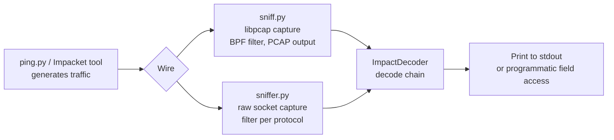
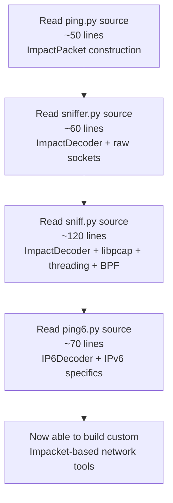

title: "sniffer.py"
script: "examples/sniffer.py"
category: "Network Analysis"
status: "Published"
protocols:
  - IP
  - ICMP
  - TCP
  - UDP
ms_specs: []
mitre_techniques:
  - T1040
auth_types: []
tags:
  - impacket
  - impacket/examples
  - category/network_analysis
  - status/published
  - protocol/ip
  - protocol/icmp
  - protocol/tcp
  - protocol/udp
  - technique/raw_socket_capture
  - technique/protocol_filtered_capture
  - technique/impact_decoder_reference
  - mitre/T1040
aliases:
  - sniffer
  - raw-socket-sniffer
  - protocol-filtered-sniffer
  - impacket-raw-capture


# sniffer.py

> **One line summary:** Minimal raw socket packet sniffer written by Gerardo Richarte (`@gerasdf`) and Javier Kohen at Core Security as a reference example for Impacket's `ImpactDecoder`, opening one raw socket per IP protocol the user requests (default `icmp`, `tcp`, `udp`) and decoding each received packet via the `IPDecoder` class to print human readable header summaries; ~60 lines of Python total, deliberately spare to make the raw socket mechanics and decoder traversal pattern readable end to end; the architectural sibling of `sniff.py` which targets the same goal (passive packet capture with Impacket decoding) using libpcap via `pcapy` instead of raw sockets, and the contrast between the two tools is the article's primary teaching value: when raw sockets work (Linux with CAP_NET_RAW or root, single host capture, IP layer protocols only), when pcapy is required (Windows, link layer access, BPF filtering, offline PCAP file replay), and why Impacket ships both as deliberate demonstrations of two different capture strategies; uses the `select()` syscall to multiplex up to N raw sockets in a single readiness loop, an idiom that predates modern asyncio by decades and is still the right answer for any small synchronous tool that needs to wait on multiple file descriptors; **continues Network Analysis at 4 of 7 articles (57%), with three stubs remaining (`mqtt_check.py`, `nmapAnswerMachine.py`, `split.py`) before the category closes as the 12th complete category in the wiki**.

| Field | Value |
|:---|:---|
| Script | `examples/sniffer.py` |
| Category | Network Analysis |
| Status | Published |
| Authors | Gerardo Richarte (`@gerasdf`), Javier Kohen, both at Core Security |
| Companion tool | [`sniff.py`](sniff.md) (capture based on libpcap) - the article makes the contrast explicit and treats the two tools as a deliberate pedagogical pair |
| Primary protocols | IP family (ICMP, TCP, UDP by default; any IP protocol number can be supplied) |
| MITRE ATT&CK techniques | T1040 Network Sniffing |
| Authentication | None (capture is local to the host running the tool) |
| Privileges required | Root, or `CAP_NET_RAW` capability on Linux. Cannot run unprivileged. |
| Implementation size | ~60 lines of Python |
| Imports of note | `from impacket import ImpactDecoder` (the reference purpose of the script) |
| Library reference role | Demonstrator for `ImpactDecoder.IPDecoder.decode()` and the resulting decoded packet's accessor methods |


## Prerequisites

This article assumes familiarity with:

- [`sniff.py`](sniff.md) for the libpcap based capture approach and the `ImpactDecoder` API in detail. sniffer.py reuses the decoder side wholesale and contrasts on the capture side. Reading sniff.py first makes the contrast in this article more useful.
- [`ping.py`](ping.md) for the construction side of Impacket's networking library (`ImpactPacket`). ping.py + sniff.py + sniffer.py + ping6.py form the four article reference set for "Impacket as a general networking library beyond Windows protocols."
- Linux raw socket basics: `socket.AF_INET` + `socket.SOCK_RAW` + protocol number, the `IP_HDRINCL` socket option for outbound use, and the requirement for `CAP_NET_RAW` or root to open raw sockets.
- The `select()` system call as a readiness primitive across multiple file descriptors. Modern Python code typically uses asyncio for this kind of multiplexing, but `select.select()` remains the right answer for small synchronous tools and is what sniffer.py uses.


## What it does

`sniffer.py` opens one raw socket per IP protocol the user names on the command line (defaulting to `icmp`, `tcp`, `udp` if no protocols are supplied), uses `select.select()` to wait for any of those sockets to become readable, decodes each received packet via `ImpactDecoder.IPDecoder().decode()`, and prints the decoded packet's `__str__()` representation to stdout. Runs forever until interrupted with Ctrl-C.

Default invocation:

```text
$ sudo sniffer.py
Using default set of protocols. A list of protocols can be supplied from the command line, eg.: sniffer.py <proto1> [proto2] ...
IP source: 10.10.10.1 destination: 10.10.10.50 protocol: 1
ICMP type: 8 code: 0 id: 23456 sequence: 1
... (data) ...
IP source: 10.10.10.50 destination: 10.10.10.1 protocol: 1
ICMP type: 0 code: 0 id: 23456 sequence: 1
... (data) ...
IP source: 10.10.10.50 destination: 142.250.80.46 protocol: 6
TCP source port: 54321 destination port: 443 sequence: 1234567890 ack: 0 flags: SYN
... (and so on) ...
```

Specifying a non default protocol list:

```text
$ sudo sniffer.py icmp
... (only ICMP packets) ...

$ sudo sniffer.py tcp udp
... (only TCP and UDP, no ICMP) ...
```

Protocol names are passed directly to `socket.getprotobyname()`, so any name in `/etc/protocols` works: `icmp`, `tcp`, `udp`, `igmp`, `ipv6-icmp`, `gre`, `esp`, `ah`, etc. Case insensitive.

The output format is whatever each decoded packet's `__str__` method produces. The format is human readable but not machine parseable; for parseable output, modify the script to access individual fields directly. The article's "Practical usage" section includes an example.


## Why it exists

### The reference purpose

The script's docstring explicitly says "Reference for: ImpactDecoder." That's the primary purpose. sniffer.py exists to demonstrate, in the smallest possible amount of code, how to:

1. Open raw sockets for specific IP protocols.
2. Use `select()` to multiplex reading from multiple sockets.
3. Pass received bytes to `IPDecoder().decode()`.
4. Print the resulting decoded packet.

That's the entire script. About 60 lines. Designed to be readable as a teaching example, not as production tooling.

This is the same design philosophy as [`ping.py`](ping.md) (reference for `ImpactPacket` construction) and [`sniff.py`](sniff.md) (reference for libpcap based capture with ImpactDecoder). All three are deliberately spare so a reader can understand the underlying library by reading the example. None of them are intended to compete with production tools like tcpdump or Wireshark for operational capture work.

### Why both sniffer.py and sniff.py exist

The two are functionally similar (passive packet capture with Impacket decoding) but architecturally different (raw sockets vs libpcap). Both ship in Impacket because both demonstrate valid capture strategies and the contrast itself is educational.

| Property | `sniffer.py` (raw socket) | `sniff.py` (libpcap) |
|:---|:---||
| Capture mechanism | `socket.SOCK_RAW` per protocol | `pcapy.open_live()` |
| Filter mechanism | Per-socket protocol number filter at kernel | BPF filter via `setfilter()` |
| Layer captured | IP header and above (Layer 3+) | Full frame including Ethernet (Layer 2+) |
| Privileges required | `CAP_NET_RAW` or root | `CAP_NET_RAW` or root, plus libpcap installed |
| Cross-platform | Linux only in practice (Windows raw sockets are heavily restricted) | Linux, macOS, Windows (with WinPcap/Npcap) |
| Loopback capture | Works on Linux | Works with appropriate libpcap support |
| Filter expressiveness | Limited to "protocol N or not" | Full BPF (port, host, size, flags, etc.) |
| Offline PCAP read | Not supported | Supported via `open_offline()` |
| Dependencies | Standard library only | `pcapy` Python binding plus libpcap C library |
| Code size | ~60 lines | ~120 lines |
| First appearance in Impacket | Very early (one of the original reference examples) | Very early (also one of the originals) |

The right tool depends on the situation:

- For a quick Linux only test of "what's on this interface", sniffer.py is enough.
- For BPF filtering, Windows support, or offline PCAP analysis, sniff.py is required.
- For production capture, neither: use tcpdump, tshark, or a custom script built on Scapy.

### Why this lives in Impacket at all

Impacket's roots are in the early 2000s as a Python alternative to libnet/libpcap/struct.pack for protocol research at Core Security. The networking library (ImpactPacket and ImpactDecoder) predates the Windows protocol implementations (SMB, MSRPC, Kerberos) that Impacket is now famous for.

sniffer.py and ping.py are artifacts of that earlier era when Impacket was primarily a low level networking library. The Windows protocol tools eclipsed them in operational visibility but the foundational packet construction and decoding modules continue to ship and continue to be useful for any researcher who wants to construct, capture, or decode arbitrary IP traffic from Python.

The pedagogical role is real: a researcher reading the Impacket source to understand ImpactDecoder learns most efficiently by reading sniffer.py first (60 lines, raw sockets, single threaded, no external dependencies) and then sniff.py (more substantial, demonstrates libpcap idioms and BPF filters). The two together cover the decoder API in two different operational contexts.


## Protocol theory

### Raw sockets (`SOCK_RAW`) on Linux

A raw socket is a socket that gives the application direct access to packets at the IP layer without processing at the protocol level. Three relevant variants:

- **`socket.AF_PACKET` + `SOCK_RAW`**: full Layer 2 access including Ethernet headers. Linux only.
- **`socket.AF_INET` + `SOCK_RAW` + `IPPROTO_<protocol>`**: Layer 3 access with the kernel handling Ethernet but exposing the IP header and payload. Available across platforms in principle (Linux, BSD, macOS, Windows with restrictions).
- **`socket.AF_INET6` + `SOCK_RAW` + `IPPROTO_<protocol>`**: same as above for IPv6.

sniffer.py uses the second variant: `socket.AF_INET` raw sockets per IP protocol. This means:

- The kernel still processes Ethernet headers (sniffer.py doesn't see them).
- The kernel filters by IP protocol number (sniffer.py only receives packets for the protocols it requested).
- The kernel does NOT process TCP/UDP state (sniffer.py sees raw TCP segments and UDP datagrams without any flow tracking).
- Only locally received packets are visible (sniffer.py is not a tap; it sees what the kernel routes to this host).

This last point is critical and limits sniffer.py's operational utility. On a switched network, the host running sniffer.py only sees:

- Traffic destined for this host's IP addresses.
- Broadcast traffic.
- Multicast traffic the host has joined.
- Traffic the host originates.

It does NOT see traffic between other hosts on the network unless the switch is mirroring (SPAN port), the host is on a hub (rare), or the host has been ARP spoofed into a position to see other traffic. For comparison, libpcap based capture via sniff.py can observe in promiscuous mode if the interface supports it - the NIC accepts frames not addressed to it and passes them up the stack.

### `IP_HDRINCL` and why sniffer.py doesn't set it

The `IP_HDRINCL` socket option is for outbound use: when set, the kernel expects the application to provide the entire IP header rather than constructing one. ping.py sets `IP_HDRINCL` because it constructs ICMP packets and wants to send raw IP traffic.

sniffer.py is purely on the receive side: it never sends. It does not set `IP_HDRINCL`. On the receive side, raw socket reads always include the IP header on Linux regardless of the socket option, so sniffer.py gets the full IP packet starting from the IP header byte.

### `select()` multiplexing

`select.select()` is the classic Unix system call for waiting on multiple file descriptors. The Python wrapper accepts three lists (ready for read, ready for write, exception) and an optional timeout. It blocks until at least one descriptor in the read list has data available (or the write list has buffer space, etc.), then returns lists of which descriptors are ready.

sniffer.py opens one raw socket per requested protocol and passes them all into `select.select()`. When any socket has data, sniffer.py iterates the ready list and reads from each one.

```python
ready_to_read, _, _ = select(rawSockets, [], [])
for s in ready_to_read:
    packet = s.recvfrom(1500)[0]
    decoded = decoder.decode(packet)
    print(decoded)
```

This pattern is structurally identical to an echo server based on select, an event loop in a single threaded GUI, or a chat server with multiple connections. It's the canonical Unix multiplexing idiom and predates modern alternatives (epoll, kqueue, asyncio) by decades. For 3-4 sockets it's perfectly adequate; for hundreds of sockets, modern alternatives scale better but are unnecessary complexity for a 60-line teaching example.

### `ImpactDecoder.IPDecoder`

`ImpactDecoder` provides decoder classes for many protocols: `EthDecoder`, `IPDecoder`, `IP6Decoder`, `TCPDecoder`, `UDPDecoder`, `ICMPDecoder`, `ARPDecoder`, and so on. Each has a `decode(buffer)` method that parses bytes and returns a packet object.

Because sniffer.py works at the IP layer (raw sockets do not include Ethernet), it instantiates `IPDecoder()` and calls `decode(packet_bytes)`. The decoder handles the IP header, identifies the next protocol (TCP, UDP, ICMP, etc.) by IP protocol number, and recursively decodes the payload using the appropriate sub-decoder.

The result is a packet object that has accessor methods for each header field and a `child()` method to access the decoded payload. The `__str__` method walks the chain and produces a human readable summary, which is what sniffer.py's `print()` calls produce.

For programmatic field access, the pattern is:

```python
ip = decoder.decode(packet)
src = ip.get_ip_src()
dst = ip.get_ip_dst()
proto = ip.get_ip_p()  # 1=ICMP, 6=TCP, 17=UDP

if proto == 6:  # TCP
    tcp = ip.child()
    sport = tcp.get_th_sport()
    dport = tcp.get_th_dport()
    flags = tcp.get_th_flags()
```

The decoded packet behaves like a layered structure mirroring the wire format. Walking child() down the layers gives access to each protocol's fields.


## How the tool works internally

The complete script structure (paraphrased and trimmed for clarity):

```python
from select import select
import socket
import sys
from impacket import ImpactDecoder

DEFAULT_PROTOCOLS = ('icmp', 'tcp', 'udp')

if len(sys.argv) == 1:
    toListen = DEFAULT_PROTOCOLS
    print("Using default set of protocols. ...")
else:
    toListen = sys.argv[1:]

# Open one raw socket per requested protocol
rawSockets = []
for protocol in toListen:
    try:
        protocol_num = socket.getprotobyname(protocol)
    except socket.error:
        print("Ignoring unknown protocol: %s" % protocol)
        continue
    s = socket.socket(socket.AF_INET, socket.SOCK_RAW, protocol_num)
    rawSockets.append(s)

# Decoder for IP packets
decoder = ImpactDecoder.IPDecoder()

# Main loop
while True:
    ready_to_read, _, _ = select(rawSockets, [], [])
    for s in ready_to_read:
        packet = s.recvfrom(1500)[0]
        print(decoder.decode(packet))
```

Some details elided (error handling, edge cases) but the architecture is exactly that. Three phases:

1. **Argument parsing**: figure out which protocols to listen for. No argparse; positional arguments are the protocol names.
2. **Socket setup**: one raw socket per protocol via `socket.getprotobyname` plus `socket.SOCK_RAW`.
3. **Main loop**: `select()` to wait for any socket, read from each ready socket, decode, print.

### Buffer size choice (1500 bytes)

The `recvfrom(1500)` call reads up to 1500 bytes. This is the standard Ethernet MTU and matches what most IP packets fit within. For jumbo frame networks (9000 byte MTU) this would truncate; for normal Ethernet it captures complete packets.

A more robust implementation would use a larger buffer (65535 bytes is the IP packet maximum) to handle any size. The 1500 choice in sniffer.py is one of several places where the script's simplicity as a reference example shows.

### What the tool does NOT do

- Does NOT capture link layer (Ethernet) headers. Raw sockets at AF_INET level start at the IP header.
- Does NOT support BPF filtering. Filtering is per socket by IP protocol number only.
- Does NOT support promiscuous mode. Only locally received packets visible.
- Does NOT write PCAP files. Output goes to stdout in format readable by humans.
- Does NOT read offline PCAP files. Live capture only.
- Does NOT support IPv6 packets. The `IPDecoder` decodes IPv4 only; IPv6 would require `IP6Decoder` which sniffer.py does not instantiate. (For IPv6 raw socket capture, the script would need adapting.)
- Does NOT work on Windows except in very limited ways. Windows raw sockets are heavily restricted since SP2 to mitigate worm spread; Windows raw sockets cannot capture incoming TCP packets in many configurations.
- Does NOT handle reassembly of IP fragments. Each fragment appears as a separate packet.
- Does NOT decode TLS, HTTP, DNS, or any application protocol contents. Decoding stops at the IP+transport layer.
- Does NOT survive packet rates above kernel buffer overflow. High traffic loads cause packet drops without warning.
- Does NOT have a clean exit path. Ctrl-C kills the process; no graceful socket closing.


## Practical usage

### Default capture (ICMP + TCP + UDP)

```bash
sudo ./sniffer.py
```

Captures all ICMP, TCP, and UDP packets on the host. Useful for quick inspection during a debugging session. Output to stdout; redirect to a file for review:

```bash
sudo ./sniffer.py > capture.txt 2>&1
```

### Filter to specific protocols

```bash
# ICMP only (useful for ping debugging)
sudo ./sniffer.py icmp

# TCP only
sudo ./sniffer.py tcp

# Multiple
sudo ./sniffer.py icmp tcp

# IGMP for multicast monitoring
sudo ./sniffer.py igmp

# GRE for tunnel debugging
sudo ./sniffer.py gre
```

Any IP protocol named in `/etc/protocols` is accepted. Numeric values may also work depending on Python version (`getprotobyname` accepts strings only, but the script could be modified to accept numbers).

### Inside a virtual machine for pen testing labs

When learning network protocols in a lab, sniffer.py is useful to verify that traffic Impacket-based tools generate is what you expect on the wire. Run sniffer.py in one terminal, run [`ping.py`](ping.md) or another Impacket tool in another, observe the traffic.

```bash
# Terminal 1 (in lab VM)
sudo ./sniffer.py icmp

# Terminal 2 (in lab VM)
ping.py 10.10.10.50 10.10.10.51

# Terminal 1 now shows the ICMP echo and reply packets as decoded by ImpactDecoder
```

### Custom field extraction (modified script)

The default print output is human readable but not parseable. For programmatic use, a small modification extracts specific fields:

```python
# Replace the print line with:
ip = decoder.decode(packet)
print("%s -> %s proto=%d" % (ip.get_ip_src(), ip.get_ip_dst(), ip.get_ip_p()))
```

For TCP-specific extraction:

```python
ip = decoder.decode(packet)
if ip.get_ip_p() == 6:
    tcp = ip.child()
    print("%s:%d -> %s:%d flags=0x%02x" % (
        ip.get_ip_src(), tcp.get_th_sport(),
        ip.get_ip_dst(), tcp.get_th_dport(),
        tcp.get_th_flags()
    ))
```

These modifications turn sniffer.py into a small custom protocol monitor. The decoder API is the part being demonstrated; the surrounding script is meant to be modified.

### When to use sniffer.py vs sniff.py

Recommendation tree:

- **Need BPF filtering** (`tcp port 443`, `host 10.0.0.1`, etc.) → use [`sniff.py`](sniff.md).
- **Need to capture link layer** (Ethernet headers, ARP, anything below IP) → use [`sniff.py`](sniff.md).
- **Need to read offline PCAP files** → use [`sniff.py`](sniff.md).
- **Need to capture on Windows** → use [`sniff.py`](sniff.md) with Npcap.
- **Quick Linux capture filtered to specific IP protocols** → sniffer.py.
- **Learning the ImpactDecoder API** → read sniffer.py first (smaller, simpler), then sniff.py.
- **Production capture with PCAP output** → use tcpdump or tshark, not Impacket tools.

### Key flags

sniffer.py has no flags in the modern argparse sense. All arguments are positional protocol names:

```text
sudo ./sniffer.py [proto1] [proto2] [proto3] ...
```

If no protocols specified, defaults to `icmp tcp udp`. If specified, those replace the defaults entirely (no additive behavior).

This is one of the script's few rough edges. A modern rewrite would use argparse with a `--protocol` flag accepting multiple values, but the current form preserves the original 2003-era simplicity.


## What it looks like on the wire

sniffer.py is purely on the receive side; it does not generate traffic. From a wire perspective there is nothing to see. The interesting captures are whatever traffic arrives at the host running sniffer.py.

For traffic that sniffer.py captures and decodes:

### IP header summary in output

For every captured packet, sniffer.py prints something like:

```text
IP source: 10.10.10.1 destination: 10.10.10.50 protocol: 1 ttl: 64 ...
```

The fields are whatever `IPDecoder.__str__()` chooses to display. Common fields: source IP, destination IP, protocol number, TTL, fragmentation flags, checksum.

### TCP packet decoding

When the IP protocol is 6 (TCP), the decoder traverses to TCP and prints TCP fields:

```text
TCP source: 54321 destination: 443 sequence: 1234567890 ack: 0 flags: SYN window: 64240 ...
```

### UDP packet decoding

```text
UDP source: 53 destination: 35642 length: 156 ...
```

### ICMP packet decoding

```text
ICMP type: 8 code: 0 id: 12345 sequence: 1
ICMP type: 0 code: 0 id: 12345 sequence: 1
```

Type 8 is Echo Request (ping), type 0 is Echo Reply.

### Wireshark equivalent

The same captured traffic seen in Wireshark would show full Ethernet frames (which sniffer.py doesn't see), full protocol decoding, and the actual packet bytes. sniffer.py's value is the API demonstration, not the capture quality.


## What it looks like in logs

sniffer.py is a local Linux tool. It does not generate network traffic. The host's Linux kernel is the only thing that "sees" sniffer.py at all.

### Linux audit signals

If `auditd` is configured to track syscalls, sniffer.py's behavior generates:

- `socket(AF_INET, SOCK_RAW, ...)`: three or more raw socket creations.
- `setsockopt` calls (none in sniffer.py specifically, since it doesn't set IP_HDRINCL).
- `select()` calls in the main loop.
- `recvfrom()` calls when packets arrive.

A monitoring policy for raw socket creation would catch sniffer.py at process start. SELinux and AppArmor policies on hardened systems may block raw socket creation entirely for processes other than root.

### Process indicators

- Process running as root (or with `CAP_NET_RAW`).
- Process named `python` or `python3` running `sniffer.py` (or whatever the operator named it).
- Long-lived process with low CPU usage and no network outbound traffic generated by it.

### Detection approach for unauthorized capture

- **Process auditing for raw socket creation**: detect any process opening `SOCK_RAW` and alert if the process is unexpected.
- **Capability monitoring**: track which processes have `CAP_NET_RAW`. Limited set in normal operation.
- **EDR with Linux process visibility**: most modern EDR products flag raw socket creation by user space processes.
- **Container security**: capture tools should not run inside production containers; container security platforms can detect raw socket creation as anomalous.

### Sigma rule example (Linux audit)

```yaml
title: Raw Socket Creation by Python Process
logsource:
  product: linux
  service: auditd
detection:
  selection_syscall:
    syscall: 'socket'
    a0: '2'         # AF_INET
    a1: '3'         # SOCK_RAW
  selection_python:
    exe|contains:
      - 'python'
      - 'python3'
  condition: selection_syscall and selection_python
level: medium
```

Medium severity. Many legitimate Python network tools use raw sockets; the detection value is in correlation with other signals (unexpected user, unusual time, unfamiliar script path).


## Detection and defense

### Detection difficulty

Passive packet capture is fundamentally difficult to detect from the network layer because the capturing host generates no traffic. Detection requires either:

- **Endpoint visibility** into the capturing host (process, syscall, capability monitoring).
- **Knowledge from outside the band** that capture is happening (network admin notices unauthorized SPAN port, security team observes anomalous capability grants, etc.).

For sniffer.py specifically, the absence of promiscuous mode usage means even detection at the endpoint level for promiscuous mode (which would catch sniff.py in promiscuous setup) doesn't help. Raw sockets without promiscuous mode look like ordinary networking from the kernel's perspective.

### Preventive controls

- **Privilege restriction**: do not grant `CAP_NET_RAW` to processes that don't need it. Modern Linux defaults restrict raw socket creation to root or processes with the explicit capability.
- **Container security**: run application containers with `--cap-drop=NET_RAW`. Most application workloads do not need raw socket access.
- **Network segmentation**: traffic between hosts should be encrypted (TLS, IPsec, SSH) so even successful capture yields little useful information. Defense in depth: assume capture happens, ensure data is protected.
- **No plaintext credentials on the wire**: enforce TLS for all traffic carrying credentials. Disable cleartext protocols (Telnet, FTP, HTTP without TLS, SMTP without STARTTLS).
- **ARP spoofing detection**: many capture scenarios depend on ARP spoofing to see traffic the host wouldn't normally receive. Detection via DAI (Dynamic ARP Inspection on switches) or ARP monitoring on the host itself.
- **Switch port security**: limit MAC addresses per port, disable unused ports, configure 802.1X for port authentication.

### What sniffer.py does NOT enable

- Does NOT capture traffic between other hosts on a switched network without ARP spoofing or SPAN/mirror port access. The host sees only what the kernel routes to it.
- Does NOT decrypt encrypted traffic. TLS, SSH, IPsec all remain opaque.
- Does NOT perform packet injection. Receive-side only.
- Does NOT work on Windows for most realistic capture scenarios. Windows raw socket restrictions limit incoming packet visibility.
- Does NOT survive sustained high traffic rates. Kernel buffer overflow drops packets silently.
- Does NOT process Ethernet headers. Layer 2 invisible.


## Related tools and attack chains

sniffer.py **continues Network Analysis at 4 of 7 articles (57%)**. Three stubs remain (`mqtt_check.py`, `nmapAnswerMachine.py`, `split.py`) before the category closes as the 12th complete category in the wiki.

### Related Impacket tools

- [`sniff.py`](sniff.md) is the capture companion based on libpcap. Same basic goal (passive capture with Impacket decoding), different mechanism (pcapy + libpcap vs raw sockets). The article makes the contrast explicit because the two together teach two distinct capture strategies. For most operational use, sniff.py is more capable; for learning the decoder API specifically, sniffer.py is simpler.
- [`ping.py`](ping.md) is the construction side companion: where sniffer.py demonstrates `ImpactDecoder`, ping.py demonstrates `ImpactPacket`. The two together cover Impacket's general networking library API end to end.
- [`ping6.py`](ping6.md) is the IPv6 construction companion. A natural extension exercise for a reader who has worked through ping.py + sniffer.py would be writing a `sniffer6.py` that uses `IP6Decoder`. The Impacket source includes the `IP6Decoder` class but no example tool ships using it for capture.
- [`split.py`](split.md) (pending wiki article) is the PCAP file manipulation utility in the same Network Analysis category. Logically downstream from any capture work that produces PCAP output.

### External alternatives

- **`tcpdump`**: the canonical Unix packet capture tool. BPF filters, PCAP output, decades of stability, available on every Unix system. For any production capture need, tcpdump is the right answer.
- **`tshark`**: Wireshark's command line interface. Same dissectors as Wireshark with full protocol decoding for hundreds of protocols. Heavy compared to sniffer.py but vastly more capable.
- **`Wireshark`**: the canonical GUI packet analyzer. Live capture and offline analysis. Industry standard.
- **`Scapy`**: Python packet crafting and analysis library. Much more capable than sniffer.py for any nontrivial Python packet work; the right choice for building production tools.
- **`pyshark`**: Python wrapper around tshark. Combines Python convenience with tshark's full dissector library.
- **`Zeek`** (formerly Bro): network security monitor with rich protocol parsers and scripting. Different category of tool; not directly comparable.
- **Custom raw socket scripts**: many security researchers write their own minimal raw socket Python tools. sniffer.py is essentially the canonical reference for that pattern within the Impacket ecosystem.

For operational capture work, tcpdump or tshark are essentially always the right answer. For Python research code that needs to receive and decode IP packets, Scapy is usually preferred. sniffer.py's role is reference documentation for the Impacket library, not operational tooling.

### Capture and analysis chain



Both capture tools feed the same decoder. Construction (ping.py) and capture (sniff.py / sniffer.py) form the full cycle of the Impacket networking library.

### Educational chain for learning Impacket as a networking library



The reference set of four articles is intentional. A reader who works through ping.py → sniffer.py → sniff.py → ping6.py in that order has a complete grounding in the Impacket networking library, in the order that the concepts build naturally on each other.


## Further reading

- **Impacket sniffer.py source** at `https://github.com/fortra/impacket/blob/master/examples/sniffer.py`. Canonical implementation. ~60 lines.
- **Impacket sniff.py source** at `https://github.com/fortra/impacket/blob/master/examples/sniff.py`. The pcapy-based companion for comparison.
- **Impacket ImpactDecoder source** at `https://github.com/fortra/impacket/blob/master/impacket/ImpactDecoder.py`. The decoder library that sniffer.py demonstrates.
- **Impacket ImpactPacket source** at `https://github.com/fortra/impacket/blob/master/impacket/ImpactPacket.py`. The construction library that ping.py demonstrates.
- **Linux man page for `socket(7)`** at `https://man7.org/linux/man-pages/man7/socket.7.html`. AF_INET + SOCK_RAW semantics.
- **Linux man page for `raw(7)`** at `https://man7.org/linux/man-pages/man7/raw.7.html`. Raw socket specifics, IP_HDRINCL, kernel filtering.
- **Linux man page for `select(2)`** at `https://man7.org/linux/man-pages/man2/select.2.html`. The multiplexing primitive sniffer.py uses.
- **W. Richard Stevens, "UNIX Network Programming Volume 1"**. Chapter on raw sockets remains the canonical reference for this style of Unix network programming.
- **`tcpdump` documentation** at `https://www.tcpdump.org/`. The production reference for packet capture.
- **`Scapy` documentation** at `https://scapy.readthedocs.io/`. The Python alternative for nontrivial packet work.
- **MITRE ATT&CK T1040 Network Sniffing** at `https://attack.mitre.org/techniques/T1040/`.

If you want to internalize sniffer.py, the productive exercise has two parts. First, on a Linux host with root or `CAP_NET_RAW`, run `sudo ./sniffer.py icmp` in one terminal and `ping 8.8.8.8` in another; observe the ICMP echo and reply packets as decoded output. Modify the script to extract just source IP, destination IP, and ICMP type into a single line per packet; observe how decoder field accessors work. Second, do the same exercise with `sniff.py` and the BPF filter `icmp`. Compare the two scripts side by side: what does sniff.py do that sniffer.py doesn't? Why does sniff.py need `pcapy` while sniffer.py doesn't? When would each be the right choice? After this exercise, the architectural difference between raw sockets and libpcap as capture mechanisms becomes concrete, and the reason Impacket ships both as reference examples becomes clear: they are deliberately designed as a pedagogical pair, not as redundant alternatives.
