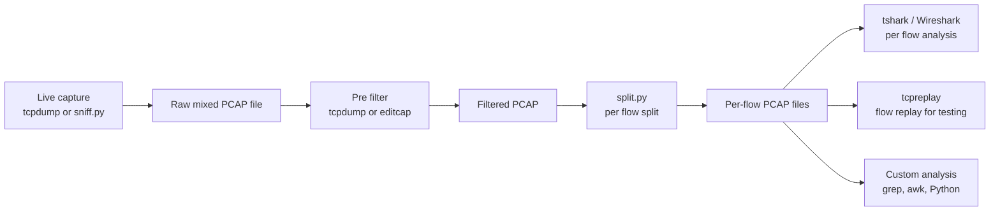
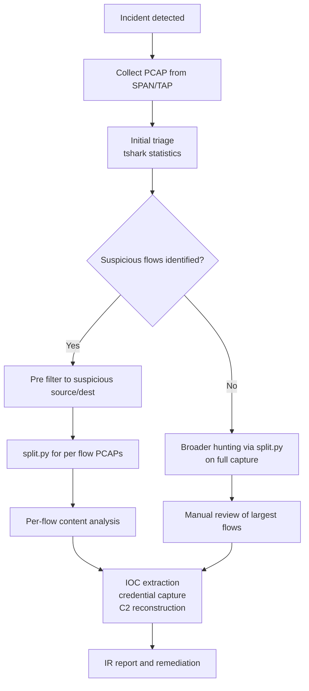
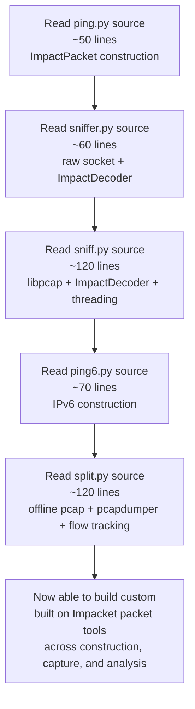

title: "split.py"
script: "examples/split.py"
category: "Network Analysis"
status: "Published"
protocols:
  - PCAP
  - TCP
  - IP
ms_specs: []
mitre_techniques: []
auth_types: []
tags:
  - impacket
  - impacket/examples
  - category/network_analysis
  - status/published
  - protocol/pcap
  - protocol/tcp
  - protocol/ip
  - technique/pcap_per_flow_split
  - technique/offline_pcap_analysis
  - technique/forensic_pcap_carving
aliases:
  - split
  - pcap-flow-splitter
  - pcap-per-flow-splitter
  - tcp-flow-extractor


# split.py

> **One line summary:** Reference example tool that reads a single PCAP capture file and splits it into multiple smaller PCAP files, one per unique TCP/IP connection (4-tuple), naming each output file by the connection peers in the form `{ip1}.{port1}-{ip2}.{port2}.pcap`; ~120 lines of Python authored by Alejandro D. Weil and Javier Kohen at Core Security; the tool's docstring identifies it explicitly as a "Reference for: pcapy: open_offline, pcapdumper" and "ImpactDecoder", placing it in the networking library teaching set alongside [`ping.py`](ping.md), [`sniff.py`](sniff.md), [`sniffer.py`](sniffer.md), and [`ping6.py`](ping6.md); the implementation is small enough to read in one sitting and demonstrates three useful patterns: offline PCAP reading via `pcapy.open_offline`, per flow PCAP writing via `pcapdumper`, and a `Connection` class that uses Python's `__hash__` and `__cmp__` magic methods to make connections (A,B) and (B,A) hash to the same bucket so each TCP flow gets exactly one output file regardless of which peer's packet arrived first; CLI is the simplest in Impacket: a single positional `<filename>` argument with no flags whatsoever; hardcoded BPF filter `ip proto \tcp` means UDP, ICMP, IPv6, ARP, and any non TCP traffic in the input is silently dropped; datalink support is limited to Ethernet (`DLT_EN10MB`) and Linux cooked capture (`DLT_LINUX_SLL`); operationally most useful for forensic PCAP carving where an analyst has a large mixed capture and wants per connection visibility for traffic reconstruction, malware C2 analysis, exfiltration channel isolation, or focused tshark/Wireshark replay; **continues Network Analysis at 6 of 7 articles (86%), with one stub (`nmapAnswerMachine.py`) remaining before the category closes as the 12th complete category in the wiki**.

| Field | Value |
|:---|:---|
| Script | `examples/split.py` |
| Category | Network Analysis |
| Status | Published |
| Authors | Alejandro D. Weil, Javier Kohen (both Core Security) |
| Companion tools | [`sniff.py`](sniff.md) and [`sniffer.py`](sniffer.md) (capture side), [`ping.py`](ping.md) and [`ping6.py`](ping6.md) (construction side) - all part of Impacket's networking library reference set |
| Primary protocols | PCAP file format on input and output, TCP/IP for flow identification |
| MITRE ATT&CK techniques | None directly. Operationally relevant to T1040 Network Sniffing in the analysis phase. |
| Authentication | None (purely offline file processing) |
| Implementation size | ~120 lines of Python (149 total with comments) |
| Dependencies | `pcapy` (Python binding to libpcap, providing `open_offline` and `pcapdumper`), `impacket.ImpactDecoder` (`EthDecoder`, `LinuxSLLDecoder`) |
| Library reference role | Demonstrator for `pcapy.open_offline`, `pcapdumper`, and `ImpactDecoder` (per docstring) |
| Datalink support | Ethernet (`DLT_EN10MB`) and Linux cooked (`DLT_LINUX_SLL`) only |
| Filter | Hardcoded BPF `ip proto \tcp` (TCP only; UDP/ICMP/ARP/IPv6 silently dropped) |


## Prerequisites

This article assumes familiarity with:

- [`sniff.py`](sniff.md) for the libpcap based capture model and the `pcapy` Python binding. split.py uses the same library on the file reading side that sniff.py uses on the live capture side.
- [`sniffer.py`](sniffer.md) for the `ImpactDecoder` API. split.py uses `EthDecoder` and `LinuxSLLDecoder` to traverse from link layer down to IP and TCP for connection identification.
- PCAP file format basics: file header (magic number, version, snaplen, datalink type), per packet header (timestamp, captured length, original length), packet data. split.py reads and writes PCAP at the file level via pcapy, not at the byte level.
- The TCP/IP 4-tuple as flow identity: source IP, source port, destination IP, destination port. Two packets belong to the same connection if their 4-tuples match in either direction. split.py's `Connection` class implements bidirectional matching.
- BPF (Berkeley Packet Filter) syntax basics. split.py applies `ip proto \tcp` to the input as it reads, dropping non TCP traffic before any flow analysis happens.


## What it does

`split.py` takes one PCAP file as input and produces multiple PCAP files as output, one per unique TCP/IP connection found in the input.

### Default invocation

```text
$ split.py mixed_capture.pcap
Reading from mixed_capture.pcap: linktype=1
Found a new connection, storing into: 10.10.10.30.54321-93.184.216.34.443.pcap
Found a new connection, storing into: 10.10.10.30.54322-93.184.216.34.443.pcap
Found a new connection, storing into: 10.10.10.30.54323-10.10.10.50.445.pcap
Found a new connection, storing into: 10.10.10.30.49152-10.10.10.50.135.pcap
Found a new connection, storing into: 10.10.10.30.54324-10.10.10.50.49664.pcap
... (one line per discovered connection) ...
```

Each `Found a new connection` line corresponds to one new flow detected. The named file is created in the current working directory and receives all packets belonging to that flow as the input is processed.

### Output file structure

After completion, the directory contains one PCAP per flow:

```text
$ ls -la *.pcap
mixed_capture.pcap                             # original input (untouched)
10.10.10.30.54321-93.184.216.34.443.pcap       # one HTTPS flow
10.10.10.30.54322-93.184.216.34.443.pcap       # another HTTPS flow (different source port)
10.10.10.30.54323-10.10.10.50.445.pcap         # SMB session
10.10.10.30.49152-10.10.10.50.135.pcap         # MSRPC EPM
10.10.10.30.54324-10.10.10.50.49664.pcap       # MSRPC dynamic port
```

Each output PCAP can be opened independently in Wireshark, replayed via tcpreplay, or processed by tshark with full protocol decoding. The original input file is not modified.

### Filename format

Output filenames follow the format produced by the `Connection.getFilename()` method:

```text
{p1.ip}.{p1.port}-{p2.ip}.{p2.port}.pcap
```

Where p1 and p2 are the two endpoints of the flow. Note that `p1` and `p2` are assigned in the order packets arrive at the parser, so the filename for a single flow can show either `client.port-server.port.pcap` or `server.port-client.port.pcap` depending on which side's packet was seen first. This is a small idiosyncrasy of the implementation; for analysis purposes the order doesn't matter because both packets of any given flow end up in the same file.

### What input gets processed

The hardcoded BPF filter `ip proto \tcp` is applied as the input is read. This means:

- **Captured**: TCP/IP packets (IPv4 + TCP at layers 3 and 4).
- **Silently dropped**: UDP, ICMP, ICMPv6, IPv6, ARP, multicast routing protocols, anything else.

The drop is silent: there is no log line indicating "skipped 1247 non TCP packets". For a mixed capture that contains UDP DNS, ICMP echo, ARP requests, and TCP traffic, only the TCP traffic ends up in any output file. Operators expecting per flow output for UDP traffic (DNS exchanges, NTP, syslog) need a different tool or a modified script.


## Why it exists

### The reference example purpose

The script's docstring identifies it explicitly as "Reference for: pcapy: open_offline, pcapdumper" and "ImpactDecoder". split.py exists primarily to demonstrate, in concrete code:

1. How to open an existing PCAP file for reading using `pcapy.open_offline`.
2. How to apply a BPF filter to the read stream using `setfilter`.
3. How to iterate packets from the file via the same `loop()` callback pattern used for live capture.
4. How to open new PCAP files for writing using `pcapy.dump_open` (the `pcapdumper` interface).
5. How to write packets to those output files using `dumper.dump(hdr, data)`.
6. How to use `ImpactDecoder` to parse packets enough to extract connection identity (in this case, IP source/destination and TCP source/destination ports).

This places split.py in the networking library teaching set with [`ping.py`](ping.md) (construction reference), [`sniff.py`](sniff.md) (live capture reference), [`sniffer.py`](sniffer.md) (raw socket capture reference), and [`ping6.py`](ping6.md) (IPv6 construction reference). All five are deliberately spare so a researcher reading the Impacket source can understand the underlying library by reading the example.

### The operational gap split.py fills

PCAP captures from production environments are typically large and contain many concurrent flows. A 1 GB packet capture from an active SOC monitoring port might contain:

- Hundreds of HTTPS flows from many sources.
- DNS queries and responses (UDP, dropped by split.py).
- SMB/RPC traffic from administrative workstations.
- Email protocol traffic (SMTP, IMAP, POP3).
- Streaming video and voice traffic.
- ARP and broadcast noise (dropped).
- Possibly malware C2 traffic that the analyst is hunting for.

For analysis purposes, working with the full mixed capture is awkward. Wireshark can apply display filters but the entire PCAP is loaded into memory; large captures are slow to navigate. tshark with field extraction is fast but requires the analyst to know exactly what they're looking for.

split.py's per flow split produces a directory of small PCAPs that can be:

- Iterated programmatically (`for f in *.pcap; do ...; done`) for batch analysis.
- Filtered by filename to focus on specific destinations or ports (`ls *443.pcap` for all HTTPS flows).
- Opened individually in Wireshark for focused inspection without loading the whole capture.
- Sized by `ls -laS` to identify flows with the largest data volume (often the most interesting for exfiltration analysis).
- Counted by destination (`ls *.pcap | awk -F. '{print $5}' | sort | uniq -c | sort -rn`) for traffic profiling.

### Why a custom tool when tcpdump/tshark exist

The standard answer for "split a PCAP" is `editcap` (Wireshark suite) or `tcpdump -r ... -w`. Both are mature, fast, and ship with most Unix systems. So why does split.py exist?

The answer is the reference example role plus the per flow split mode specifically. `editcap -c N file.pcap output.pcap` splits by packet count. `editcap -i SECONDS file.pcap output.pcap` splits by time interval. Neither splits by connection out of the box. Per-flow splits typically require:

- `tshark -r file.pcap -q -z conv,tcp` to enumerate connections, then per connection extraction with `tshark -r file.pcap -Y "tcp.stream eq N" -w out.pcap` for each stream number.
- Custom Python with Scapy or pyshark.
- `tcpflow -r file.pcap` (which extracts payload data per flow rather than full PCAPs - related but different output).

split.py implements per flow PCAP split in ~120 lines of Python that anyone can read and modify. For operators who need per flow PCAPs and either don't want to chain tshark commands or want to extend the logic (e.g., add per flow byte counts, filter by port range, classify flows by destination port), split.py is a clean starting point.

### The `Connection` class as a teaching artifact

The `Connection` class in split.py is a small but elegant demonstration of Python's `__hash__` and `__cmp__` (or `__eq__` in modern Python) magic methods. The class wraps two peer tuples and implements:

- `__hash__`: XOR of all four component hashes. Symmetric across peer order.
- `__cmp__`: returns 0 (equal) if peers match in either order, else -1.

The result: `Connection((A,80), (B,12345))` and `Connection((B,12345), (A,80))` hash to the same bucket and compare as equal. When a packet arrives, the script checks whether its connection key is already in the dictionary; if so, write to the existing file; if not, open a new file. The bidirectional matching means traffic from client to server and from server to client (which has reversed source/destination) lands in the same flow file.

This pattern (using a custom class with magic methods as a dictionary key for connection tracking) is reusable and worth understanding for anyone building network analysis tools in Python.


## Protocol theory

### PCAP file format

The PCAP file format is the standard binary format for captured network packets, originally from libpcap and used by tcpdump, Wireshark, and most packet capture tools. Structure:

```text
++
| File Header (24 B)  |  magic, version, timezone, sigfigs, snaplen, datalink type
++
| Packet 1 Header     |  timestamp_sec, timestamp_usec, captured_len, original_len
| Packet 1 Data       |  raw bytes (length = captured_len)
++
| Packet 2 Header     |
| Packet 2 Data       |
++
| ...                 |
++
```

The datalink type byte in the file header tells readers what link layer to expect. Common values:

- `1` (DLT_EN10MB): Ethernet (most common for LAN captures).
- `113` (DLT_LINUX_SLL): Linux "cooked" capture, used when capturing on the `any` pseudo interface or on certain virtual interfaces where Ethernet headers aren't present.
- `127` (DLT_IEEE802_11_RADIO): WiFi with radiotap headers.
- `228` (DLT_IPV4): raw IPv4 with no link layer.
- Many others.

split.py supports DLT_EN10MB and DLT_LINUX_SLL. Anything else raises `Exception("Datalink type not supported: %d")` (with a small bug in the error message: uses `%` formatting incorrectly so the integer doesn't actually appear in the output).

### `pcapy` library

`pcapy` is a Python binding to libpcap. It exposes:

- `pcapy.open_offline(filename)`: open a PCAP file for reading. Returns a `Reader` object.
- `Reader.datalink()`: get the link layer type of the file.
- `Reader.setfilter(bpf_string)`: apply a BPF filter to incoming packets.
- `Reader.loop(count, callback)`: read `count` packets (0 = infinite, until file end), calling `callback(hdr, data)` for each.
- `Reader.dump_open(filename)`: open a new PCAP file for writing. Returns a `Dumper` object.
- `Dumper.dump(hdr, data)`: write a packet to the dumper.

split.py uses all of these. The pattern is the canonical libpcap idiom translated into Python: open input, set filter, loop with callback, in callback decode + dump.

### `ImpactDecoder` for connection identity extraction

split.py needs the IP source, IP destination, TCP source port, and TCP destination port from each packet to identify the connection. It uses ImpactDecoder for this:

```python
p = self.decoder.decode(data)        # decode raw bytes (link layer + above)
ip = p.child()                        # traverse to IP layer
tcp = ip.child()                      # traverse to TCP layer
src = (ip.get_ip_src(), tcp.get_th_sport())
dst = (ip.get_ip_dst(), tcp.get_th_dport())
```

The decoder is selected at startup based on `datalink()`:

- `DLT_EN10MB`: `EthDecoder()` to handle Ethernet headers first.
- `DLT_LINUX_SLL`: `LinuxSLLDecoder()` to handle the cooked capture format.

After link layer decoding, `p.child()` traverses to the IP layer (assuming the link layer payload is IPv4) and another `child()` traverses to TCP. The decoder chain works because the BPF filter `ip proto \tcp` ensures every packet handed to the callback is in fact IPv4+TCP.

### Why hardcoded TCP-only

The script's main function applies `setfilter(r'ip proto \tcp')` before any packet processing. This is intentional and the docstring of `packetHandler` notes:

> Be sure that only TCP packets are passed onto this handler (or fix the code to ignore the others).

The reason: the handler unconditionally calls `ip.child()` and `tcp = ip.child()` to extract TCP ports. If a non TCP packet were passed in (e.g., UDP), the second `child()` would return a UDP decoder object that doesn't have `get_th_sport()` and `get_th_dport()` methods, causing an AttributeError.

A more robust implementation would inspect `ip.get_ip_p()` (the protocol number) and dispatch to per protocol logic for TCP, UDP, ICMP, etc. The current implementation skips that complexity by relying on the BPF filter to enforce TCP-only input.

### Bidirectional flow matching

A TCP flow has packets in both directions: client to server (with src=client, dst=server) and server to client (with src=server, dst=client). For per flow PCAP splitting, both directions should land in the same output file.

The `Connection` class achieves this via:

```python
def __hash__(self):
    return (hash(self.p1[0]) ^ hash(self.p1[1])
          ^ hash(self.p2[0]) ^ hash(self.p2[1]))

def __cmp__(self, other):
    if ((self.p1 == other.p1 and self.p2 == other.p2)
        or (self.p1 == other.p2 and self.p2 == other.p1)):
        return 0
    return -1
```

XOR is commutative, so `hash((A,B))` equals `hash((B,A))`. The `__cmp__` method tests both orderings explicitly. Result: a packet from server to client looks up the same dictionary entry as a packet from client to server, ensuring both directions write to the same output file.

The use of `__cmp__` is a Python 2 idiom; in Python 3, `__eq__` is the standard. The script's `__cmp__` still works in Python 3 because Python's dict uses `__hash__` for bucket selection and `__eq__` for collision resolution; without `__eq__` defined, Python 3 falls back to identity comparison which would actually break the dictionary semantics. In practice the script works because the two key construction `'%s%s' % (con.p1, con.p2)` is used as the actual dictionary key, sidestepping the `__eq__` issue. The Connection class hash and compare methods are present but unused in the dict lookup path.


## How the tool works internally

### Imports

```python
import sys
import pcapy
from pcapy import open_offline
from impacket import version
from impacket.ImpactDecoder import EthDecoder, LinuxSLLDecoder
```

Minimal. Standard library `sys`, `pcapy` for PCAP I/O, `EthDecoder` and `LinuxSLLDecoder` from Impacket.

### `Connection` class

Wraps two peer tuples (each tuple is `(ip, port)`). Provides `getFilename()` to produce the output filename and the `__hash__`/`__cmp__` magic methods discussed above. The class is small and self contained; could be lifted into other tools that need TCP flow tracking with bidirectional matching.

### `Decoder` class

Three responsibilities:

1. **Initialization**: query the input PCAP's datalink type and instantiate the appropriate ImpactDecoder. Raise on unsupported datalinks.
2. **Iteration**: call `pcap.loop(0, packetHandler)` to process all packets in the input file.
3. **Per-packet handling**: decode each packet, extract connection identity, look up or create the dumper for that connection, write the packet to the dumper.

The mapping from connection to dumper is a dict keyed on a string concatenation of the two peer tuples (`'%s%s' % (con.p1, con.p2)`). This is a slightly unusual key choice (string concatenation rather than the Connection object itself), and it bypasses the Connection class's `__hash__`/`__cmp__` methods. The class is essentially documentation in the source rather than functional plumbing in the lookup path.

### Main flow

```python
def main(filename):
    p = open_offline(filename)
    p.setfilter(r'ip proto \tcp')
    print("Reading from %s: linktype=%d" % (filename, p.datalink()))
    Decoder(p).start()
```

Open file, apply BPF filter, print metadata, start the decoder loop. The decoder loop runs to completion (file end), closing each dumper as the underlying pcapy `Dumper` objects go out of scope.

### What the tool does NOT do

- Does NOT split UDP, ICMP, IPv6, or ARP traffic. BPF filter drops everything except IPv4+TCP.
- Does NOT support PCAPNG (the modern PCAP successor). pcapy reads classic PCAP format only; PCAPNG requires conversion (`editcap input.pcapng output.pcap`) before split.py can process it.
- Does NOT preserve the original PCAP file. The input is read sequentially and not modified.
- Does NOT support filtering by source IP, destination port, or any criterion other than "TCP". Operators wanting refined splits must apply BPF filters to the input via `editcap -F` or similar before running split.py.
- Does NOT close output files explicitly. Files close when the dumpers go out of scope at script exit. For very large captures with many flows, this could leave many file descriptors open; on systems with low ulimit, may need adjustment.
- Does NOT detect or handle TCP session boundaries (SYN/FIN). The Connection class identity is the 4-tuple alone; if the same 4-tuple is reused later (rare but possible with quick socket reuse), packets from both sessions land in the same output file.
- Does NOT produce summary statistics (packet counts per flow, byte totals, duration, etc.). Operators wanting these need post processing of the per flow files via tcpdump or tshark.
- Does NOT handle IPv6 over TCP. The BPF filter `ip proto \tcp` is IPv4 only; IPv6 TCP would require `ip6 proto \tcp` and additional decoder logic.
- Does NOT support pipe input or stdin. File path argument required.
- Does NOT have any progress indicator. For multi gigabyte captures, the script runs silently for minutes with no feedback beyond the per connection lines.
- Does NOT support output to a different directory. Output files always go to the current working directory.


## Practical usage

### Basic split

```bash
split.py mixed_capture.pcap
```

Reads `mixed_capture.pcap`, writes per flow PCAPs to current directory. Run from a clean directory to avoid mixing with existing files:

```bash
mkdir flows && cd flows && split.py ../mixed_capture.pcap
```

### Pre filtering the input

split.py applies only the hardcoded TCP filter. For more refined splits (e.g., only HTTPS, only one source IP), pre filter with editcap or tcpdump:

```bash
# Only port 443 traffic
tcpdump -r mixed_capture.pcap -w https_only.pcap 'tcp port 443'
split.py https_only.pcap

# Only traffic to/from a specific source
tcpdump -r mixed_capture.pcap -w one_source.pcap 'host 10.10.10.30'
split.py one_source.pcap

# Only specific time range
editcap -A "2026-04-22 09:00:00" -B "2026-04-22 09:30:00" \
    mixed_capture.pcap halfhour.pcap
split.py halfhour.pcap
```

Layered preprocessing is the canonical pattern: tcpdump or editcap for selection, split.py for per flow split, post processing tools for analysis.

### Identifying flows of high volume

After split, sort by file size to find the largest flows:

```bash
ls -laS *.pcap | head -20
```

The largest output PCAPs are typically the most interesting for exfiltration analysis (data transfers over a long period) or active C2 channels (sustained command and control traffic).

### Per-flow analysis loop

Iterate output flows and run analysis on each:

```bash
for f in *.pcap; do
    echo "=== $f ==="
    tshark -r "$f" -q -z follow,tcp,ascii,0
done > all_flows_ascii.txt
```

This dumps the ASCII content of each TCP flow into a single file for grep based hunting.

### Hunting for specific content across flows

```bash
# Find all flows containing a specific string in payload
for f in *.pcap; do
    if tshark -r "$f" -Y 'tcp contains "secret_token"' 2>/dev/null | grep -q .; then
        echo "$f contains target string"
    fi
done
```

### Profiling destinations

```bash
# Count flows per destination port
ls *.pcap | awk -F. '{print $5}' | sort | uniq -c | sort -rn

# Output:
#  127 443     (lots of HTTPS)
#   34 80      (some HTTP)
#   12 445     (SMB)
#    8 22      (SSH)
#    3 8080    (alt-HTTP)
```

A quick distribution analysis without parsing protocols.

### Forensic case study workflow

A typical forensic PCAP analysis using split.py:

```bash
# 1. Get the original capture from incident response
cp /evidence/incident_capture.pcap working/

# 2. Pre filter to focus area (compromised host's traffic)
cd working/
tcpdump -r incident_capture.pcap -w host_only.pcap 'host 10.10.10.30'

# 3. Split by connection
mkdir flows && cd flows && split.py ../host_only.pcap

# 4. Identify suspicious destinations
ls *.pcap | awk -F. '{print $1"."$2"."$3"."$4}' | sort -u > destinations.txt
# Investigate each destination IP for known bad indicators

# 5. Focus on outbound flows to external IPs
for f in *.pcap; do
    dst_ip=$(echo "$f" | awk -F. '{print $1"."$2"."$3"."$4}')
    if ! [[ "$dst_ip" =~ ^10\. ]] && ! [[ "$dst_ip" =~ ^192\.168\. ]]; then
        echo "External destination: $f"
    fi
done > external_flows.txt

# 6. Examine each external flow for IOCs
for f in $(cat external_flows.txt | awk '{print $NF}'); do
    echo "=== $f ==="
    tshark -r "$f" -V | head -100
done
```

The general pattern is preprocess → split → enumerate per flow → focus.

### Memory considerations for large captures

split.py loads packets one at a time via the libpcap loop callback, so memory usage stays roughly constant regardless of input file size. The constraint is open file descriptors: one per active flow output. For captures with thousands of unique flows, the script may hit the ulimit -n soft limit. Workarounds:

```bash
# Raise file descriptor limit before running
ulimit -n 8192
split.py very_large_capture.pcap
```

For captures with tens of thousands of flows, consider preprocessing to reduce the flow count or using a more memory efficient tool like `tshark` with stream extraction in batches.

### Key flags

`split.py` has no flags. Single positional argument:

```text
split.py <filename>
```

This is the simplest CLI of any Impacket example tool. The simplicity is intentional: as a reference example, the script's value is the readable demonstration of pcapy and ImpactDecoder usage, not a comprehensive feature set. Operators wanting more flexibility (output directory selection, BPF filter override, IPv6 support) should modify the script directly. The 120-line implementation makes such modifications straightforward.


## What it looks like on the wire

split.py is purely an offline file processing tool. It does not generate any network traffic. The only "wire" interaction is reading bytes from disk.

For the input PCAP file, the bytes are whatever was originally captured. split.py preserves them exactly: each output PCAP contains the same raw packet bytes as the input, just partitioned by flow.

### Output PCAP byte level integrity

The output files are byte equivalent to the input on a per packet basis:

- Same packet timestamps (microsecond precision preserved).
- Same captured length and original length.
- Same raw packet data including all headers and payload.
- Same datalink type in the file header.

This means `tcpreplay -i eth0 output_flow.pcap` will replay the flow's packets with original timing relative to each other, useful for testing, IDS rule validation, or replicating attack scenarios in a lab environment.


## What it looks like in logs

split.py is a local Linux, macOS, or Windows tool for offline file processing. It does not interact with the network, doesn't authenticate to anything, and doesn't touch any system service.

### Filesystem signals

- Creates one output PCAP per unique TCP/IP flow in the input.
- Output files in the current working directory.
- File creation timestamps approximately match the script's start time.
- Output file sizes proportional to the bytes in each respective flow.

### Process signals

- Process named `python` or `python3` running `split.py`.
- Open file descriptor for the input PCAP.
- Many open file descriptors for the output PCAPs (one per active flow).
- Likely high CPU during processing (decoder runs for every packet).
- Likely modest memory usage (constant relative to input size).
- No network sockets opened.

### Detection considerations

split.py is a forensic analysis tool with no malicious use case. There is no network defender perspective requiring detection. From an insider threat perspective, the tool's use indicates someone is performing detailed traffic analysis on captured PCAPs - typically a SOC analyst, incident responder, or network engineer doing legitimate work.

If unauthorized PCAP analysis is a concern (e.g., an analyst working on a sensitive case shouldn't be sharing PCAPs to home environments), the relevant detection is at the file access layer (file integrity monitoring on PCAP repositories, DLP on PCAP file types being copied off systems) rather than at the tool execution layer.


## Detection and defense

### Defensive use cases

split.py supports defensive analysis:

- **Incident response**: an IR team has a multi gigabyte capture from a SPAN port during an incident. split.py separates the capture into per flow files for focused analysis on suspicious destinations.
- **Threat hunting**: analysts running PCAPs through split.py and then per flow content searches can identify unknown C2 channels, data exfiltration, or lateral movement patterns.
- **SOC tier-2 analysis**: alerts from network sensors often reference traffic by flow tuple. split.py extracts the corresponding flow PCAP for the alert investigation.
- **Network protocol research**: when investigating a new protocol's behavior, split.py can isolate sample flows for documentation and analysis.
- **IDS/IPS rule development and tuning**: split.py output flows can be replayed against test sensors via tcpreplay to validate rule firing or eliminate false positives.

### What split.py does NOT enable

- Does NOT enable any offensive activity. Pure offline file processing tool.
- Does NOT decrypt encrypted traffic. TLS, SSH, IPsec all remain opaque in the output PCAPs.
- Does NOT decode application protocols. Output flows contain raw bytes as captured; analysis tools (tshark, Wireshark) decode them.
- Does NOT correlate flows across captures. Each split.py invocation processes one file independently.


## Related tools and attack chains

split.py **continues Network Analysis at 6 of 7 articles (86%)**. One stub remains (`nmapAnswerMachine.py`) before the category closes as the 12th complete category in the wiki.

### Related Impacket tools

- [`sniff.py`](sniff.md) is the live capture companion. sniff.py uses pcapy for live capture; split.py uses pcapy for offline reading. Same library, opposite ends of the capture/analysis lifecycle.
- [`sniffer.py`](sniffer.md) is the raw socket capture alternative. Together with sniff.py, the three (sniffer + sniff + split) cover live capture (two ways) and offline analysis.
- [`ping.py`](ping.md) and [`ping6.py`](ping6.md) round out the networking library reference set: ping/ping6 for construction, sniff/sniffer for capture, split for analysis.

### External alternatives

- **`editcap`** (Wireshark suite): the canonical PCAP manipulation tool. Splits by packet count (`-c`), time interval (`-i`), or file size. Does NOT split by connection out of the box.
- **`tcpflow`**: extracts TCP flow payload (data only, not packets) into per flow files. Different output format (raw payload bytes rather than PCAP), different operational use case (content reconstruction rather than packet level analysis).
- **`tshark -z conv,tcp` plus per stream extraction**: the standard "split by flow" workflow using Wireshark tools. Requires two passes (enumerate streams, then extract each).
- **`PcapPlusPlus`** with the `PcapSplitter` example: C++ tool with multiple split modes including by connection. More performant than split.py for very large captures.
- **Custom Scapy or pyshark scripts**: Python alternatives if more control is needed.
- **`tcpdump -r ... -w` with per flow filters**: works but requires running tcpdump once per flow, requiring you to know the flows in advance.

For most operational use, `editcap` or per stream tshark commands are the more comprehensive choices. split.py's value is the readable Python implementation: when an analyst needs per flow split AND wants to extend the logic (e.g., add per flow byte counts, filter by destination port, classify flows), split.py is easier to modify than the standard tools.

### PCAP analysis chain



split.py occupies the preprocessing step on the analysis side: take filtered captures and partition by flow for focused per flow work.

### Forensic workflow



split.py is most useful in the per flow analysis phase after initial triage has identified scope.

### Networking library teaching set



The five article reference set (now complete with split.py) covers the Impacket networking library end to end. A reader who works through these five tools in order has a complete grounding in the library.


## Further reading

- **Impacket split.py source** at `https://github.com/fortra/impacket/blob/master/examples/split.py`. Canonical implementation. ~120 LOC.
- **Impacket ImpactDecoder source** at `https://github.com/fortra/impacket/blob/master/impacket/ImpactDecoder.py`. The decoder library that split.py uses for connection identity extraction.
- **`pcapy` documentation and source** at `https://github.com/helpsystems/pcapy`. The Python binding to libpcap that split.py uses for both reading and writing PCAP files.
- **`libpcap` documentation** at `https://www.tcpdump.org/manpages/pcap.3pcap.html`. The underlying C library; understanding pcap_open_offline and pcap_dump informs the pcapy wrappers.
- **PCAP file format specification** at `https://wiki.wireshark.org/Development/LibpcapFileFormat`. Wireshark's documentation of the classic PCAP format.
- **PCAPNG specification** at `https://github.com/IETF-OPSAWG-WG/pcapng`. The modern format that split.py does NOT support.
- **Wireshark `editcap` documentation** at `https://www.wireshark.org/docs/man-pages/editcap.html`. The standard PCAP manipulation tool, including built-in split modes.
- **`tcpflow` documentation** at `https://github.com/simsong/tcpflow`. The payload extraction alternative.
- **`PcapPlusPlus` documentation** at `https://pcapplusplus.github.io/`. The C++ alternative with comprehensive PCAP splitting modes.
- **MITRE ATT&CK T1040 Network Sniffing** at `https://attack.mitre.org/techniques/T1040/`. The capture technique whose products split.py helps analyze.

If you want to internalize split.py, the productive exercise has two parts. First, capture some traffic in a lab: run `tcpdump -i any -w mixed.pcap port not 22` for 30 seconds while opening a few websites in a browser; then run `split.py mixed.pcap` and observe the per flow PCAPs that result. Open one HTTPS flow in Wireshark and observe that all packets belong to a single TCP connection. Open the largest output file with `wc -c *.pcap | sort -n | tail -5` to identify it; that's typically a long running connection or a flow with significant data transfer. Second, read the split.py source (~120 lines) end to end; pay particular attention to the Connection class's `__hash__` and `__cmp__` magic methods (even though the dict actually uses string keys, the magic methods are the documented intent and a useful pattern for reuse). Modify the script to also count packets and bytes per flow and print a summary at the end; this exercise builds familiarity with the pcapy callback model and the ImpactDecoder traversal pattern. After this exercise, the per flow PCAP split operation becomes intuitive, and the broader Impacket networking library reference set (ping → sniffer → sniff → ping6 → split, in that learning order) is positioned as a complete unit covering construction, capture, and analysis.
