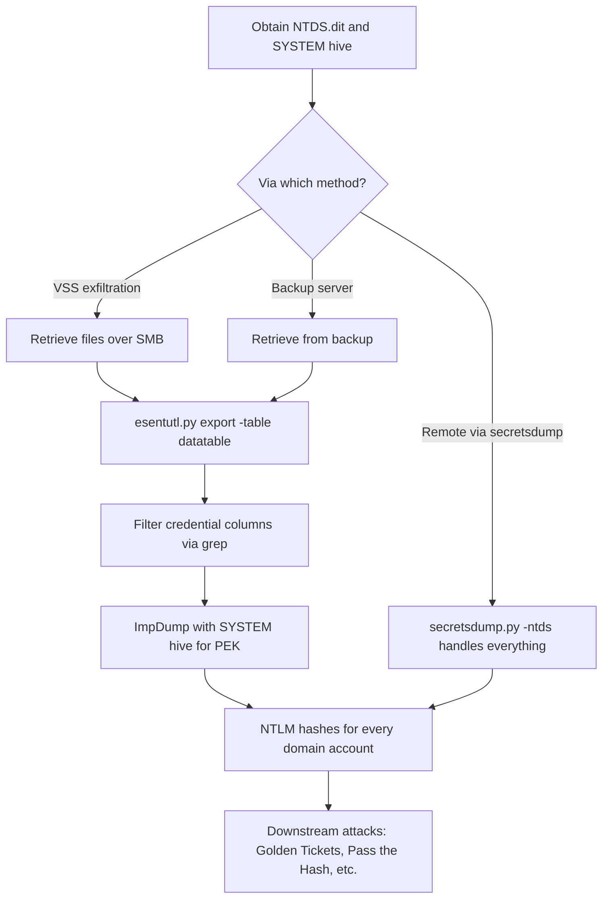

title: "esentutl.py"
script: "examples/esentutl.py"
category: "File Format Parsing"
status: "Published"
protocols:
  - None
ms_specs:
  - MS-ESE
mitre_techniques:
  - T1003.003
  - T1005
  - T1213
auth_types:
  - offline
tags:
  - impacket
  - impacket/examples
  - category/file_format_parsing
  - status/published
  - offline
  - technique/ntds_parsing
  - technique/ese_database_extraction
  - technique/offline_credential_extraction
  - format/ese
  - format/ntds
  - format/jet
  - mitre/T1003/003
  - mitre/T1005
  - mitre/T1213
aliases:
  - esentutl
  - impacket-esentutl
  - ese_utility


# esentutl.py

> **One line summary:** Pure Python parser for Microsoft's Extensible Storage Engine (ESE) database format, which is the underlying storage engine Active Directory uses for `NTDS.dit`, DNS uses for its AD-integrated zones, Microsoft Exchange uses for mailbox stores, Windows Search uses for the indexer database, and numerous other Windows components use for structured data, with three subcommands (`info`, `dump`, `export`) that enable offline inspection of an ESE file's schema, raw page contents, or specific table data without requiring the Windows `esentutl.exe` utility, making it the foundational file format tool that underlies [`secretsdump.py`](../03_credential_access/secretsdump.md)'s `-ntds` mode and opens the **File Format Parsing** category as the first of three articles covering Impacket's role as a library for Windows binary file formats rather than just network protocols.

| Field | Value |
|:---|:---|
| Script | `examples/esentutl.py` |
| Category | File Format Parsing |
| Status | Published |
| Primary protocols | None (offline file parsing) |
| Primary Microsoft specifications | `[MS-ESE]` Extensible Storage Engine File Format (partially reverse engineered; the format is not fully documented by Microsoft) |
| MITRE ATT&CK techniques | T1003.003 OS Credential Dumping: NTDS, T1005 Data from Local System, T1213 Data from Information Repositories |
| Authentication types supported | Offline only; operates on files already in hand |
| First appearance in Impacket | Early Impacket (the `impacket.ese` module predates Impacket's public release) |
| Original author | Alberto Solino (`@agsolino`) |


## Prerequisites

This article is largely self contained because it covers an offline file format parser. Helpful context:

- [`00_Introduction_and_Architecture.md`](Introduction_and_Architecture.md) for the Impacket stack overview.
- [`secretsdump.py`](../03_credential_access/secretsdump.md) for the most common downstream use: parsing `NTDS.dit` for domain credential extraction. The secretsdump `-ntds` mode uses the same `impacket.ese` library that `esentutl.py` exposes directly.
- [`reg.py`](../08_remote_system_interaction/reg.md) and [`dpapi.py`](../03_credential_access/dpapi.md) round out the offline file parsing ecosystem: registry hives, DPAPI blobs, and ESE databases are the three main Windows binary formats attackers work with.

Understanding relational database concepts (tables, columns, rows, indexes, pages) is helpful. ESE is a B+ tree based key/value store with a relational abstraction layer on top.


## What it does

`esentutl.py` is a minimal utility for inspecting ESE database files. It provides three subcommands:

| Subcommand | Purpose |
|:---|:---|
| `info` | Dump the database catalog: list all tables and their columns, showing the ESE schema. |
| `dump` | Dump a specific page of the database in raw hex form. Used for format analysis and troubleshooting. |
| `export` | Extract all rows of a named table as key/value output. The primary data extraction mode. |

The tool is deliberately minimal. It does not provide SQL style querying, joins, or sophisticated filtering. Its purpose is to give offensive and defensive researchers a Python native way to crack open ESE files, enumerate their schemas, and pull specific table contents. Downstream tools (like `secretsdump.py`, custom parsers, or third party tools like `ImpDump` or `ntdsxtract`) consume the exported data to do higher level analysis.

The operational value is concentrated on one specific use case: **parsing `NTDS.dit`**. Active Directory stores every user account, every group, every organizational unit, every Group Policy Object, and every authentication credential in a single ESE database named `NTDS.dit`. Anyone who obtains a copy of this file (via [`secretsdump.py`](../03_credential_access/secretsdump.md) remote extraction, via Volume Shadow Copy exfiltration, via DC backup theft, or by being on the console of a DC) has the entire domain's contents in their hands, but in a format that requires parsing. `esentutl.py` and the `impacket.ese` library provide that parsing.

Other ESE-using subsystems where `esentutl.py` may be useful:

- **DNS zones** when Active Directory integrated (stored in `NTDS.dit` or in `DNS.dit`).
- **Windows Search** indexer database (`Windows.edb`).
- **Exchange Server** mailbox stores (though Exchange stores are large and typically parsed by specialized tools).
- **SRUM** (System Resource Usage Monitor), which stores program execution and network usage history in an ESE database. Forensically valuable.
- **Internet Explorer WebCache** in older Windows versions.

These secondary use cases are less common in offensive research but occasionally relevant.


## Why it exists

Active Directory has used ESE as its storage engine since AD's original release in Windows 2000. The format is not fully documented by Microsoft, but the structure has been reverse engineered over decades of research. Joachim Metz's `libesedb` project in the early 2010s produced the first open source parser that could reliably extract data from `NTDS.dit`. Alberto Solino ported and extended similar functionality into pure Python for Impacket's `impacket.ese` module.

Before the Impacket ESE parser existed, offensive workflows for `NTDS.dit` extraction required either:

- Running `esentutl.exe /p` on Windows to repair a copy of the DIT, then parsing it with Windows native tools.
- Using `libesedb` + `ntdsxtract` on Linux: a multi step pipeline that exported tables, then processed them through separate Python scripts.

The Impacket native ESE parser collapsed this into a single dependency: `impacket.ese` handles the file format, `secretsdump.py` calls into it with `-ntds`, and the whole extraction happens in one command. `esentutl.py` is the interactive tool that exposes the same underlying parser for ad hoc inspection.

The tool's name deliberately matches the Windows `esentutl.exe` utility that ships with every Windows installation. The Windows tool has many modes (repair, defragment, integrity check, backup); the Impacket tool implements only the read only inspection capabilities that are useful for security research.

The "why it still exists" case has two parts. First, as the interface to a library that matters: when you want to understand or debug `secretsdump.py`'s DIT parsing, running `esentutl.py` against the same DIT directly gives you the raw data that secretsdump is processing. Second, for ESE databases beyond `NTDS.dit`: if you encounter an `Windows.edb` from a user profile, or a SRUM database during forensics, or an unfamiliar ESE file from a Windows component, `esentutl.py` is the quickest way to learn its schema and extract its contents.


## The format theory

This section covers what operators need to know about the ESE format. It is not a complete reference; the format is complex enough to fill a book. The goal is to explain enough structure that `esentutl.py`'s output makes sense and that operators can troubleshoot when something unexpected happens.

### ESE overview

Extensible Storage Engine (also called "Jet Blue" or "Jet Database Engine", not to be confused with Jet Red which underlies Access databases) is Microsoft's own embedded database engine. It dates to the early 1990s. Design goals:

- Embedded, not a separate server process.
- Transactional, with write ahead logging.
- B+ tree indexed storage with efficient range queries.
- Single file per database.

ESE files have the extension `.edb` historically, but AD renamed its own to `.dit` (Directory Information Tree). Microsoft documentation refers to "JET" and "ESE" somewhat interchangeably; for this article, "ESE" is the term.

### Database structure

An ESE database is a single file divided into pages of fixed size. Default page size: 8192 bytes (8 KB) for older databases, 32 KB for newer ones. AD's `NTDS.dit` uses a page size determined at domain creation; modern domains use 32 KB.

The first page (`Database Header`) contains metadata: format version, page size, state (clean/dirty), signatures, log file info, last commit information. The database header is critical; corruption here means the database cannot open.

Subsequent pages contain either:

- **B+ tree nodes** (internal or leaf) holding index or data pointers.
- **Pages holding long values** for columns too large to fit inline.
- **Free pages** available for allocation.

The B+ tree structure enables efficient lookup by key. Each table has at least one index (the primary index), and may have additional secondary indexes.

### The catalog

The catalog is a special reserved table that describes the database's schema: what tables exist, what columns each table has, what indexes are defined. The catalog itself is an ESE table with a fixed reserved name (`MSysObjects`) and structure.

`esentutl.py info` reads the catalog and displays its contents. This is the first operation when encountering an unknown ESE file: enumerate its tables to understand what data it holds.

### Tables, columns, and rows

ESE exposes a relational abstraction over the underlying page storage:

- **Tables** are named collections of rows.
- **Columns** are typed attributes. ESE supports standard types: integers of fixed length (1/2/4/8 bytes), floats, GUIDs, text (ANSI or Unicode), binary, long text, long binary.
- **Rows** are collections of values, one per column, stored as records in the table's B+ tree.

NTDS.dit's key tables:

| Table | Purpose |
|:---|:---|
| `datatable` | Every AD object (users, groups, computers, OUs, GPOs). This is where credentials live. |
| `link_table` | Relationships between objects (group memberships, manager to reports links, etc.). |
| `sd_table` | Security descriptors referenced by objects in datatable. |
| `hiddentable` | Internal metadata. |

Most offensive work focuses on `datatable`.

### Column naming in NTDS.dit

AD uses numeric attribute IDs rather than descriptive column names. Key columns in `datatable`:

| Column | AD attribute | Purpose |
|:---|:---||
| `ATTm3` | `cn` (Common Name) | Object name. |
| `ATTr589970` | `objectSid` | Security Identifier. |
| `ATTk589914` | `unicodePwd` | Current NT hash (encrypted with PEK). |
| `ATTk589879` | `ntPwdHistory` | Historical NT hashes (encrypted). |
| `ATTk589984` | `dBCSPwd` | Current LM hash (encrypted). |
| `ATTk589918` | `lmPwdHistory` | Historical LM hashes. |
| `ATTk590689` | `supplementalCredentials` | Kerberos keys, cleartext passwords (when reversible encryption is enabled), and other credential data. |
| `ATTq131589` | `pwdLastSet` | Timestamp of when the password was last set. |
| `ATTj589832` | `userAccountControl` | UAC flags. |
| `ATTm590045` | `samAccountName` | Pre-Windows-2000 account name. |

When exporting data from `datatable`, operators typically grep for these specific columns:

```bash
esentutl.py ntds.dit export -table datatable | grep -E \
  "ATTk590689|ATTm3|ATTm590045|ATTr589970|ATTk589914|ATTk589879|ATTk589984|ATTk589918"
```

This extracts just the columns relevant to credentials and discards the rest of each row (saving significant space for large directories).

### PEK encryption layer

Password hashes in `NTDS.dit` are encrypted, not stored in plaintext. The encryption scheme:

- Each hash is encrypted with RC4 using a key specific to the row, derived from the row's RID and the Password Encryption Key (PEK).
- The PEK itself is encrypted and stored in the `pekList` attribute on the domain root object.
- The PEK is encrypted with the boot key (SYSKEY), which lives in the `SYSTEM` registry hive (specifically at `HKLM\SYSTEM\CurrentControlSet\Control\Lsa` distributed across several value names via the LSA secret scheme).

Full decryption workflow:

1. Extract boot key from `SYSTEM` hive.
2. Decrypt PEK from `NTDS.dit`'s domain root using boot key.
3. For each user, derive the row specific RC4 key from PEK and RID.
4. Decrypt the user's NT hash with the RC4 key.

`esentutl.py` does not do the decryption; it only extracts the encrypted data. Downstream tools (`secretsdump.py -ntds`, `ImpDump`, `ntdsxtract`) handle the decryption chain. For offensive work, `esentutl.py` outputs are piped to `impdump.py` or similar, or `secretsdump.py -system <hive> -ntds <dit> LOCAL` does the whole chain in one command.

### The transaction log and dirty state

ESE uses write ahead logging for durability. Log files (`.log`, `.jrs`) accompany the main database file and contain uncommitted changes. When the database is closed cleanly, all log content is flushed into the database file and the logs are reset.

If an attacker copies an `NTDS.dit` from a running DC, the file is likely in a "dirty" state: it contains committed changes but also references log files with uncommitted changes. A dirty database cannot be reliably read.

The workarounds:

- **Volume Shadow Copy** (a Windows feature built into the OS) captures a consistent snapshot of the DC's filesystem including both `NTDS.dit` and its log files in a coherent state. This is the standard offensive technique for extracting `NTDS.dit` from a running DC.
- **`esentutl.exe /p`** on Windows "repairs" a dirty DIT by replaying the logs and marking it clean.
- **Running secretsdump against a running DC** avoids the issue: the DRSUAPI or registry method reads the data through Windows's own transactional interfaces, which handle the dirty state.

`esentutl.py` opens ESE files read only and does not handle log file replay. Operators processing a DIT from the field should use `secretsdump.py` directly with a VSS snapshot, or explicitly clean the DIT with `esentutl.exe /p` on a Windows machine before offline parsing.

### Why NTDS.dit is so valuable

`NTDS.dit` contains:

- Every user's NT hash (current and history, when password history is retained).
- Every computer's NT hash (for computer accounts).
- `krbtgt` hash (which enables Golden Ticket forgery via [`ticketer.py`](../02_kerberos_attacks/ticketer.md)).
- Every service account's hash.
- Trust keys for relationships between domains.
- Complete group membership mappings.
- Every user's UAC flags (disabled, locked, smart card required, etc.).
- Every user's metadata (email, title, manager, phone, etc.) that may be useful for social engineering.
- Security descriptors on every object (for DACL attack path analysis).

Extracting `NTDS.dit` once is equivalent to obtaining every credential in the domain. This makes it the single most valuable file in any Active Directory environment. Protecting access to it and to its backups is a primary defensive concern.


## How the tool works internally

The script is small because it delegates most work to the `impacket.ese` module.

1. **Argument parsing.** Database file path (positional), subcommand, optional `-page` for the `dump` subcommand, `-table` for the `export` subcommand.

2. **Database opening.** Instantiates `impacket.ese.ESENT_DB(filename)` which opens the file, reads the database header, and validates the format version.

3. **Subcommand dispatch.**
    - **`info`:** calls `ESENT_DB.mSysObjects()` to enumerate catalog entries. For each table, prints the table name and its columns with their types.
    - **`dump`:** calls `ESENT_DB.getPage(page_number)` to read the specified page. Prints the page structure including header fields, tag count, and tagged data.
    - **`export`:** opens the specified table via `ESENT_DB.openTable(table_name)`, then iterates through rows with `ESENT_DB.getNextRow(cursor)`. For each row, prints every column with its value.

4. **Row iteration.** The ESE parser tracks B+ tree traversal state. For each leaf page, it decodes individual records. Columns holding long values that span multiple pages are automatically resolved: the parser follows the long value reference to retrieve the full content.

5. **Output.** Plain text output in a simple format: `<column>: <value>` per row, separator lines between rows. Binary columns are printed in hex; text columns as decoded strings.

6. **Cleanup.** Closes the database file. No log files are modified; the tool is strictly read only.

The `impacket.ese` module itself is substantial (thousands of lines implementing the ESE format). `esentutl.py` is the thin interactive wrapper on top.


## Authentication options

None. `esentutl.py` is purely offline. It operates on files already on the attacker's filesystem. There is no network interaction, no authentication, no target.

The precondition is that the attacker has obtained an ESE file somehow. For NTDS.dit specifically:

- **Via `secretsdump.py` remote extraction** (the `secretsdump.py DOMAIN/user:pass@target.fqdn` default workflow writes the DIT to `/tmp` on the target, retrieves it, parses it).
- **Via Volume Shadow Copy** on a DC where the attacker has admin access. VSS creates a consistent snapshot; copy `C:\Windows\NTDS\ntds.dit` and the SYSTEM hive from the snapshot.
- **Via DC backup** from a backup server, file share, or offsite backup media. Many environments store AD backups with looser access control than the DCs themselves.
- **Via direct DC compromise** where the attacker has console or RDP access and can copy the file directly (less common because the file is locked by the running `ntds.exe` process; requires VSS or esentutl /p).

Once the file is in hand, `esentutl.py` runs anywhere with Python installed.


## Practical usage

### Enumerate tables in a database

```bash
esentutl.py NTDS.dit info
```

Produces output like:

```text
[*] Opened NTDS.dit
[*] Tables found:
    - MSysObjects (256 columns)
    - MSysObjectsShadow
    - MSysUnicodeFixupVer2
    - datatable (1047 columns)
    - hiddentable
    - link_table (6 columns)
    - sd_table (4 columns)
    - quota_table
    - quota_rebuild_progress_table
```

The first operation on any unknown ESE file. Reveals the schema at a glance.

### Dump a specific table (the primary operation)

```bash
esentutl.py NTDS.dit export -table datatable
```

Produces one output block per row, with every column name and value. For a domain with 10000 users and 1000 computers, this is a lot of output (easily hundreds of megabytes of text). Typically piped to a file and then filtered:

```bash
esentutl.py NTDS.dit export -table datatable > datatable.txt
grep -E 'ATTm3|ATTr589970|ATTk589914|ATTm590045' datatable.txt > credentials_only.txt
```

Or grep inline to save space:

```bash
esentutl.py NTDS.dit export -table datatable | grep -E \
  "ATTk590689|ATTm3|ATTm590045|ATTr589970|ATTk589914|ATTk589879|ATTk589984|ATTk589918" \
  > output.txt
```

This extracts only the columns relevant to credentials. The resulting file is then processed by `impdump.py` or similar to decrypt the hashes that PEK has wrapped.

### Dump a specific page (for format research)

```bash
esentutl.py NTDS.dit dump -page 5
```

Returns the raw contents of database page 5 in a structured format showing the page header fields and tagged data. Useful for:

- Verifying database integrity at specific points.
- Understanding the B+ tree layout.
- Debugging the ESE parser when it encounters unexpected data.
- Academic exploration of the ESE format.

Rarely needed in offensive work but essential for researchers developing new ESE tools.

### Full workflow: from NTDS.dit to hashes (without secretsdump)

This demonstrates what `secretsdump.py -ntds` automates:

```bash
# Step 1: obtain NTDS.dit and SYSTEM hive (somehow - VSS, compromise, backup, etc.)

# Step 2: extract the credential columns from datatable
esentutl.py NTDS.dit export -table datatable | grep -E \
  "ATTk590689|ATTm3|ATTm590045|ATTr589970|ATTk589914|ATTk589879|ATTk589984|ATTk589918" \
  > datatable_creds.txt

# Step 3: use ImpDump or similar to decrypt (needs SYSTEM hive for boot key)
git clone https://github.com/HarmJ0y/ImpDump
cd ImpDump
./impdump.py SYSTEM /path/to/datatable_creds.txt

# Output:
# domain.local\Administrator:500:aad3b435b51404eeaad3b435b51404ee:<nthash>:::
# domain.local\krbtgt:502:aad3b435b51404eeaad3b435b51404ee:<nthash>:::
# domain.local\user1:1104:aad3b435b51404eeaad3b435b51404ee:<nthash>:::
# ...
```

In practice nobody does this manually because secretsdump.py is simpler:

```bash
secretsdump.py -system SYSTEM -ntds NTDS.dit LOCAL
```

Produces the same output in one command. The manual workflow with `esentutl.py` is useful for:

- Educational purposes (understanding what secretsdump does under the hood).
- Custom analysis where only specific users or specific columns are of interest.
- Debugging when secretsdump fails on an unusual DIT.
- ESE files other than NTDS.dit where secretsdump does not apply.

### Parse a Windows Search database

```bash
esentutl.py Windows.edb info
esentutl.py Windows.edb export -table SystemIndex_Gthr > search_index.txt
```

Extracts the Windows Search indexer contents. Can reveal information about files that existed on a system even if those files have since been deleted. Forensically valuable.

### Parse a SRUM database (System Resource Usage Monitor)

```bash
esentutl.py SRUDB.dat info
esentutl.py SRUDB.dat export -table "{973F5D5C-1D90-4944-BE8E-24B94231A174}" > network_usage.txt
```

SRUM records program execution and network usage over the past 30 days. The specific table GUIDs correspond to different event categories. Forensic investigations use SRUM to establish what programs ran and when.

### Key flags

| Flag | Meaning |
|:---|:---|
| `databaseFile` (positional) | Path to the ESE file. |
| Subcommand | `info`, `dump`, or `export`. |
| `-page <n>` | Page number (for `dump`). |
| `-table <n>` | Table name (for `export`). |
| `-debug`, `-ts` | Verbose/timestamp logging. |

Very small argument surface. Most complexity is in the ESE library, not the wrapper.


## What it looks like on the wire

Nothing. The tool is offline and produces zero network traffic.

Network traffic only appears in the context of the upstream step that obtained the ESE file. For NTDS.dit specifically, that is typically SMB file retrieval (see [`smbclient.py`](../05_smb_tools/smbclient.md)) or the DRSUAPI conversation that `secretsdump.py -just-dc` uses.


## What it looks like in logs

None on the attacker's side. `esentutl.py` is a local Python process reading a local file.

The detection story is entirely about the upstream step: how did the attacker obtain the ESE file? For NTDS.dit:

**File retrieval via SMB from a DC.** Windows Security logs show:

- Event 4624 (successful logon to the DC by the attacker).
- Event 5145 (share access checks) for the `C$` or `ADMIN$` share.
- File access events for `C:\Windows\NTDS\ntds.dit` (if file auditing is enabled).

**Volume Shadow Copy creation.** If the attacker uses VSS to get a consistent copy:

- Event 8222 (shadow copy created) on the DC.
- Event 8224 (shadow copy deleted) when cleanup occurs.
- VSS activity of this kind is distinctive because most production DCs do not run VSS operations on demand frequently.

**Use of ntdsutil.exe, wbadmin.exe, or similar tools on the DC.** These are the Windows native ways to extract NTDS.dit consistently. Process creation events (4688) catch them.

**DRSUAPI replication requests from sources that are not DCs.** The `secretsdump.py -just-dc` path uses this instead of file copy. See [`secretsdump.py`](../03_credential_access/secretsdump.md) for the specific detection story around DRSUAPI abuse.

### Starter Sigma rules

Detection here is inherited from the tools that produce the ESE file. Representative rule for one path:

```yaml
title: NTDS.dit Access via SMB
logsource:
  product: windows
  service: security
detection:
  selection:
    EventID: 5145
    ShareName|contains:
      - 'C$'
      - 'ADMIN$'
    RelativeTargetName|contains: 'NTDS\ntds.dit'
  condition: selection
level: critical
```

Matches any remote access to the DIT. High fidelity; almost no legitimate workflow reads the DIT over SMB.

```yaml
title: Shadow Copy Creation on Domain Controller
logsource:
  product: windows
  service: system
detection:
  selection:
    EventID: 8222
    Provider_Name: 'VSS'
    # Correlate with DC inventory - this event on a DC is the concerning case
  condition: selection
level: high
```

VSS creation on a DC is unusual outside of scheduled backup windows. Alerting with tuning specific to the environment catches most exfiltration attempts.


## Detection and defense

### Detection opportunities

`esentutl.py` itself is undetectable at the target side (it runs on the attacker's host). Detection is entirely about the upstream extraction of the ESE file.

For NTDS.dit specifically:

- **Any remote file access to `\\DC\C$\Windows\NTDS\ntds.dit`.** This is the gold standard signal. Legitimate access is essentially zero.
- **VSS operations on a DC outside of scheduled backup windows.**
- **`ntdsutil.exe` or `wbadmin.exe` execution on a DC.** These are Windows native tools for DIT extraction and rarely used in normal operations.
- **SMB or SCMR access to a DC from workstations that are not administrative.** Any interactive session to a DC warrants scrutiny.
- **DRSUAPI replication traffic from IPs that are not DCs.** Covered in detail in [`secretsdump.py`](../03_credential_access/secretsdump.md). This is the alternative path to DIT contents that avoids extraction at the file level.

### Preventive controls

**Protect NTDS.dit access paths:**

- **Tier 0 isolation for DCs.** DCs should only be administered from dedicated Tier 0 admin workstations. Anyone else connecting to a DC is anomalous.
- **Disable `Backup Operators` and similar groups' access on DCs.** These groups can legitimately read NTDS.dit via privilege, but that privilege is rarely needed in modern backup architectures (which use VSS writers exposed to backup software).
- **Monitor backup infrastructure.** DC backups contain NTDS.dit too; backup servers and backup media are sometimes easier targets than the DCs themselves.
- **Enable Credential Guard.** Does not directly protect the DIT but limits what an attacker with the DIT can do (specifically, disrupts the use of extracted TGT keys in certain scenarios).
- **LAPS for DC local admin accounts.** Reduces the "one password fits all" risk.
- **Restrict DRSUAPI.** Block DRSUAPI traffic to DCs except from other DCs. This defeats `secretsdump.py -just-dc` without impacting normal replication.
- **Monitor `krbtgt` password age.** If the DIT is ever compromised, the `krbtgt` hash must be changed twice (to invalidate all existing Kerberos tickets). Tracking `krbtgt` password age is a defensive hygiene practice; a `krbtgt` password older than 180 days is a risk regardless of whether compromise is known.


## Related tools and attack chains

`esentutl.py` opens the File Format Parsing category with one of three articles. The other stubs:

- **`ntfs_read.py`** (stub) for NTFS volume mounting. Enables direct file extraction from NTFS filesystem images.
- **`registry_read.py`** (stub) for Windows registry hive parsing. The offline complement to [`reg.py`](../08_remote_system_interaction/reg.md) for files already in hand.

### Related Impacket tools

- [`secretsdump.py`](../03_credential_access/secretsdump.md) is the primary consumer of `impacket.ese`. Its `-ntds` option invokes the ESE parser internally. Understanding `esentutl.py` clarifies what `secretsdump.py` does under the hood.
- [`dpapi.py`](../03_credential_access/dpapi.md) parses a different family of file formats (DPAPI blobs, master keys, vaults). Together with `esentutl.py`, they cover the main file formats that hold credentials.
- [`reg.py`](../08_remote_system_interaction/reg.md) handles registry hives, which are the third main format that holds credentials.

Between these three, an operator can parse essentially every Windows binary format that holds credential data.

### External tools

- **`libesedb`** at `https://github.com/libyal/libesedb`. The canonical C library for ESE parsing. Predates the Impacket ESE parser and remains the reference implementation. Tools like `esedbexport` come from this library.
- **`ntdsxtract`** at `https://github.com/csababarta/ntdsxtract`. Older Python toolkit that consumed `libesedb` output to produce decrypted NTDS data. Functionally superseded by `secretsdump.py`.
- **`ImpDump`** at `https://github.com/HarmJ0y/ImpDump`. Parser specifically for `esentutl.py export` output. Useful when the workflow has two stages (separate extract and decrypt steps).
- **DSInternals** at `https://github.com/MichaelGrafnetter/DSInternals`. A PowerShell toolkit for AD offensive and defensive work with ESE/NTDS parsing capabilities. Windows native alternative.
- **`esentutl.exe`** (built into Windows). For database repair, integrity checking, and defragmentation. Impacket's tool does not replicate these write side features.

### Attack chains involving esentutl.py

The primary chain is straightforward:



In practice `secretsdump.py -ntds` handles the full chain in one step. The explicit `esentutl.py` workflow is used when:

- Only specific data from the DIT is needed (a few users, not the full dump).
- Research on the DIT format itself.
- Non-NTDS ESE files where secretsdump does not apply.
- Educational exercises to understand the format.

### Why this matters

NTDS.dit extraction is the "game over" event for an Active Directory compromise. Once the attacker has the DIT, they have every credential in the domain including the krbtgt hash. Subsequent attacks (Golden Tickets, Pass the Hash, Pass the Ticket) are trivial. Rolling the krbtgt password requires specific procedures and dual rotation to avoid breaking replication; many environments have never done it even once.

Defenders who understand the DIT's structure and significance prioritize its protection accordingly. Attackers who understand its structure can extract targeted credential data quickly without noisy full dumps. `esentutl.py` is the tool that makes both understandings operationally meaningful.


## Further reading

- **`[MS-DRSR]`** at `https://learn.microsoft.com/en-us/openspecs/windows_protocols/ms-drsr/`. Directory Replication Service Remote Protocol specification (related; describes the replication API that secretsdump's DRSUAPI mode uses).
- **`libesedb` project documentation** at `https://github.com/libyal/libesedb`. Joachim Metz's reverse engineering of the ESE format is the reference.
- **Joachim Metz "Extensible Storage Engine Database File Format"** whitepaper. The most comprehensive public description of the ESE format.
- **Microsoft "Extensible Storage Engine" documentation** at `https://learn.microsoft.com/en-us/windows/win32/extensible-storage-engine/`. Official but limited; focuses on the API, not the file format internals.
- **Csaba Barta "Active Directory Offline Hash Dump and Forensic Analysis"** at historical archives. The foundational research on NTDS.dit credential extraction.
- **Passcape "Active Directory Password Audit"** at `https://www.passcape.com/`. Commercial reference material with detailed NTDS.dit parsing discussion.
- **Grant Fritchey and Ken Dickinson "Active Directory Domain Services 2008 How-To"** (book). Chapter on DIT structure.
- **MITRE ATT&CK T1003.003** at `https://attack.mitre.org/techniques/T1003/003/`. NTDS credential dumping technique.
- **MITRE ATT&CK T1550.002** at `https://attack.mitre.org/techniques/T1550/002/`. Pass the Hash (the downstream use of extracted hashes).
- **`secretsdump.py` source code**. The `impacket/examples/secretsdump.py` file and the supporting `impacket/examples/secretsdump.py` classes show `esentutl.py`'s library in production use.

If you want to internalize ESE, obtain a lab `NTDS.dit` (easy: set up a small AD lab, copy the DIT via VSS). Run `esentutl.py NTDS.dit info` to see the full schema. Then run `esentutl.py NTDS.dit export -table datatable > out.txt` and pipe through `grep` for the credential columns. Look at the raw encrypted hash values. Finally, use `secretsdump.py -system SYSTEM -ntds NTDS.dit LOCAL` and compare the output. Reading through the column filtering and then seeing secretsdump do it in one command makes tangible what the abstraction buys you. After that, try `esentutl.py` on an unfamiliar ESE file (the SRUM database at `C:\Windows\System32\sru\SRUDB.dat` is a good candidate) and explore the tables via `info` + `export`. The format's consistency makes any ESE database learnable within an hour once you have the mental model.
