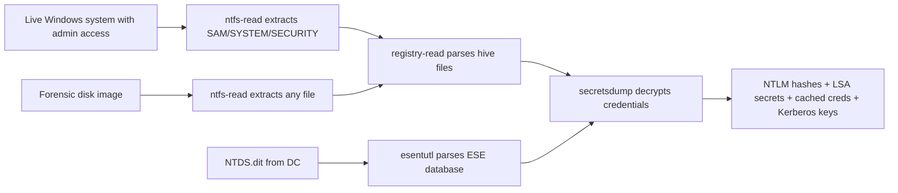

title: "ntfs-read.py"
script: "examples/ntfs-read.py"
category: "File Format Parsing"
status: "Published"
protocols: []
ms_specs: []
file_formats:
  - NTFS (New Technology File System)
mitre_techniques:
  - T1003.002
  - T1003.004
  - T1006
  - T1552.001
auth_types:
  - none
tags:
  - impacket
  - impacket/examples
  - category/file_format_parsing
  - status/published
  - file_format/ntfs
  - file_format/mft
  - technique/offline_filesystem_parse
  - technique/direct_volume_access
  - technique/locked_file_extraction
  - technique/ads_enumeration
  - library/ntfs
  - mitre/T1003.002
  - mitre/T1003.004
  - mitre/T1006
  - mitre/T1552.001
aliases:
  - ntfs-read
  - ntfs_read
  - impacket-ntfs-read


# ntfs-read.py

> **One line summary:** Offline NTFS filesystem parser that reads directly from a raw NTFS volume (Windows device path like `\\.\C:` or Unix device path like `/dev/disk1s1`) without mounting, providing an interactive mini shell (`use`, `cd`, `ls`, `cat`, `get`, `lcd`, `pwd`, `help`) for browsing the Master File Table (MFT) and extracting files, plus a direct `-extract <pathname>` flag for one shot extraction; the canonical use case is retrieving files that are locked by the running Windows OS (the SAM hive being the textbook example, since Windows keeps it open exclusively while booted and normal file APIs cannot read it) by going beneath the filesystem driver to parse MFT records and data runs directly, completing the offline forensic trilogy with [`esentutl.py`](esentutl.md) (ESE databases) and [`registry-read.py`](registry_read.md) (Registry hives) and closing the File Format Parsing category at 3 of 3 articles, making it the fifth complete category in the wiki.

| Field | Value |
|:---|:---|
| Script | `examples/ntfs-read.py` |
| Category | File Format Parsing |
| Status | Published |
| Primary file format | NTFS (New Technology File System) volumes and disk images |
| Primary Microsoft specifications | None public; NTFS is undocumented by Microsoft. Reference work by the Linux-NTFS project and Joachim Metz's libfsntfs. |
| MITRE ATT&CK techniques | T1003.002 SAM (via offline extraction), T1003.004 LSA Secrets (via offline hive extraction), T1006 Direct Volume Access, T1552.001 Credentials in Files |
| Authentication types supported | None (operates on raw volume or disk image) |
| First appearance in Impacket | 0.9.11 (alongside esentutl.py, registry-read.py, and secretsdump.py) |
| Original author | Alberto Solino (`@agsolino`) |
| Underlying library | `impacket.ntfs` |


## Prerequisites

This article builds on:

- [`esentutl.py`](esentutl.md) and [`registry-read.py`](registry_read.md), the sibling offline file format parsers. The three tools together form the "Impacket as offline forensic library" trio that this article completes.
- [`secretsdump.py`](../03_credential_access/secretsdump.md) which performs the end to end credential extraction workflow that ntfs-read supports at the volume access layer (reading locked SAM/SYSTEM/SECURITY hives directly from a running system requires either VSS or direct volume access; ntfs-read provides the direct volume path).
- [`00_Introduction_and_Architecture.md`](Introduction_and_Architecture.md) for the overall Impacket architecture.

Familiarity with basic filesystem concepts (inodes, directories, metadata, file attributes) helps. The article covers the NTFS pieces that matter for the tool.


## What it does

`ntfs-read.py` opens a raw NTFS volume and lets you browse and extract files from it, bypassing the OS filesystem driver. Two usage modes:

**Mini shell mode (no `-extract` flag):** launches an interactive prompt where the operator can navigate the filesystem using familiar commands.

```text
$ sudo python3 ntfs-read.py /dev/sdb1
Type help for list of commands
\> ls
drwxrwxrwx     1          0  ...  $AttrDef
drwxrwxrwx     1          0  ...  $BadClus
drwxrwxrwx     1          0  ...  $Bitmap
drwxrwxrwx     1          0  ...  $Boot
drwxrwxrwx     1          0  ...  $Extend
drwxrwxrwx     1          0  ...  $LogFile
drwxrwxrwx     1          0  ...  $MFT
drwxrwxrwx     1          0  ...  $MFTMirr
drwxrwxrwx     1          0  ...  $Secure
drwxrwxrwx     1          0  ...  $UpCase
drwxrwxrwx     1          0  ...  $Volume
drwxrwxrwx     1          0  ...  Windows
drwxrwxrwx     1          0  ...  Users
drwxrwxrwx     1          0  ...  Program Files
\> cd Windows\System32\config
\\Windows\System32\config\> ls
-rw-rw-rw-     1      65536  ...  SAM
-rw-rw-rw-     1    5242880  ...  SOFTWARE
-rw-rw-rw-     1      28672  ...  SECURITY
-rw-rw-rw-     1   15728640  ...  SYSTEM
...
\\Windows\System32\config\> get SAM
\\Windows\System32\config\> exit
```

The extracted file appears in the operator's current working directory on the analyst host.

**Direct extraction mode (`-extract <pathname>`):** one shot, no shell. Takes the volume and a pathname within that volume, extracts directly.

```bash
sudo python3 ntfs-read.py "\\.\C:" -extract "\windows\system32\config\sam"
```

On Linux, the volume argument is a block device path (`/dev/sda1`, `/dev/mapper/volumename`, or a raw disk image opened via a loop device). On Windows, it is a device path (`\\.\C:` for the C drive, `\\.\PhysicalDrive0` for an entire physical disk).

### Shell commands

| Command | Purpose |
|:---|:---|
| `use` | Change to a different NTFS volume (without restarting). |
| `cd <path>` | Change directory within the volume. |
| `ls` | List files and directories in the current location. |
| `cat <file>` | Print a file's contents to stdout (small files only). |
| `get <file>` | Download a file from the volume to the local working directory. |
| `lcd <path>` | Change the local (analyst side) working directory. |
| `pwd` | Print the current directory in the volume. |
| `help` | List commands. |
| `exit` | Exit the shell. |

The interface is deliberately familiar to anyone who has used an FTP client or Impacket's own [`smbclient.py`](../01_recon_and_enumeration/smbclient.md) or [`mssqlclient.py`](../09_mssql/mssqlclient.md). Consistent shell idiom across Impacket tools reduces cognitive overhead.

### What makes this different from ordinary file access

When you run `cat /windows/system32/config/sam` or `type C:\Windows\System32\config\SAM` on a running Windows system, the request goes through the OS filesystem driver, which enforces:

- File permissions (ACLs).
- Mandatory file locks (Windows holds SAM exclusively open while running).
- Sharing modes.
- Volume mount state.

ntfs-read bypasses all of that by reading the raw bytes of the NTFS volume and parsing them with its own NTFS implementation. The NTFS driver's view of who can read what is irrelevant because the tool never asks the driver. Whether SAM is locked is irrelevant because ntfs-read does not use file open APIs; it reads blocks from the volume and interprets them.

This is direct volume access (MITRE T1006). The tradeoff is that it requires read access to the raw block device, which typically means root or SYSTEM privileges and bypasses audit trails at the filesystem layer.


## Why it exists

Several scenarios require reading files that normal filesystem APIs cannot deliver:

- **Live SAM/SYSTEM/SECURITY hive extraction.** Windows holds these hives in exclusive lock while running. Normal file copy fails. Alternatives are VSS snapshots (Impacket's reg.py and secretsdump.py use this), backup APIs (require specific privileges), or direct volume access (ntfs-read).
- **Forensic imaging.** Given a raw disk image (from `dd`, `ewfmount`, `FTK Imager`, etc.), ntfs-read parses the NTFS volume within it without requiring filesystem mounting. This matters because mounting a forensic image modifies filesystem timestamps in some configurations and is forbidden in strict forensic workflows.
- **Alternate Data Stream extraction.** NTFS files can have named data streams beyond the primary data. Many filesystem tools ignore ADS; a direct NTFS parser sees them.
- **Deleted file recovery (partial).** The MFT retains entries for deleted files until the slot is reused. Direct MFT parsing can find these entries.
- **Bypass of EDR hooks that watch filesystem APIs.** Some EDR products hook filesystem APIs to monitor sensitive file access. Reading the raw volume skips those hooks entirely.

Impacket's inclusion of ntfs-read was motivated primarily by the first use case: credential extraction from live systems where SAM is locked. Paired with registry-read and the boot key computation, ntfs-read turns a privileged local shell into a credential harvesting platform without requiring VSS or any OS-level tools that might be logged.

The secondary use cases (forensics, ADS, deleted file recovery, EDR evasion) emerged naturally from having a working NTFS parser in Python. Today ntfs-read is less commonly used for credential work because secretsdump automates the full workflow better, but it remains the right tool when:

- The full secretsdump workflow is too noisy.
- You need a specific file that is not a registry hive.
- You are working on a forensic image in a Python pipeline.
- You want to understand NTFS at a hands on level.

The tool is also one of the more educational examples in Impacket. Reading the source and `impacket/ntfs.py` together teaches NTFS internals concretely, bridging what the format references document with what actual parsing code looks like.


## NTFS format theory

NTFS is complex. This section covers what matters for reading ntfs-read.py and the shipped `impacket/ntfs.py` library. Readers who need the full format should consult Linux-NTFS documentation and libfsntfs by Joachim Metz; ntfs-read implements a useful subset but is not exhaustive.

### Core concept: everything is a file

NTFS's central design choice is that every structure on disk, including metadata structures, is represented as a file. The Master File Table ($MFT) is itself a file. The volume bitmap ($Bitmap) is a file. The transaction log ($LogFile) is a file. Security descriptors ($Secure), bad clusters ($BadClus), boot sector ($Boot), volume information ($Volume), attribute definitions ($AttrDef), uppercase conversion table ($UpCase), extended metadata ($Extend): all files.

Files in NTFS have names starting with `$` for system files. Normal user files start with a letter or digit. The root directory is special (MFT entry 5) but is also a file.

Since everything is a file, the NTFS parser only needs one fundamental capability: given an MFT entry, produce the file's data. All other operations (listing a directory, traversing a path, reading metadata) reduce to reading files.

### The boot sector

The first 512 bytes of an NTFS volume are the boot sector containing:

- BIOS Parameter Block (BPB) with sector size, sectors per cluster, reserved sectors.
- Total sectors in the volume.
- Logical Cluster Number (LCN) of the start of the MFT.
- LCN of the start of the MFT mirror ($MFTMirr).
- MFT record size (typically 1024 bytes).
- Index record size.
- Volume serial number.

ntfs-read reads this first, determines the cluster size and MFT location, then starts parsing MFT records.

### The Master File Table

$MFT is a file containing records for every file on the volume, including itself. Each MFT record is a fixed size (usually 1024 bytes) and has:

- **Record header** with magic bytes (`FILE`), update sequence number, sequence number, hard link count, first attribute offset, flags (indicating whether this is a file, whether it is a directory, whether it is in use), real size, allocated size, base record reference, next attribute ID.
- **A sequence of attributes.** Each attribute has a type (NAME, DATA, SECURITY_DESCRIPTOR, ATTRIBUTE_LIST, INDEX_ROOT, etc.) and its own content.
- **End marker** (attribute type 0xFFFFFFFF).

### Attributes

NTFS stores file metadata and content in typed attributes within the MFT record. Key types:

| Attribute type | Hex | Purpose |
|:---|:---||
| `$STANDARD_INFORMATION` | 0x10 | Timestamps, DOS attributes, owner, SID. |
| `$ATTRIBUTE_LIST` | 0x20 | When a file has too many attributes for one MFT record, this attribute lists them. |
| `$FILE_NAME` | 0x30 | Filename, parent directory reference, timestamps (duplicated from $STANDARD_INFORMATION). |
| `$OBJECT_ID` | 0x40 | Unique GUID. |
| `$SECURITY_DESCRIPTOR` | 0x50 | Security (Windows 2000 style; modern NTFS uses $Secure instead). |
| `$VOLUME_NAME` | 0x60 | Volume label ($Volume only). |
| `$VOLUME_INFORMATION` | 0x70 | Volume flags, NTFS version. |
| `$DATA` | 0x80 | File contents. Named $DATA attributes are Alternate Data Streams. |
| `$INDEX_ROOT` | 0x90 | Directory index root (B-tree). |
| `$INDEX_ALLOCATION` | 0xA0 | Directory index non resident storage. |
| `$BITMAP` | 0xB0 | Bitmap of allocated index records or MFT entries. |
| `$REPARSE_POINT` | 0xC0 | Reparse point (junctions, symlinks, mount points). |
| `$EA_INFORMATION` | 0xD0 | Extended attributes metadata. |
| `$EA` | 0xE0 | Extended attributes data. |
| `$LOGGED_UTILITY_STREAM` | 0x100 | EFS, DFS metadata. |

### Resident vs non resident attributes

Small attributes live inside the MFT record itself (resident). Large attributes live in data clusters elsewhere on the volume, and the MFT record just stores pointers (non resident).

For the $DATA attribute specifically:

- **Resident $DATA:** the file's contents are inside the MFT record. Works for files up to approximately 700 bytes. These files do not consume any cluster outside their MFT entry.
- **Non resident $DATA:** the MFT record stores "data runs" describing which clusters contain the file. Each data run is a (length, offset) pair. Offset is relative to the previous run, enabling compact encoding for sparse or compressed files.

ntfs-read parses both. The data runs encoding is one of the more complex pieces of NTFS (it uses variable length integer encoding with a size header byte indicating how many bytes the length and offset each consume). The `impacket/ntfs.py` module handles this.

### Directories as B-trees

Directories in NTFS are implemented as B-trees keyed by filename. The $INDEX_ROOT attribute holds the root of the tree; larger directories overflow into $INDEX_ALLOCATION (non resident index records).

Each index entry contains:

- A reference to another MFT entry (the file being indexed).
- A copy of the file's $FILE_NAME attribute (name, timestamps, size).
- Left/right child pointers for the B-tree.

This structure makes directory listings fast and supports case insensitive filename lookup via the $UpCase table.

ntfs-read's `ls` command walks the index, producing the file listing. `cd` resolves path components one at a time, looking up each component in its parent's index.

### Alternate Data Streams

NTFS allows a file to have multiple $DATA attributes, each with a different name. The unnamed $DATA attribute holds the primary file contents; named $DATA attributes are ADS.

Syntax: `filename:streamname`. Creating an ADS on Windows:

```cmd
echo secret > innocent.txt:hidden
```

Reading it normally requires specifying the stream name: `type innocent.txt:hidden`. Many tools ignore streams entirely.

ntfs-read sees all data streams because it parses the MFT directly. This is relevant for forensic analysis (malware has used ADS for storage) and for research (understanding what ADS actually look like at the format layer).

### The $LogFile and journaled writes

NTFS journals metadata operations to $LogFile for recovery after crashes. The journal is volatile (circular buffer) but while it exists, it contains records of recent file creations, deletions, renames, and attribute changes. Forensic tools sometimes parse $LogFile for timeline reconstruction.

`impacket/ntfs.py` does not parse $LogFile. Operators needing journal analysis should use LogFileParser or similar specialized tools.

### What ntfs-read does not do

- **Writing.** Read only.
- **Sparse file reconstruction in all variants.** Handles common cases; exotic sparse layouts may fail.
- **Encrypted File System (EFS) decryption.** Reads encrypted file data as ciphertext; decryption requires the user's master key material.
- **Compressed files.** NTFS compression is partially supported in the library; some compressed files may not decompress correctly.
- **$LogFile analysis.**
- **Extended attributes (EA) complex cases.**
- **Reparse point following.** Shows the reparse attribute but does not follow junctions/symlinks to their targets automatically.

For forensic-grade NTFS parsing, libfsntfs or The Sleuth Kit's TSK library are more complete. ntfs-read is sufficient for the common cases (standard file extraction, directory browsing, locked file access).


## How the tool works internally

The tool is a thin wrapper around `impacket.ntfs`. Walking the flow:

1. **Argument parsing.** Positional `volume` (device path or file path). Optional `-extract <pathname>`.

2. **Open the volume.** The library opens the file or device for raw read. On Linux this is a normal file open of `/dev/sdX` or a disk image file. On Windows, device paths like `\\.\C:` or `\\.\PhysicalDrive0` are opened via the Windows CreateFile API with the appropriate sharing and access modes.

3. **Parse boot sector.** Read the first sector, validate NTFS magic ("NTFS    " at offset 3), extract cluster size and MFT location.

4. **Locate $MFT.** Read MFT entry 0 (which describes $MFT itself). This gives the data runs that describe where $MFT lives on the volume. From this point, any other MFT entry can be read.

5. **Locate root directory.** MFT entry 5 is the root directory by NTFS convention.

6. **Operation dispatch.**
   - **Extract mode:** resolve the given pathname component by component (each step is an index lookup in the parent directory), get the final MFT entry, read the $DATA attribute, write to local file.
   - **Shell mode:** enter the REPL. Each command manipulates a pointer to the current directory (the MFT entry number of the CWD) and performs lookups relative to it.

7. **Data reading.** For a given MFT entry with a $DATA attribute:
   - If resident, copy the bytes directly from the MFT record.
   - If non resident, parse the data runs to get a list of (cluster, length) tuples. For each tuple, read those clusters from the volume, concatenate. Handle compressed and sparse runs per NTFS rules.

8. **Output.** File data goes to stdout (`cat`) or a local file (`get`, `-extract`).

The implementation is a few hundred lines spread across `ntfs.py` and a few helper modules. Readable by anyone comfortable with Python and binary parsing, which is part of why the tool is good educational material.


## Authentication options

None. The tool does not authenticate; it reads block devices or files. Access is controlled by:

- **Permissions on the block device at the OS layer.** On Linux, `/dev/sdX` is typically readable only by root. On Windows, raw device access requires administrator privileges.
- **Volume mount state.** Reading a mounted volume raw is usually fine for read access but can produce inconsistent results if the OS is actively writing to the same volume. For running Windows systems, reading the live C: volume this way is common and generally works; for critical forensics, use a VSS snapshot or offline image.

### Running

```bash
sudo python3 ntfs-read.py /dev/sda1
```

On Linux. On Windows (from an administrator cmd):

```cmd
python ntfs-read.py \\.\C:
```

For a disk image file, point to the image directly:

```bash
python3 ntfs-read.py /path/to/image.raw
```


## Practical usage

### Browse the root of a volume

```bash
sudo python3 ntfs-read.py /dev/sda2
\> ls
\> cd Users\kevin\Documents
\> ls
\> get important.docx
\> exit
```

### Extract the SAM hive from a live Windows system

The classic credential extraction workflow:

```cmd
python ntfs-read.py \\.\C: -extract "\windows\system32\config\sam"
python ntfs-read.py \\.\C: -extract "\windows\system32\config\system"
python ntfs-read.py \\.\C: -extract "\windows\system32\config\security"
```

Three hive files land in the working directory. From there, `secretsdump.py -sam sam -system system -security security LOCAL` extracts all credentials offline.

The alternative is VSS based acquisition which is what [`reg.py`](../08_remote_system_interaction/reg.md) and [`secretsdump.py`](../03_credential_access/secretsdump.md) do by default. ntfs-read is quieter in terms of telemetry (no vssadmin calls, no remote registry service, no saved hive files on the target temporarily) but requires direct volume access privileges, which typically means local administrator or SYSTEM.

### Extract from a forensic image

```bash
python3 ntfs-read.py disk_image.raw
\> cd Users\Administrator\AppData\Roaming\Microsoft\Credentials
\> ls
\> get <some_credential_blob>
```

Combine with [`dpapi.py`](../03_credential_access/dpapi.md) for DPAPI blob decryption.

### Find Alternate Data Streams

Normal `ls` shows the primary stream. Named streams are accessed by their qualified name:

```text
\> cat "suspicious.txt:hidden"
```

If the parser detects multiple $DATA attributes on an MFT entry, they appear as separate streams accessible by their names.

### Read files with restrictive ACLs

On a running Windows system, some files have ACLs that exclude even administrators (for example, `C:\System Volume Information\*`). Direct volume access bypasses ACLs:

```cmd
python ntfs-read.py \\.\C: -extract "\System Volume Information\{GUID}\..."
```

Useful for research on EFS, VSS internals, and other Windows subsystems that hide behind ACLs.

### Work with snapshot volumes

If the operator has mounted a VSS snapshot as a volume, ntfs-read reads it like any other NTFS volume. Combined with VSS creation, this provides a non destructive read of a point in time snapshot without the OS filesystem driver in the path.

### Key flags

| Flag | Meaning |
|:---|:---|
| `volume` (positional) | Path to the NTFS volume. Windows device path (`\\.\C:`), Unix block device (`/dev/sda1`), or disk image file path. |
| `-extract <pathname>` | Direct extraction mode. Path uses backslashes (`\windows\system32\config\sam`). |
| `-debug`, `-ts` | Verbose/timestamp logging. |

Simple interface. The depth lives in the underlying NTFS parser, not in the tool wrapping it.


## What it looks like on the wire

Nothing. The tool is purely local. No network traffic is generated.

If the volume being read lives on remote storage (iSCSI, FC, SMB-mounted disk image), that underlying access generates traffic, but ntfs-read itself is filesystem local.


## What it looks like in logs

### OS level logging

Direct volume access on Windows generates minimal logging:

- **Process execution** of python.exe with the ntfs-read script appears in Event ID 4688 (Sysmon 1) if configured.
- **Handle opening** of `\\.\C:` can be captured by advanced EDR products but is not in the default Windows audit set. Legitimate tools (disk backup, defrag, antivirus scanners) also open raw volumes, so tuning is required.
- **File access events (4663)** are NOT generated for direct volume access. This is a key point: traditional file access auditing does not see ntfs-read reads because those reads never go through the filesystem driver where the audit hooks live.

On Linux:

- Reading `/dev/sdX` requires root or CAP_SYS_RAWIO; the access itself is not usually logged unless auditd is configured to watch raw device opens.

### Direct volume access as an indicator

The absence of file access events combined with presence of raw volume handle events is itself a signal. EDR products increasingly watch for this pattern:

- Process opens `\\.\<volume>` as a raw device.
- Process reads large amounts from the device.
- No corresponding opens at the filesystem layer on the files actually accessed.

That pattern is characteristic of forensics tools, backup tools, AV scanners, and attackers using tools like ntfs-read. Baselining the legitimate uses is essential for tuning.

### Starter Sigma rules

```yaml
title: Raw Volume Access by Non-Standard Process
logsource:
  product: windows
  service: sysmon
detection:
  selection:
    EventID: 1
    CommandLine|contains:
      - '\\.\C:'
      - '\\.\PhysicalDrive'
      - '\\\\.\\C:'
      - '\\\\.\\PhysicalDrive'
  filter_legitimate:
    Image|endswith:
      - '\vssadmin.exe'
      - '\defrag.exe'
      - '\chkdsk.exe'
      - '\MsMpEng.exe'
      - '\dd.exe'
  condition: selection and not filter_legitimate
level: high
```

Detects the raw volume access pattern from unexpected processes. Must be tuned for the environment's legitimate tools.

```yaml
title: Python Process Accessing Raw Volume
logsource:
  product: windows
  service: sysmon
detection:
  selection:
    EventID: 1
    Image|endswith:
      - '\python.exe'
      - '\python3.exe'
      - '\pythonw.exe'
    CommandLine|contains:
      - 'ntfs'
      - 'disk'
      - '\\.\C:'
      - '\\.\PhysicalDrive'
  condition: selection
level: high
```

More targeted. Python plus raw volume references is an unusual combination.

```yaml
title: Sensitive Hive File Referenced in Command Line
logsource:
  product: windows
  service: security
detection:
  selection:
    EventID: 4688
    CommandLine|contains:
      - 'config\sam'
      - 'config\system'
      - 'config\security'
  filter_legitimate:
    ParentImage|endswith:
      - '\wbengine.exe'
      - '\BackupExec.exe'
  condition: selection and not filter_legitimate
level: high
```

Process command lines that name hive files are rare in legitimate workflows. Good signal with baseline tuning.


## Detection and defense

### Detection opportunities

Direct volume access detection is an active area for modern EDR:

- **Raw device open syscalls.** `CreateFile("\\\\.\\C:", ...)` and equivalents on Linux. EDR hooks on these calls produce events of high fidelity.
- **MFT-pattern reads.** After opening the raw device, processes that read the MFT blocks (clusters starting around the MFT LCN) are exhibiting offline parser behavior. Some EDRs detect this pattern specifically.
- **Process command line inspection.** Arguments containing `\\.\` device paths, hive file names, or tool names (`ntfs-read`, `fgdump`, `secretsdump`) flag at process creation.
- **Unsigned or unusual executables** accessing raw devices. Legitimate tools are usually signed and well known; unsigned Python scripts accessing raw volumes are suspicious.

### Preventive controls

- **Administrator privilege restriction.** Raw volume access requires administrator on Windows, root on Linux. Tight control over administrative credentials is the fundamental defense.
- **LSA Protection (RunAsPPL).** Does not prevent raw volume access but protects some exposure pathways for secrets in memory.
- **BitLocker.** Encryption of the full disk. A locked BitLocker volume cannot be parsed by ntfs-read (or any NTFS parser) without the decryption key. This is the most effective preventive control against offline attacks.
- **EDR with raw device monitoring.** Modern EDR agents detect the raw device open pattern with reasonable fidelity.
- **Application control.** AppLocker, Windows Defender Application Control, or similar can block unsigned Python from running with administrative privileges in production environments.
- **Credential Guard** does not prevent raw disk access but limits the utility of SAM hash extraction by isolating domain credentials from the typical memory locations.

### What ntfs-read does not enable by itself

Reading a file is one step. The extracted bytes still need to be interpreted:

- Extracted SAM hive is not useful without the boot key (from SYSTEM hive) and the decryption algorithm (which [`secretsdump.py`](../03_credential_access/secretsdump.md) implements).
- Extracted DPAPI blob is not useful without the master key (which [`dpapi.py`](../03_credential_access/dpapi.md) helps decrypt).
- Extracted NTDS.dit is not useful without the boot key and ESE parsing (which [`esentutl.py`](esentutl.md) handles).

In other words, ntfs-read is the volume access layer of the credential extraction stack. Higher layers (registry-read, esentutl, secretsdump, dpapi) provide the actual credential recovery. Each layer is documented in its own article.

### Framing for credential workflows

Direct volume access via ntfs-read is the "quiet" path for hive extraction: no VSS, no Remote Registry service, no file copy in Windows Temp. The tradeoff is that it is detectable by modern EDR through the raw device access signal. For environments with weak EDR, ntfs-read is valuable for research. For environments with strong EDR, it is noisy in a different way.


## Related tools and attack chains

`ntfs-read.py` completes the File Format Parsing category at **3 of 3 articles**, joining [`esentutl.py`](esentutl.md) and [`registry-read.py`](registry_read.md). This is the fifth complete category in the wiki.

### The offline forensic trilogy

The three File Format Parsing articles together cover Impacket's offline file parsing capabilities:

- [`esentutl.py`](esentutl.md) parses ESE databases (NTDS.dit, Windows Search index, Exchange EDB, Active Directory database).
- [`registry-read.py`](registry_read.md) parses Windows Registry hives (SAM, SYSTEM, SECURITY, SOFTWARE, NTUSER.DAT).
- **`ntfs-read.py` parses NTFS volumes**, enabling access to files the other two tools need as input when those files are locked.

The three tools compose naturally: ntfs-read extracts a locked hive; registry-read parses it; esentutl handles the NTDS.dit case. Together they form Impacket's offline forensic library layer that [`secretsdump.py`](../03_credential_access/secretsdump.md) orchestrates.



### Related Impacket tools

- [`esentutl.py`](esentutl.md) for the ESE database case. Input files can come from ntfs-read extraction.
- [`registry-read.py`](registry_read.md) for the registry hive case. Input files can come from ntfs-read extraction.
- [`secretsdump.py`](../03_credential_access/secretsdump.md) for the automated end to end credential extraction. Uses all three file format parsers internally.
- [`dpapi.py`](../03_credential_access/dpapi.md) for DPAPI blob decryption. Blobs often extracted via ntfs-read from user profiles.
- [`smbclient.py`](../01_recon_and_enumeration/smbclient.md) and [`mssqlclient.py`](../09_mssql/mssqlclient.md) use the same mini shell idiom. Consistent UX across Impacket tools.

### External alternatives

- **The Sleuth Kit (TSK)** at `https://www.sleuthkit.org/`. The canonical open source forensic toolkit. `fls`, `icat`, `fsstat`, `istat` provide NTFS parsing with forensic rigor far beyond ntfs-read. For any serious forensic workflow, TSK is the right choice.
- **libfsntfs** (Joachim Metz) at `https://github.com/libyal/libfsntfs`. Dedicated NTFS parser in C with Python bindings. More complete format coverage than ntfs-read.
- **Autopsy** at `https://www.sleuthkit.org/autopsy/`. GUI for TSK. Standard in forensic investigations.
- **FTK Imager** and **EnCase** for commercial forensic acquisition and parsing.
- **ntfs-3g** for Linux userspace NTFS read/write driver. Mounts volumes as real filesystems; different use case.
- **ntfsprogs** (`ntfsls`, `ntfscat`, `ntfsundelete`, etc.) for Linux NTFS access on the command line. More feature rich than ntfs-read for forensic tasks.
- **FLS from TSK** for forensic file listing with MFT record numbers, deleted file flags, and timestamps.

### When to choose ntfs-read.py

Similar pattern to the other File Format Parsing tools:

- **Integrated Impacket workflows.** If credential extraction is the goal and the rest of the pipeline is Impacket-based, ntfs-read fits the stack.
- **Quick locked file extraction.** Simple one command extraction from a live system or image without setting up TSK or mounting.
- **Educational material.** Reading `impacket/ntfs.py` teaches NTFS internals concretely.
- **Python pipeline integration.** For automated workflows in Python, using ntfs-read (or the library directly) is cleaner than shelling out to TSK.

For deep forensic work (timeline reconstruction, deleted file analysis, $LogFile parsing, VSS internal structures), TSK and dedicated tools win. ntfs-read is the right tool for the offensive and operational use cases in Impacket's wheelhouse.

### Credential extraction workflow comparison

Three paths to extract SAM/SYSTEM/SECURITY hives from a running Windows system:

| Method | Noise | Requires | Bypasses |
|:---|:---|||
| **reg save / VSS+copy** (reg.py default) | Medium (vssadmin, Remote Registry service) | Admin on target | Normal file ACLs |
| **ntfs-read direct volume** | Low (raw device open only) | Admin on target | Normal file ACLs AND filesystem audit hooks |
| **DRSUAPI / DCSync** (secretsdump -just-dc-ntlm) | High on DC (replication events) | DA or equivalent replication rights | Everything (doesn't touch the target host) |

Each has operational tradeoffs. ntfs-read is quietest in terms of artifacts on the host but triggers EDR signals for raw device access that the other methods do not. Choose based on the environment's visibility profile.


## Further reading

- **Linux-NTFS documentation** at `https://flatcap.github.io/linux-ntfs/ntfs/`. The canonical community documentation of NTFS internals. Produced over years of reverse engineering by the ntfs-3g team.
- **libfsntfs documentation** (Joachim Metz) at `https://github.com/libyal/libfsntfs/tree/main/documentation`. Structured reference derived from extensive format study.
- **File System Forensic Analysis** (Brian Carrier). The definitive textbook on filesystem forensics including NTFS. Required reading for forensic engineers.
- **The Sleuth Kit documentation** at `https://www.sleuthkit.org/sleuthkit/docs.php`. Reference for TSK tools and the format internals they expose.
- **MFT structure reference** at `http://www.kes.talktalk.net/ntfs/` (Richard Russon's work). Detailed MFT entry and attribute documentation.
- **Impacket ntfs source** at `https://github.com/fortra/impacket/blob/master/impacket/ntfs.py`. Short and readable. Best way to understand what the library does and does not support.
- **MITRE ATT&CK T1006** at `https://attack.mitre.org/techniques/T1006/`. Direct Volume Access technique.
- **MITRE ATT&CK T1003.002** at `https://attack.mitre.org/techniques/T1003/002/`. SAM extraction, of which ntfs-read enables one variant.
- **Microsoft NTFS overview** at `https://learn.microsoft.com/en-us/windows-server/storage/file-server/ntfs-overview`. Surface level official reference (does not document the format on disk).

If you want to internalize NTFS and the tool concretely, the best exercise has three phases. First, prepare a test USB drive formatted as NTFS with a known set of files including at least one file with an Alternate Data Stream (`echo secret > test.txt:hidden`). Second, run `ntfs-read.py` against the drive and explore: walk the root, cd into directories, view ADS, extract files, verify extracted bytes match the original. Observe the system files ($MFT, $Bitmap, $LogFile, etc.) visible at the root. Third, read `impacket/ntfs.py` alongside the Linux-NTFS documentation and trace through what happens during a simple `cat` operation: boot sector read, $MFT location, MFT entry read, attribute enumeration, $DATA extraction via data runs. This three hour exercise teaches NTFS and the tool simultaneously and produces durable understanding that transfers to any other NTFS parser. From there, extending ntfs-read for custom research (compressed file handling, $LogFile parsing, deleted file enumeration, ADS scanning across an entire volume) becomes approachable because the library's structure and the format's structure both make sense. The offline forensic trilogy (esentutl + registry-read + ntfs-read) is now complete in this wiki; reading all three articles in sequence gives a comprehensive picture of Impacket's offline file parsing capabilities and the credential extraction workflows built on top of them.
