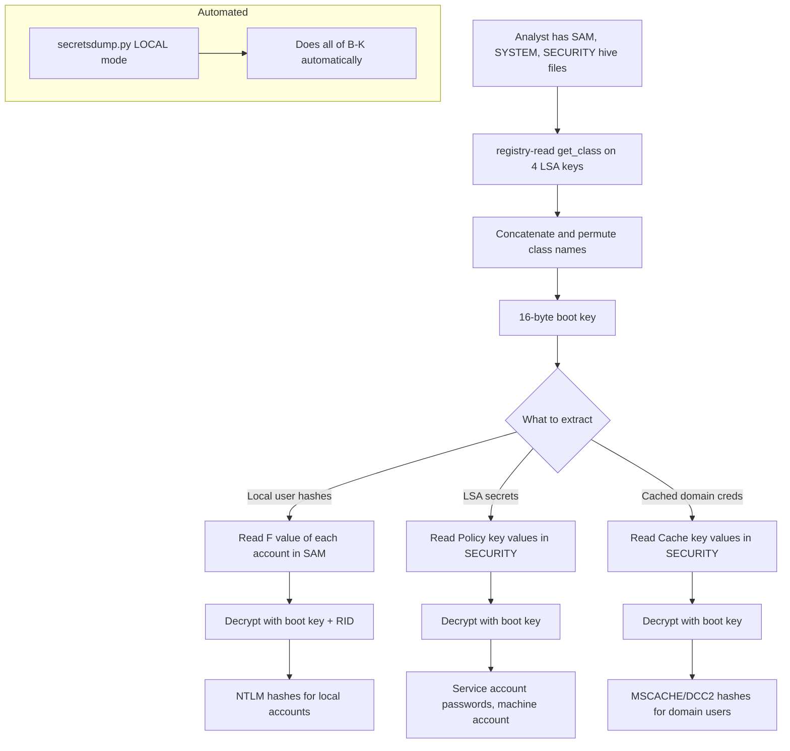

title: "registry-read.py"
script: "examples/registry-read.py"
category: "File Format Parsing"
status: "Published"
protocols: []
ms_specs:
  - MS-RRP
file_formats:
  - Windows Registry Hive (REGF)
  - Registration Entries (.reg export)
mitre_techniques:
  - T1003.002
  - T1003.004
  - T1552.002
  - T1555.004
auth_types:
  - none
tags:
  - impacket
  - impacket/examples
  - category/file_format_parsing
  - status/published
  - file_format/regf
  - file_format/registry_hive
  - file_format/reg_export
  - target/sam_hive
  - target/system_hive
  - target/security_hive
  - target/ntuser_dat
  - target/software_hive
  - technique/offline_registry_parse
  - technique/hive_analysis
  - library/winregistry
  - mitre/T1003.002
  - mitre/T1003.004
  - mitre/T1552.002
  - mitre/T1555.004
aliases:
  - registry-read
  - registry_read
  - impacket-registry-read


# registry-read.py

> **One line summary:** Offline parser for Windows Registry hive files that reads the binary REGF format used on disk for SYSTEM, SAM, SECURITY, SOFTWARE, NTUSER.DAT, and other hive files (and, as of PR #1840 in late 2024, the UTF-16 LE text format produced by `regedit.exe` and `reg.exe export`), providing five subcommands (`enum_key`, `enum_values`, `get_value`, `get_class`, `walk`) that enumerate subkeys, list values, retrieve specific value data, fetch class names, and recursively walk arbitrary subtrees without requiring Windows or the Windows Registry API; the underlying `impacket.winregistry` library is the same code that [`secretsdump.py`](../03_credential_access/secretsdump.md) uses for the local SAM/SYSTEM/SECURITY extraction mode, making registry-read the educational and diagnostic companion that exposes the library directly, and completing the file format trilogy alongside [`esentutl.py`](esentutl.md) (ESE/NTDS.dit parsing) with [`ntfs-read.py`](ntfs_read.md) as the third article that would complete File Format Parsing at 3 of 3.

| Field | Value |
|:---|:---|
| Script | `examples/registry-read.py` |
| Category | File Format Parsing |
| Status | Published |
| Primary file formats | Windows Registry Hive (REGF binary format); exported Registration Entries (.reg UTF-16 LE text format, since PR #1840) |
| Primary Microsoft specifications | `[MS-RRP]` for the semantic model (same concepts underlie the online RPC interface and the offline file format) |
| MITRE ATT&CK techniques | T1003.002 LSA Secrets, T1003.004 SAM, T1552.002 Credentials in Registry, T1555.004 Windows Credential Manager |
| Authentication types supported | None (operates on files on disk) |
| First appearance in Impacket | Early Impacket; has been in the tree for many years |
| Underlying library | `impacket.winregistry` (abstract `Registry` class with `SaveRegistryParser` and `ExportRegistryParser` implementations, factory function `get_registry_parser`) |


## Prerequisites

This article builds on:

- [`esentutl.py`](esentutl.md) for the sibling file format parser (ESE databases). The two articles establish the "Impacket as offline file format library" framing together.
- [`reg.py`](../08_remote_system_interaction/reg.md) for the online counterpart. reg.py uses the MS-RRP RPC interface to query a running registry; registry-read.py parses the same data from hive files on disk.
- [`secretsdump.py`](../03_credential_access/secretsdump.md) which uses the same `impacket.winregistry` library internally for local SAM/SYSTEM/SECURITY extraction. Reading registry-read.py makes the secretsdump local mode concrete.
- [`dpapi.py`](../03_credential_access/dpapi.md) for the related forensic workflow around DPAPI blobs, which often live in locations accessible through the registry.

Familiarity with the Windows Registry hierarchy (HKLM, HKCU, predefined root keys, hives, subkeys, values, value types) is helpful. The article reviews the relevant format pieces.


## What it does

`registry-read.py` takes a hive file on disk and lets you query its contents through five subcommands:

- **`enum_key -name <keypath>`** enumerates the immediate subkeys of the specified key. With `-recursive`, enumerates the entire subtree.
- **`enum_values -name <keypath>`** lists all values under the specified key with their types and data.
- **`get_value -name <keypath\valuename>`** retrieves the data for a specific value.
- **`get_class -name <keypath>`** retrieves the class name associated with the key (used for some hive internals including boot key reconstruction in the SYSTEM hive).
- **`walk -name <keypath>`** walks from the named key downward, printing the full subtree structure.

The hive file path is a positional argument preceding the subcommand. Format is auto-detected: the tool reads the first bytes to determine whether it is a REGF binary hive (starts with `regf` magic) or an exported .reg text file (starts with `Windows Registry Editor Version 5.00` in UTF-16 LE).

Typical hive files on Windows:

| Hive file | Location | Contents |
|:---|:---||
| `SAM` | `C:\Windows\System32\config\SAM` | Local accounts, user RIDs, password hashes |
| `SYSTEM` | `C:\Windows\System32\config\SYSTEM` | Hardware, services, boot key for credential decryption |
| `SECURITY` | `C:\Windows\System32\config\SECURITY` | LSA secrets, cached domain credentials |
| `SOFTWARE` | `C:\Windows\System32\config\SOFTWARE` | Installed software, system configuration |
| `DEFAULT` | `C:\Windows\System32\config\DEFAULT` | Default user profile |
| `NTUSER.DAT` | `C:\Users\<user>\NTUSER.DAT` | Per-user registry settings |
| `UsrClass.dat` | `C:\Users\<user>\AppData\Local\Microsoft\Windows\UsrClass.dat` | Per-user COM/ActiveX class registrations |

All of these parse cleanly with registry-read.py when obtained via filesystem access (live from a running system requires VSS because the hives are locked; from an offline disk image or mounted volume, the files are accessible directly).

The tool does not modify hive files; it is strictly read only. Registry modification is out of scope; use `reg.py` for online modifications or dedicated offline tools if modification of an offline hive is actually required.


## Why it exists

Offline registry hive parsing is a fundamental capability for several workflows:

- **Forensics.** When analyzing a disk image, hive files are often the starting point for user activity reconstruction, installed software inventory, persistence mechanism identification, and credential extraction.
- **Incident response.** When a host is suspected of compromise, the hive files (copied via forensic imaging or via VSS on a running system) provide evidence of configuration and activity that resists tampering.
- **Credential research.** SAM, SECURITY, and SYSTEM hives together contain local accounts, LSA secrets, and the boot key needed to decrypt many Windows credential stores. Offline parsing is the standard workflow for extracting these.
- **Malware analysis.** Persistence mechanisms (Run keys, services, COM hijacks, image file execution options) all live in the registry. Analyzing a malware sample's registry changes requires reading hive files.
- **Security research.** New attack techniques often leave registry artifacts; researching those artifacts requires reading hive files programmatically rather than through the Windows UI.

Impacket chose to include registry hive parsing because the Windows Registry is central to so many locations carrying credentials that security researchers regularly need to read. Having a parser written entirely in Python means this work can happen on Linux, macOS, or any platform, without requiring a running Windows system or Windows specific tools.

The `impacket.winregistry` library predates the `registry-read.py` example tool; the library existed internally for [`secretsdump.py`](../03_credential_access/secretsdump.md) which uses it for the LOCAL extraction mode. Once the library was proven out through secretsdump use, exposing it as a general-purpose tool made sense both as educational material and as a reusable utility.

The October 2024 PR #1840 by `@MaxToffy` extended support to the text-based `.reg` export format that Windows `regedit.exe` and `reg.exe export` produce. This matters because:

- Sometimes investigators have access to .reg exports but not the binary hives themselves (for example, an administrator provided a registry export rather than a forensic image).
- The .reg format is UTF-16 LE text, fundamentally different from the binary REGF format, requiring its own parser.
- The PR also integrated the new format into secretsdump.py for SAM/LSA extraction from .reg exports, with one caveat: the LSA boot key computation relies on class names that the .reg export format does not preserve, so it requires the operator to supply the boot key manually via a new `getbootkey.py` helper.

The library is now architected around an abstract `Registry` class with concrete implementations (`SaveRegistryParser` for REGF binary, `ExportRegistryParser` for .reg text) selected automatically by a factory function. Users of the library get format transparency; users of registry-read.py see a consistent interface regardless of source format.


## The registry format theory

This section covers the REGF binary hive format at the level needed to understand what registry-read.py does. Forensic references like Joachim Metz's libregf documentation have the full gory details for readers who need them.

### The registry model (recap)

Windows Registry is a hierarchical key/value store. Keys form a tree. Each key can have:

- Zero or more subkeys.
- Zero or more values (name + type + data).
- An optional class name (a short string used by certain system keys for internal purposes).
- Security descriptors.
- Timestamps.

Value types include:

| Type | Value | Description |
|:---|:---||
| `REG_NONE` | 0 | No defined type. |
| `REG_SZ` | 1 | Unicode string terminated by a null. |
| `REG_EXPAND_SZ` | 2 | Unicode string terminated by a null, with environment variable expansion. |
| `REG_BINARY` | 3 | Arbitrary binary data. |
| `REG_DWORD` | 4 | Integer of 32 bits (little endian). |
| `REG_DWORD_BIG_ENDIAN` | 5 | Integer of 32 bits (big endian). |
| `REG_LINK` | 6 | Unicode symbolic link. |
| `REG_MULTI_SZ` | 7 | Sequence of Unicode strings each terminated by a null. |
| `REG_RESOURCE_LIST` | 8 | Resource list (used by PnP). |
| `REG_QWORD` | 11 | Integer of 64 bits. |

registry-read.py decodes these types when displaying values; `REG_SZ` prints as text, `REG_DWORD` as integer, `REG_BINARY` as hex, etc.

### The REGF binary format

Windows stores each hive as a file on disk in a format called REGF (magic bytes `regf` at file offset 0). The format is well documented, both by Microsoft (briefly) and by reverse engineering efforts (extensively, most notably Joachim Metz's libregf project).

High level structure:

- **File header (4096 bytes).** Contains the `regf` magic, sequence numbers (for transactional integrity), timestamps, and a pointer to the root cell.
- **Hive bins (4096-byte aligned regions).** Contain the actual key/value/data cells.
- **Cells within bins.** Each cell represents a key node, value, subkey list, value list, security descriptor, or data blob.

Key cell types:

| Cell | Magic | Purpose |
|:---|:---||
| `nk` (name key) | `nk` | A registry key. Points to parent, subkey list, value list, security, and class name. |
| `vk` (value key) | `vk` | A registry value. Contains name, type, and data (directly or via pointer). |
| `sk` (security key) | `sk` | Security descriptor for one or more keys. Shared across keys with identical security. |
| `lf`, `lh`, `li`, `ri` | various | Subkey list indexes with different storage strategies for different key counts. |
| `db` (data block) | `db` | Large value data that does not fit inline. |

The format is optimized for use in memory (keys can be added and removed without rewriting the whole file) but readable for parsers that implement the cell traversal logic. A correct REGF parser handles the full cell taxonomy; Impacket's `winregistry.py` does this for the subset needed by common use cases.

### Transaction logs and dirty hives

Running Windows keeps registry changes in transaction logs (`.LOG1`, `.LOG2` files alongside each hive). On clean shutdown, the logs are merged into the hive and removed. On crash or fast shutdown, the hive on disk may be in an inconsistent state without the logs.

For forensic and research purposes:

- **Clean hive:** registry-read.py parses normally.
- **Dirty hive with logs available:** Windows's `reg.exe /UnloadHive` or dedicated tools (Regf, RegistryExplorer) can merge logs. Impacket's parser does not currently handle log merging; it reads whatever is in the main hive file.
- **Dirty hive without logs:** some data may be missing or stale. This is a known limitation of any parser that does not walk the transaction log.

In practice, hives obtained via proper forensic procedures (VSS snapshot, `reg save`, imaging after graceful shutdown) are clean and parse without issue. Hives from crash dumps or unclean memory acquisitions may need specialized tools.

### The exported .reg text format

`regedit.exe` and `reg.exe export` produce a different format: UTF-16 LE text files that look like:

```text
Windows Registry Editor Version 5.00

[HKEY_LOCAL_MACHINE\SOFTWARE\Example]
"StringValue"="hello world"
"DwordValue"=dword:00000042
"BinaryValue"=hex:00,01,02,03
"ExpandValue"=hex(2):25,00,53,00,59,00,53,00,54,00,45,00,4d,00,52,00,4f,00,4f,00,54,00,25,00,00,00
```

The format is readable by humans by design. Each key section is bracketed; values are `"name"=type:data` or `@=...` for the default value. Binary data is hex bytes separated by commas on continuation lines.

PR #1840's `ExportRegistryParser` parses this format into the same logical structure the REGF parser produces, so the rest of the library sees hives consistently.

### What this format does NOT preserve

The .reg export format loses:

- **Class names.** Present in REGF for specific system keys (JD, Skew1, GBG, Data - the four keys under `HKLM\SYSTEM\CurrentControlSet\Control\Lsa` whose class names are concatenated and permuted to form the boot key). Since .reg exports do not include class names, LSA boot key reconstruction from .reg files is not possible without external information.
- **Security descriptors.** The .reg format does not encode DACL/SACL/owner/group information. For security ACL research, REGF is required.
- **Timestamps for last write.** The .reg format does not carry these; REGF does.
- **Transactional state.** Obviously, a static export has no log.

For most enumeration and credential extraction needs, .reg exports are sufficient. For forensic reconstruction, REGF is preferred.

### Relationship to the MS-RRP online interface

The online registry is accessed via `[MS-RRP]` (Windows Remote Registry Protocol) through `reg.py`. The on-disk REGF format and the online MS-RRP interface expose the same semantic model (keys with subkeys and values) but through completely different mechanisms:

- **MS-RRP:** DCE/RPC calls to `winreg` service on a running Windows system. Traffic on the wire. Live data. Subject to access controls enforced by Windows.
- **REGF:** binary file parsing. No network involvement. Data frozen at the moment of file acquisition. No access controls (any process that can read the file can read any key in it).

For a researcher studying the registry, these are complementary tools. Use reg.py when you have credentials and network access to a live system and need current state. Use registry-read.py when you have file access (forensic image, running system with VSS, .reg export) and want to work offline.


## How the tool works internally

The tool is a small wrapper around the `impacket.winregistry` library:

1. **Argument parsing.** Positional `hive` (the hive file path) followed by subcommand (`enum_key`/`enum_values`/`get_value`/`get_class`/`walk`) with flags specific to each subcommand.

2. **Format detection and parser selection.** The library's factory function reads the first bytes of the file and returns either a `SaveRegistryParser` (for REGF) or an `ExportRegistryParser` (for .reg text). Both implement the same abstract `Registry` interface.

3. **Parser initialization.**
    - For REGF: read file header, identify hive bins, locate root cell, initialize internal state.
    - For .reg: read UTF-16 LE text, parse section headers, parse value lines, build in-memory key tree.

4. **Subcommand dispatch.**
    - `enum_key` calls `enum_key(keypath)` on the parser, which walks the subkey list of the specified key and returns immediate children. With `-recursive`, calls itself on each child.
    - `enum_values` calls `enum_values(keypath)` which iterates the value list of the specified key, returning name/type/data tuples.
    - `get_value` calls `get_value(valuepath)` returning the data directly.
    - `get_class` calls `get_class_name(keypath)` returning the class name string.
    - `walk` is a recursive `enum_key` + `enum_values` combination, printing the full subtree.

5. **Output formatting.** Value types are formatted appropriately:
    - `REG_SZ`, `REG_EXPAND_SZ`: decoded Unicode strings.
    - `REG_DWORD`, `REG_QWORD`: integer representations.
    - `REG_BINARY`: hex dump.
    - `REG_MULTI_SZ`: list of strings.
    - Unknown types: raw hex.

The library implementation is a few hundred lines covering REGF; the .reg parser from PR #1840 adds another few hundred. Both are well within the "readable and modifiable by an experienced Python developer in an afternoon" range if you need to extend behavior.


## Authentication options

None. The tool operates on files; there is no authentication concept.

### File access requirements

- The hive file must be readable by the invoking user.
- For locked hives (e.g., live `SYSTEM`, `SAM`, `SECURITY` files on a running Windows system), file copy requires VSS or similar. On Linux parsing, the file is just a file.
- For volumes encrypted with BitLocker, the volume must be unlocked before the hive file is accessible.

### Getting hive files

Common methods:

1. **`reg save` on the target system.** Requires administrator privileges on Windows. Produces a .hiv file (REGF format) suitable for registry-read.py:
   ```cmd
   reg save HKLM\SAM C:\temp\sam.save
   reg save HKLM\SYSTEM C:\temp\system.save
   reg save HKLM\SECURITY C:\temp\security.save
   ```
2. **Volume Shadow Copy.** Create a VSS snapshot, then copy the hive files from the snapshot. Impacket's [`reg.py`](../08_remote_system_interaction/reg.md) `save` and `backup` subcommands do this remotely; [`secretsdump.py`](../03_credential_access/secretsdump.md) does it implicitly for credential extraction.
3. **Forensic imaging.** Mount the forensic image (e.g., via ewfmount, xmount, or a hypervisor), navigate to `\Windows\System32\config\`, copy the hive files.
4. **Offline disk access.** When the Windows system is not running (offline disk, dead system), the hive files are accessible directly from `C:\Windows\System32\config\` on the image.
5. **Exported via `reg export`.** Produces a .reg text file (the format PR #1840 added support for).

All of these produce files that registry-read.py can parse.


## Practical usage

### Enumerate keys near the top of a SYSTEM hive

```bash
registry-read.py system.save enum_key -name 'Select'
```

Lists subkeys of `\Select` (Select key indicates the CurrentControlSet value).

### Retrieve the CurrentControlSet indicator

```bash
registry-read.py system.save get_value -name 'Select\Current'
```

Returns the `Current` REG_DWORD indicating which ControlSet is current (typically 1).

### Enumerate services

```bash
registry-read.py system.save enum_key -name 'ControlSet001\Services'
```

Produces the list of installed services. Combine with `-recursive` for the full service configuration tree.

### Get service configuration

```bash
registry-read.py system.save enum_values -name 'ControlSet001\Services\Spooler'
```

Returns values under `Services\Spooler`: `ImagePath`, `Start`, `Type`, `DependOnService`, etc.

### Walk the Run keys for persistence analysis

```bash
registry-read.py ntuser.dat walk -name 'Software\Microsoft\Windows\CurrentVersion\Run'
registry-read.py software.save walk -name 'Microsoft\Windows\CurrentVersion\Run'
```

Shows autostart entries, a common persistence mechanism.

### Extract the boot key for credential decryption

The boot key is computed from the class names of four keys under `HKLM\SYSTEM\CurrentControlSet\Control\Lsa`: `JD`, `Skew1`, `GBG`, `Data`. The process:

```bash
registry-read.py system.save get_class -name 'ControlSet001\Control\Lsa\JD'
registry-read.py system.save get_class -name 'ControlSet001\Control\Lsa\Skew1'
registry-read.py system.save get_class -name 'ControlSet001\Control\Lsa\GBG'
registry-read.py system.save get_class -name 'ControlSet001\Control\Lsa\Data'
```

Each returns a string of 8 hex characters. Concatenating and permuting them per the documented algorithm produces the 16 byte boot key. From there, [`secretsdump.py`](../03_credential_access/secretsdump.md) or custom code can decrypt the SAM and SECURITY hives.

For an easier one-shot, `secretsdump.py -system system.save -sam sam.save -security security.save LOCAL` does the boot key computation, SAM hash extraction, and LSA secrets extraction in a single command. registry-read.py is for when you want to inspect the pieces directly or learn how the extraction works.

### Enumerate NTUSER.DAT persistence locations

```bash
registry-read.py NTUSER.DAT walk -name 'Software\Microsoft\Windows\CurrentVersion\Explorer\RunMRU'
registry-read.py NTUSER.DAT enum_values -name 'Software\Microsoft\Windows\CurrentVersion\Explorer\UserAssist\{CEBFF5CD-ACE2-4F4F-9178-9926F41749EA}\Count'
```

UserAssist, RunMRU, and typed URLs are commonly used in forensic user activity reconstruction.

### Parse a .reg export file (since PR #1840)

```bash
registry-read.py exported_keys.reg walk -name 'HKEY_LOCAL_MACHINE\SOFTWARE\Example'
```

Same interface, different format under the hood. Note that for LSA secrets work, you would also need the boot key supplied via the secretsdump `-bootkey` parameter (computed via the new `getbootkey.py` helper) because .reg exports lack class names.

### Key flags

| Flag | Meaning |
|:---|:---|
| `hive` (positional) | Path to the hive file. REGF binary or .reg text, detected automatically. |
| Subcommand (positional) | `enum_key`, `enum_values`, `get_value`, `get_class`, `walk`. |
| `-name <path>` | Key or value path within the hive (required for all subcommands). |
| `-recursive` | For `enum_key` only: enumerate the entire subtree rather than immediate children. |
| `-debug`, `-ts` | Verbose/timestamp logging. |

Minimal interface. The tool does one thing and does it predictably.


## What it looks like on the wire

Nothing. The tool is purely offline and does not generate network traffic. This is one of its appeals: forensic and research workflows that need to analyze registry hives from captured images should leave no network trace while doing so.

If the hive files are obtained via Impacket's network tools first (for example, `reg.py save` or `secretsdump.py`'s hive copy phase), those tools generate their own characteristic traffic, covered in the respective articles.


## What it looks like in logs

### On the target system (where the hive originated)

Nothing related to registry-read.py specifically. The tool runs on whatever system has the hive file; it does not touch the source. If the hive was acquired via remote Impacket tools, those tools generated their logs at acquisition time; registry-read.py adds none.

### On the analysis system

The tool is a Python script reading a local file. Logs on the analysis system (typically a Linux forensics workstation) show:

- Python process execution (via auditd if configured).
- File open on the hive file.
- No network activity.

No distinctive signals specific to registry-read.py unless the operator specifically monitors for it.

### Starter Sigma rules

Detection rules for the tool itself are generally not valuable; the tool is read only, offline, and leaves no signals on production systems. Useful rules live at the edges:

```yaml
title: Registry Hive File Acquisition via reg save
logsource:
  product: windows
  service: security
detection:
  selection:
    EventID: 4688
    CommandLine|contains:
      - 'reg save'
      - 'reg export HKLM\SAM'
      - 'reg export HKLM\SYSTEM'
      - 'reg export HKLM\SECURITY'
  filter_expected:
    User: 'authorized_admins'
  condition: selection and not filter_expected
level: high
```

Catches the acquisition step, which has to happen before registry-read.py can be useful. Legitimate admin backups should be baselined and excluded.

```yaml
title: VSS Creation Followed by Hive File Access
logsource:
  product: windows
  service: security
detection:
  selection_vss:
    EventID: 4688
    CommandLine|contains:
      - 'vssadmin create shadow'
      - 'Create-ShadowCopy'
  selection_hive:
    EventID: 4663
    ObjectName|contains:
      - '\Windows\System32\config\SAM'
      - '\Windows\System32\config\SYSTEM'
      - '\Windows\System32\config\SECURITY'
  timeframe: 5m
  condition: selection_vss and selection_hive
level: critical
```

Correlates VSS creation with hive access within a short window. The pattern is characteristic of credential extraction workflows.

```yaml
title: Access to Sensitive Registry Hive Files by Non-System User
logsource:
  product: windows
  service: security
detection:
  selection:
    EventID: 4663
    ObjectName|endswith:
      - '\SAM'
      - '\SECURITY'
      - '\SYSTEM'
    AccessMask|contains: '0x80'  # Read access
  filter_system:
    SubjectUserName: 'SYSTEM'
  condition: selection and not filter_system
level: high
```

Access to raw hive files outside of normal system processes is unusual. Tuning for legitimate backup tools is essential.


## Detection and defense

### Detection opportunities

Since registry-read.py operates entirely offline on acquired hive files, detection focuses on the **acquisition step** on the target system rather than the analysis step on the analyst system:

- **`reg save` and `reg export` command execution** for the SAM, SYSTEM, and SECURITY hives are the signals of highest value. Legitimate admin backups usually target HKCU or specific application keys, not the Windows credential hives.
- **VSS creation** followed shortly by access to hive files under `\Windows\System32\config\` is a pattern characteristic of credential extraction workflows.
- **Remote Registry service activation** (via reg.py, secretsdump.py, or similar) triggers the remote hive save workflow that Impacket tools perform. EDR telemetry on service state changes catches this.
- **File access to hive files by processes other than SYSTEM** is worth monitoring; the legitimate processes that access these hives are a small and clearly defined set.

### Preventive controls

Standard Windows credential protection practices apply:

- **LSA Protection (RunAsPPL).** Prevents even administrators from reading LSA memory directly, though it does not prevent hive file access with administrator privileges.
- **Credential Guard.** Security for credentials using virtualization. Makes memory extraction harder but does not prevent hive file analysis.
- **Administrator privilege restrictions.** Anyone who can read SAM/SYSTEM/SECURITY can extract credentials. Tight control over administrative access is the fundamental defense.
- **Audit file access** on sensitive hive files. Increases detection signal at some telemetry cost.
- **Encryption at rest.** BitLocker or similar encryption of the full disk protects hive files on powered down systems from offline analysis. Does not help against online attacks or against someone with the decryption key.
- **Regular password rotation.** Limits the window during which extracted hashes are useful.

### What registry-read.py does NOT enable

Clarifying scope: the tool reads registry hive files. It does not:

- Acquire hive files from remote systems (see `reg.py` and `secretsdump.py` for that).
- Modify registry hive files (out of scope; online modification via `reg.py`).
- Parse transaction logs (dirty hives may be incomplete).
- Decrypt encrypted values (SAM hashes, LSA secrets) on its own. Decryption requires the boot key and follows a specific algorithm; `secretsdump.py` implements that algorithm on top of the registry-read library.

For the full credential-extraction workflow (boot key + SAM hashes + LSA secrets + cached credentials), `secretsdump.py LOCAL` is the right tool. registry-read.py is the component that exposes the registry parsing layer separately.


## Related tools and attack chains

`registry-read.py` continues the File Format Parsing category at 2 of 3 articles alongside [`esentutl.py`](esentutl.md). The third article that would complete the category is [`ntfs-read.py`](ntfs_read.md) (NTFS filesystem parsing, currently a stub).

### Related Impacket tools

- [`esentutl.py`](esentutl.md) is the sibling offline file format parser for ESE databases (NTDS.dit being the most important). Both articles use `impacket` as "offline file format library".
- [`reg.py`](../08_remote_system_interaction/reg.md) is the online counterpart. reg.py uses MS-RRP to query a live registry; registry-read.py parses hive files on disk. Complementary tools for complementary scenarios.
- [`secretsdump.py`](../03_credential_access/secretsdump.md) uses `impacket.winregistry` internally for its LOCAL mode. When you supply `-system system.save -sam sam.save` arguments, secretsdump is running registry-read.py logic under the hood plus the boot key + decryption on top.
- [`dpapi.py`](../03_credential_access/dpapi.md) handles DPAPI blobs that commonly live in locations accessible through the registry; the two tools are often used together in credential research workflows.

### External alternatives

- **`libregf` and `regfparse`** (Joachim Metz) at `https://github.com/libyal/libregf`. The canonical open source REGF parser in C with bindings for multiple languages. More complete than Impacket's implementation, handles transaction logs, more forensically rigorous. For serious forensic work, tools built on libregf are typically preferred.
- **RegistryExplorer and RECmd** (Eric Zimmerman) at `https://ericzimmerman.github.io/`. Windows forensic tools for registry analysis with excellent visualizations and extensive forensic knowledge built in. If you are working on Windows, these are often the right choice.
- **Volatility and Volatility 3** at `https://volatility3.readthedocs.io/`. Memory forensics frameworks that include registry plugins for hive extraction from memory.
- **`python-registry`** at `https://github.com/williballenthin/python-registry`. Pure Python REGF parser. An alternative to `impacket.winregistry` with potentially more completeness.
- **Autopsy / The Sleuth Kit** at `https://www.sleuthkit.org/`. Digital forensics platform with registry analysis modules.
- **RegRipper** (Harlan Carvey). Registry analysis tool driven by plugins with an extensive plugin library for common forensic questions.

### When to choose registry-read.py

Realistically, for pure forensic work, specialized tools (RegistryExplorer, libregf-based tools, RegRipper) are usually more capable. registry-read.py wins in specific contexts:

- **Already using Impacket.** If your research or analysis workflow is built on Python and Impacket, consistency matters. Using impacket.winregistry directly in your own Python code is a natural extension of the tool.
- **Educational value.** Reading the Impacket source code teaches REGF parsing concretely. RegRipper and Eric Zimmerman's tools are excellent but their sources are closed or harder to read as educational material.
- **Scripting within the Impacket ecosystem.** Combining registry parsing with other Impacket tools (networking, protocol clients, secretsdump integration) is cleanest when everything is in one library.
- **Consistency across platforms.** Runs on Linux, macOS, Windows with the same Python code. Some tools native to Windows only run on Windows.

For large-scale forensic processing pipelines, specialized tools usually win. For research, education, and integrated Impacket workflows, registry-read.py fills its niche cleanly.

### The credential extraction chain



The chain shows what registry-read.py does (the parsing layer) versus what `secretsdump.py` does (parsing + decryption + output formatting). Understanding the chain makes operational use of secretsdump easier; reading each step directly via registry-read.py makes the black box transparent.

### Adjacent research

- **LSA secrets research:** the SECURITY hive's `Policy\Secrets` subtree contains service account passwords, DPAPI master keys, and other sensitive data. Tools like `lsadump::secrets` in mimikatz or `secretsdump.py -security` extract these; registry-read.py exposes the raw structure underneath.
- **Cached domain credentials:** the SECURITY hive also stores MSCACHEv2 / DCC2 hashes of recently-logged-in domain users. Crackable offline with hashcat. Primary extraction via secretsdump; raw access via registry-read.
- **Persistence mechanisms based in the registry:** Run keys, Image File Execution Options (IFEO), COM hijacks, AppInit_DLLs, Winlogon Shell, service ImagePath modifications. Forensic investigators use registry parsers heavily for these.
- **Windows Search (Windows.edb):** the indexer database is ESE format, parsed via [`esentutl.py`](esentutl.md) rather than registry-read.py. Mentioned here for cross-reference.


## Further reading

- **Joachim Metz's libregf documentation** at `https://github.com/libyal/libregf/tree/main/documentation`. The canonical document from reverse engineering work on the REGF format. If you want to understand the format at the byte layer, start here.
- **`[MS-RRP]`: Windows Remote Registry Protocol** at `https://learn.microsoft.com/en-us/openspecs/windows_protocols/ms-rrp/`. The online protocol specification; same semantic model as REGF.
- **Eric Zimmerman's registry research** at `https://ericzimmerman.github.io/`. Excellent writeups of registry forensics, including the algorithm that derives the boot key from class names.
- **Harlan Carvey's Windows Registry Forensics** (Syngress). The standard reference text for registry forensics.
- **Impacket PR #1840** at `https://github.com/fortra/impacket/pull/1840`. The MaxToffy contribution adding .reg export format support, with detailed discussion of the format differences.
- **`@Dfte`'s "Dumping LSA secrets: a story about task decorrelation"** article referenced in the PR #1840 discussion for alternative boot key recovery techniques when class names are unavailable.
- **Impacket winregistry.py source** at `https://github.com/fortra/impacket/blob/master/impacket/winregistry.py`. Short and readable. Reading the code is an efficient way to understand the library's capabilities and limitations.
- **`python-registry` documentation** at `https://github.com/williballenthin/python-registry`. Alternative pure-Python parser worth comparing.
- **Volatility Registry plugins documentation.** For analysis of hives resident in memory.
- **MITRE ATT&CK T1003.002** at `https://attack.mitre.org/techniques/T1003/002/`. SAM extraction technique.
- **MITRE ATT&CK T1003.004** at `https://attack.mitre.org/techniques/T1003/004/`. LSA secrets technique.

If you want to internalize both the tool and the registry format, the best exercise is to acquire a hive from a controlled test system and explore it. On a test VM: `reg save HKLM\SAM C:\temp\sam.save`. Copy `sam.save` to your Linux analysis host. Run `registry-read.py sam.save walk -name 'SAM\Domains\Account\Users'`. Observe the structure: a `Users` key containing a subkey for each local user (by RID in hex) plus a `Names` subkey mapping usernames to RIDs. Each user subkey has values `F` (user account info) and `V` (username, password hashes in encrypted form), plus various others. Then read `secretsdump.py`'s source to see how the F and V values are parsed and how the hashes are decrypted using the boot key computed from the SYSTEM hive. The two readings together (registry-read for parsing, secretsdump for decryption) teach the full Windows local credential architecture concretely. After this exercise, any registry research you want to do (persistence analysis, software inventory, user activity reconstruction, new hive exploration) follows the same pattern; the library and the tool are predictable and composable. The credential-extraction black box becomes a transparent pipeline you understand end to end.
