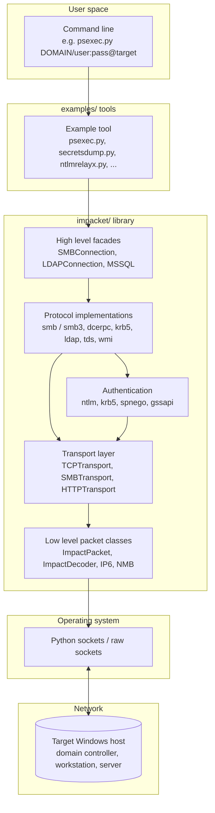

title: "Impacket: Introduction and Architecture"
category: "Foundation"
status: "Published"
tags:
  - impacket
  - impacket/architecture
  - impacket/overview
  - foundation
aliases:
  - introduction
  - impacket_overview
  - impacket_architecture
  - impacket_intro


# Impacket: Introduction and Architecture

> **One line summary:** A Python library and a matching set of example tools that together implement the Windows network protocol stack end to end, giving a security researcher direct, programmatic access to every layer of a Windows network.

Read this article first. Everything else in the wiki assumes you understand what Impacket is and how it is put together. Once these ideas are in place, the individual tool articles read like chapters in the same book instead of disconnected reference pages.


## Where to find it

- **Repository:** `https://github.com/fortra/impacket`
- **License:** Modified Apache Software License
- **Language:** Python 3
- **Maintainer:** Fortra Core Security (originally SecureAuth)
- **Primary historical author:** Alberto Solino (`@asolino` / `@agsolino`)
- **Latest stable release at time of writing:** Impacket 0.13.0 (October 2025)
- **Development branch:** 0.14.0 on `master`


## What Impacket actually is

If you look at almost any major Windows network attack tool or technique published in the last fifteen years, you will find a Python implementation of it somewhere in the Impacket repository. That is not coincidence. It is the reason Impacket exists.

Impacket is two things at once. Keep this distinction in your head from the start, because it is the single most important thing to understand about the project.

1. **A Python library** for working with network protocols, especially the ones that make Windows networks go. This library lives under the `impacket/` directory in the repo. When you write your own Python tooling and you want to speak SMB, MSRPC, LDAP, Kerberos, or TDS (MSSQL), you import from this library.

2. **A collection of example tools** that demonstrate what the library can do. These live under the `examples/` directory. They are the scripts most people mean when they say "Impacket." Think `secretsdump.py`, `psexec.py`, `ntlmrelayx.py`, `GetUserSPNs.py`. More than sixty of them ship with the project.

The examples are useful in their own right. Red team operators use them every week. Blue team analysts study them to learn what attacks look like. But the examples are also meant to be teachers. They show, in readable Python, how to combine the library's building blocks into a real capability. If a tool you need does not exist in `examples/`, you can build it yourself in a few dozen lines using the same library calls.

That two tier design is the key to Impacket's longevity. New tools appear every year. New research lands in new example scripts. Yet the library underneath changes slowly because it is built on something that almost never changes: the published Microsoft protocol specifications.


## A short history

Impacket began inside SecureAuth Labs in the early 2000s. Alberto Solino shepherded it for most of its life. Over two decades, contributors from across the security industry added implementations of protocol after protocol and example after example. The `CONTRIBUTORS` list runs to more than two hundred and forty people.

In 2022 the project moved to Fortra after Fortra acquired HelpSystems and Core Security. The project is still open source, still accepts community contributions, and still ships regular releases. The code you clone from `github.com/fortra/impacket` today is the direct descendant of the code that SecureAuth published on Google Code years ago.

For a security researcher, the practical impact is this: Impacket is stable, it is maintained, and its history is documented in a public commit log going back fifteen years. When a newer project such as NetExec (formerly CrackMapExec), Certipy, or Coercer needs to speak SMB or MSRPC, it almost always imports from Impacket rather than re implementing the protocol. Impacket is the foundation layer for a large slice of the modern Windows attack toolkit.


## The goals Impacket is trying to accomplish

Every design choice in Impacket serves one of four goals. Keep these in mind while reading the code. They explain why things are structured the way they are.

### Goal 1: Implement Microsoft's network protocols in Python, not wrap Windows APIs

When you run `net.exe user` on a Windows workstation, you are calling a native Windows binary that calls the Windows API. That only works from a Windows host with local libraries available. Impacket takes a different path. It implements the wire format of the underlying protocol in Python. The `net.py` example, for instance, speaks MSRPC SAMR directly over TCP or SMB, regardless of what operating system the attacker or researcher is on.

This is why you can run Impacket from Kali Linux, from macOS, from a Docker container, or from an ARM laptop in an airport lounge and still talk to a Windows 11 domain controller on the other side of the world. The tool does not need Windows.

### Goal 2: Give low level programmatic access to packets

Every packet type Impacket understands is a Python class. You can build a packet field by field, serialize it, send it on a socket, receive the response, and parse each field back out. The library is object oriented and the classes nest naturally. An Ethernet frame can contain an IP packet which contains a TCP segment which carries an SMB message which wraps a DCERPC request which calls an MS SAMR operation. Impacket can build or parse that entire stack.

This matters for research. When a new Windows feature ships with a new protocol twist, you can probe it from Python without waiting for someone to write a tool. You build the packet yourself.

### Goal 3: Provide a reference implementation of complex Microsoft protocols

Some Microsoft protocols are not protocols you implement from scratch as a casual project. SMB3, Kerberos, and DCERPC v5 over every supported transport, with full NTLM and Kerberos authentication, is a large amount of code written by people who read the specifications line by line. Impacket has that code. When you are reading the Microsoft `[MS-SMB2]` or `[MS-KILE]` specifications and something does not make sense, you can open the matching file in Impacket and see how a careful implementer interpreted the standard.

For a learner, that is priceless. You can move back and forth between the specification text and working Python code until the concept clicks.

### Goal 4: Ship tools that prove the library works

The `examples/` directory is not an afterthought. It is a living demonstration that the library can be composed into real capabilities. Each example also doubles as a research artifact, because many of them implement novel attacks introduced in published papers, blog posts, or conference talks. `ticketer.py` is an implementation of Golden Ticket forgery. `ntlmrelayx.py` is an implementation of NTLM relay research going back to cDc in the 2000s. `badsuccessor.py` implements very recent dMSA abuse. The tools capture the field's accumulated knowledge in executable form.


## Architecture at a glance

The cleanest way to picture Impacket is as a stack. User commands enter at the top. Raw bytes leave at the bottom. Each layer has a clearly defined job.



Every tool in the wiki sits somewhere on this stack. Most of them live at the **High level facades** layer, which is where you want to be when you are writing tooling. A few, such as the packet construction examples in `examples/ping.py`, dive all the way down to the **Low level packet classes** layer to show how the foundation works.


## Inside the `impacket/` library

Crack open the `impacket/` directory and you will find roughly a dozen subpackages. You do not need to memorize them. You do need to recognize what each one is for, because the example tools import from them constantly and the articles in this wiki will name them often.

### `impacket.smbconnection`

The high level SMB client. This is the class most tools instantiate first when they want to talk to a Windows host. It handles SMB negotiation, authentication, session setup, tree connect, and named pipe access. Under the hood it switches between SMB1, SMB2, and SMB3 based on what the target supports.

### `impacket.smb` and `impacket.smb3`

The actual SMB1 and SMB3 protocol implementations. Most tools never touch these directly. `SMBConnection` wraps them.

### `impacket.nmb`

NetBIOS over TCP. The ancient predecessor to direct SMB. Impacket supports both because real networks still have both.

### `impacket.dcerpc.v5`

The MSRPC engine. DCERPC stands for Distributed Computing Environment Remote Procedure Call. MSRPC is Microsoft's implementation of it. This is the single most important subpackage in the library, because the majority of Windows administrative protocols run over MSRPC. Inside `dcerpc.v5` you will find one module per Microsoft RPC interface:

| Module | Microsoft spec | What it speaks |
|:---|:---||
| `samr` | `[MS-SAMR]` | Security Account Manager (users, groups, local and domain accounts) |
| `lsad` / `lsat` | `[MS-LSAD]` / `[MS-LSAT]` | Local Security Authority (policy, SID lookups) |
| `scmr` | `[MS-SCMR]` | Service Control Manager (Windows services) |
| `rrp` | `[MS-RRP]` | Remote Registry |
| `tsch` | `[MS-TSCH]` | Task Scheduler |
| `drsuapi` | `[MS-DRSR]` | Directory Replication (used for DCSync) |
| `srvs` / `wkst` | `[MS-SRVS]` / `[MS-WKST]` | Server service, Workstation service |
| `nrpc` | `[MS-NRPC]` | Netlogon |
| `even6` | `[MS-EVEN6]` | Event Log |
| `dcom` | `[MS-DCOM]` | Distributed COM |
| `wmi` | `[MS-WMI]` | Windows Management Instrumentation |
| `epm` | `[MS-RPCE]` | Endpoint Mapper (the RPC "phonebook" on port 135) |

Every attack that touches one of these interfaces, from enumerating users with SAMR to forcing a DC to authenticate with NRPC, rides on the code in this subpackage.

### `impacket.krb5`

The Kerberos implementation. ASN.1 structures, KRB_AS_REQ and KRB_TGS_REQ construction, ticket parsing, the PAC (Privilege Attribute Certificate), S4U2Self and S4U2Proxy flows, ccache file format. If a tool in this wiki involves Kerberos, this is the code behind it.

### `impacket.ldap`

LDAP protocol support. Connection, bind, search, and the parsing of responses. Most LDAP heavy tools such as `GetADUsers.py` or `findDelegation.py` import from here.

### `impacket.ntlm`

NTLM authentication. Challenge, response, NTOWFv1 and v2, session key derivation. Used by SMB, MSRPC, HTTP, and LDAP tools whenever Kerberos is not in play.

### `impacket.tds`

The Tabular Data Stream protocol used by Microsoft SQL Server. Enables `mssqlclient.py` to run SQL and authenticate with SQL auth, Windows auth, or hashes.

### `impacket.examples`

A small helper package shared between example tools. Common argument parsing, credential handling, and logging. When you see `from impacket.examples.utils import parse_target`, that is what is being imported.

### Packet level primitives

At the very bottom live the classes that existed before any of the protocols above were added: `ImpactPacket`, `ImpactDecoder`, `IP6`, `ICMP6`, `dot11`, `dhcp`, `dns`. These are the raw packet building blocks. Most example tools never touch them, but they are the reason Impacket can be used for research on protocols the project has not formally adopted yet.


## Transport abstraction

A subtle but important design choice in Impacket is that MSRPC does not care how its bytes travel. Microsoft's DCERPC can run over:

- **TCP** directly, to a specific port.
- **SMB named pipes**, where the RPC bytes are encapsulated inside SMB messages to a named pipe such as `\pipe\lsarpc` or `\pipe\samr`.
- **HTTP**, using RPC over HTTP v2 (this is what Outlook historically used to reach Exchange through a firewall).
- **NetBIOS over TCP**, for backward compatibility.

Impacket expresses this as a `Transport` class. Every RPC module accepts a transport object. Need to talk to SAMR over TCP port 445? Pass in an `SMBTransport`. Need to talk to SAMR over an HTTP proxy? Pass in an `HTTPTransport`. The RPC code above does not change.

You will see this pattern in nearly every example tool. The tool first creates a transport, then binds an RPC interface to it, then calls RPC operations against the interface. This is why many Impacket tools support flags like `-dc-ip`, `-target-ip`, and `-port`: the caller is configuring the transport.


## Authentication abstraction

Every serious Impacket tool supports four ways of proving who you are. The names of these flags are consistent across tools, so once you learn them you never relearn them.

| Method | Typical flag | What you provide |
|:---|:---||
| Cleartext password | positional, `user:password@target` | The password in plain text |
| NT hash | `-hashes LMHASH:NTHASH` | The NT hash (LM hash is usually blank) |
| AES key | `-aesKey <hex>` | 128 bit or 256 bit Kerberos AES key |
| Kerberos ticket | `-k -no-pass` | A ccache file referenced by `KRB5CCNAME` |

Internally, each of these feeds the same authentication stack. A password derives an NT hash, which can authenticate over NTLM or be used to request a Kerberos TGT. A hash or AES key can do the same. A ccache skips the authentication exchange entirely and hands the server a ticket.

The result of this uniform interface is the pass the hash, pass the key, and pass the ticket attack paradigms you will see named throughout the wiki. These are not Impacket specific concepts. Impacket just makes them trivially accessible. Every tool that authenticates knows how to accept any of the four credential types, so once you have one form of credential material you can move laterally without ever needing to crack or retype a password.


## Tracing a single call from command line to the wire

Theory is easier to absorb with a concrete example. Follow a typical `secretsdump.py` invocation down the stack.

```bash
secretsdump.py CORP/alice:S3cret@10.0.0.10
```

Step by step, here is what happens:

1. **The script parses arguments.** `secretsdump.py` extracts the domain, username, password, and target from the `CORP/alice:S3cret@10.0.0.10` string using `impacket.examples.utils.parse_target`.

2. **An SMB connection is opened.** The script instantiates an `SMBConnection` pointed at `10.0.0.10`. Under the hood, SMB2 negotiation happens first, falling back to SMB1 if needed.

3. **Authentication fires.** The `SMBConnection.login()` call sends SMB session setup messages. Because the credentials are a cleartext password, NTLM authentication is used by default. The library computes the NT hash on the fly from the password.

4. **Named pipes are opened over the SMB session.** `secretsdump.py` needs the Remote Registry, the Service Control Manager, and eventually the Directory Replication Service. Each of these lives behind its own named pipe: `\pipe\winreg`, `\pipe\svcctl`, `\pipe\drsuapi`.

5. **DCERPC binds happen.** For each named pipe, the library uses an `SMBTransport` to carry DCERPC traffic. A bind operation negotiates which RPC interface will be used.

6. **RPC operations are called.** The script invokes `RRP` calls to read registry hives, `SCMR` calls to start Remote Registry if it is not running, and `DRSR.DRSGetNCChanges` to pull user objects from the domain controller directly.

7. **Parsed results are printed.** The library returns Python objects. The tool formats them as hash lines, Kerberos keys, and plaintext secrets.

Every Impacket tool follows some variation of this pattern. Parse arguments. Open a transport. Authenticate. Bind an RPC interface. Call operations. Parse and present. Once you recognize the pattern, reading the source of any example tool becomes straightforward.


## Protocols Impacket understands

A quick scan of what the library speaks natively. This is not exhaustive but it covers the protocols most relevant to the wiki.

| Layer | Protocols |
|:---|:---|
| Link | Ethernet, Linux cooked capture, 802.11 |
| Network | IPv4, IPv6, ICMP, ICMPv6, IGMP, ARP |
| Transport | TCP, UDP |
| Session | NetBIOS (NMB) |
| Application (core) | SMB1, SMB2, SMB3, MSRPC v5, LDAP, Kerberos, NTLM, TDS (MSSQL), DHCP, DNS, CDP |
| RPC interfaces | SAMR, LSAD, LSAT, SCMR, RRP, TSCH, DRSR, SRVS, WKST, NRPC, EVEN6, DCOM, WMI, EPM, and many more |
| Authentication | NTLMv1, NTLMv2, Kerberos (with PAC handling), SPNEGO, plaintext |

This breadth is what makes Impacket worth learning once and using for the rest of your career. The same library that sends an ICMP echo can request a Kerberos service ticket, perform a DCSync, or run a command through WMI.


## Why Impacket is the reference toolkit

Three reasons explain why Impacket remains the default choice after more than fifteen years.

**It follows the specifications.** The protocol code quotes Microsoft document identifiers at the top of nearly every file. When Microsoft updates a spec, the community updates Impacket to match. When you are trying to understand a weird protocol behavior, the comments in Impacket source often point you directly at the right section of the right Microsoft document.

**It is composable.** Because everything is a Python class with a clean API, a new attack rarely requires starting from zero. A researcher who reads a paper on Tuesday can prototype the attack in Impacket on Wednesday, because the primitives they need are already in the library. Most new attacks on Windows environments land in Impacket first or second.

**It works from anywhere.** A Linux box, a Mac, a Raspberry Pi, or a container can all run the full toolkit. This matters for research, for training, for CTFs, and for real engagements where the operator is not sitting at a Windows workstation.

The result is an ecosystem around Impacket. NetExec, Certipy, Coercer, PetitPotam, BloodyAD, and dozens of other well known tools either import from Impacket or were informed by it. Learning Impacket is how you understand the rest of them.


## How this wiki is organized

The wiki covers every tool in the `examples/` directory. Tools are grouped by what they do, not by which protocol they use, because a security researcher usually thinks in tasks ("I need to enumerate users" or "I need to execute a command") rather than in protocols.

The thirteen categories, in reading order:

1. Recon and enumeration
2. Kerberos attacks
3. Credential access
4. Remote execution
5. SMB tools
6. Relay attacks
7. AD modification
8. Remote system interaction
9. MSSQL
10. Exchange
11. Exploits
12. Network analysis
13. File format parsing

Each article follows the same twelve section structure. Once you read one, you will recognize the rhythm of every other one.

Recommended reading order for a newcomer:

1. This article.
2. `smbclient.py` to see the simplest possible Impacket tool interacting with a real target.
3. `rpcdump.py` and `samrdump.py` to learn what the MSRPC layer looks like in practice.
4. `GetUserSPNs.py` and `GetNPUsers.py` to meet Kerberos and the classic credential extraction workflows.
5. `getTGT.py` for ticket handling.
6. `secretsdump.py` for the flagship credential dumping workflow.
7. `psexec.py`, `smbexec.py`, and `wmiexec.py` side by side to understand remote execution tradeoffs.
8. `ntlmrelayx.py` once everything above feels comfortable.

After that, jump around. The articles cross reference each other and the progress through the wiki becomes whatever you need it to be.


## What to do next

Pick a category. Pick a tool. Open the article. You now have the map.

The rest of the wiki assumes the ideas in this article are already in your head. If any of them are fuzzy, that is expected. Come back to this article whenever the bigger picture slips away, then return to whichever tool you were studying. The stack on this page is the scaffolding that every other article hangs from.


## Further reading

- **Official repository.** `https://github.com/fortra/impacket` is the authoritative source. The `ChangeLog.md` file records every release and is a surprisingly readable history of Windows attack research.
- **Microsoft Open Specifications.** `https://learn.microsoft.com/en-us/openspecs/windows_protocols/` is the canonical home for every `[MS-XXXX]` document referenced in the wiki. Searching for the identifier brings up the spec.
- **MITRE ATT&CK, software entry S0357.** `https://attack.mitre.org/software/S0357/` maps Impacket to the ATT&CK matrix and is useful when aligning offensive work to detection coverage.
- **The Impacket releases page.** `https://github.com/fortra/impacket/releases` summarizes what is new in each version. Worth skimming when a new release lands.
- **The Kali Linux tools page for Impacket.** `https://www.kali.org/tools/impacket-scripts/` lists the tools with their help output for quick reference.
- **Core Security's Impacket page.** `https://www.coresecurity.com/core-labs/impacket` has short descriptions of each example tool from the maintainers.

Every article in the wiki adds its own curated further reading list. Treat those lists as a personal reading plan, not a link dump.
